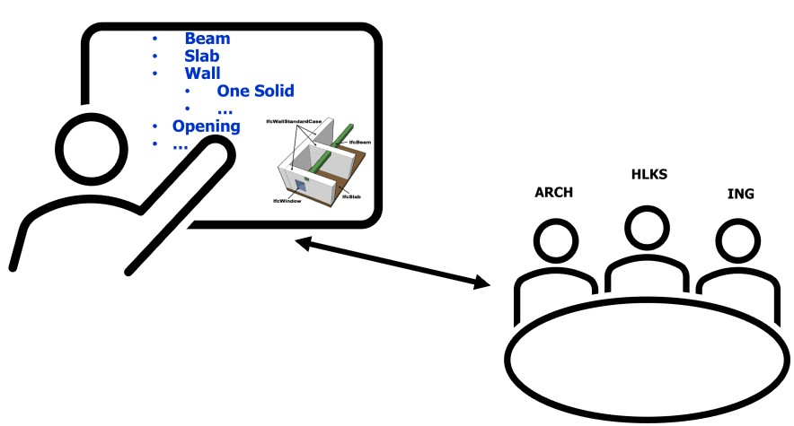
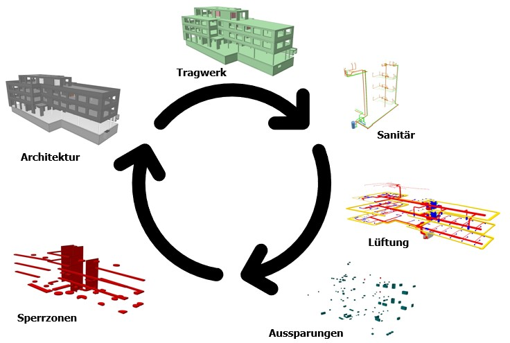

# Datenbestellung

## Was? Wieso? Wer? Wie? Wann?

Welche Daten benötigen Sie von wem für ihre Planung?  
Definieren Sie, was Sie von jeder, am Projekt beteiligten, Partei benötigen. 

Wie müssen diese Daten beschrieben sein? Welcher Qualität soll die Geometrie entsprechen?  Welche Informationen benötigen Sie vom Gegenüber?

Mit einer exakten Definition der Austauschanforderungen im Projektteam können Modelle effizient ausgetauscht und in den Planungsprozess eingebunden werden. 

Die jeweiligen Inhalte werden in Fachmodelle gegliedert (abgeleitet vom Referenzmodell). Prüfen Sie die Modelle auf deren Inhalt (Geometrie, Informationen). 
Zu Beginn des Projekts muss ein Nullpunkt, die Geschossstruktur sowie das Planungsvorgehen (Prozesse) definiert werden. 

[Checkliste Modellierung](../2.Modellierung/modelling.de.md#ifc-modellaufbau--export-aus-cadwork) :bulb:

## Holzbau-relevante IFC-Typen (Beispiel)

Entität           | empfohlen                           | nicht empfohlen | Kommentar
-----------------|:-----------------------------------:|:-------------:|
IfcBeam | :x:
IfcBuildingElementProxy | :x: | :x: | situativ   Für den Austausch von Aussparungen sind BuildingElementProxy's mit dem PredefinedType **ProvisionForVoid** empfohlen.
IfcChimney | | :x:
IfcColumn | :x:
IfcCovering | | :x: | nur wenn für Konstruktion nötig
IfcCurtainWall | :x: | |  als ein Volumen (keine geometrischen Schichten)
IfcDoor | | :x: | "bestellen" Sie die Öffnung (OpeningElement) der Türe. Prüfen Sie die Abmessung der Öffnung mit Vorsicht.
IfcFooting | :x:
IfcMember | :x:
IfcPile | | :x:
IfcPlate | :x:
IfcRailing | | :x:
IfcRamp | :x:
IfcRampFlight | | :x:
IfcRoof | :x:
IfcShadingDevice | | :x:
IfcSlab | :x: |  | als ein Volumen (keine geometrischen Schichten)
IfcStair |  | :x:
IfcStairFlight | | :x:
IfcWall | :x: |  | als ein Volumen (keine geometrischen Schichten)
IfcWindow | | :x: | in den meisten Fällen ist die Öffnung und nicht das Fenster relevant. 
IfcOpeningElement | :x: | | Prüfen Sie die Abmessung der Öffnung mit Vorsicht.
IfcDistributionControlElement | | :x:
IfcDistributionFlowElement | | :x:
IfcFurnishingElement | | :x: