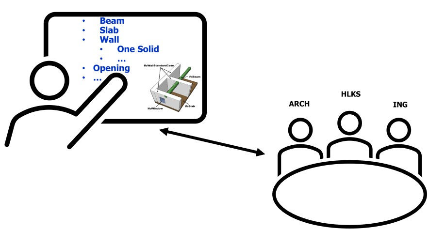
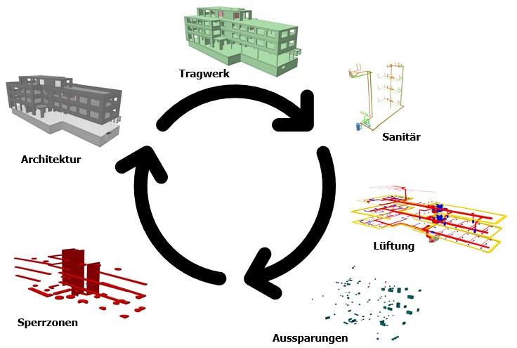

# Exchange Requirements

## What? Why? Who? How? When?

What data do you need from whom for your planning?  
Determine what you need from each party involved in the project. 

How must this data be described? What quality should the geometry correspond to?  What information do you need from the partner?

With an exact definition of the exchange requirements in the project team, models can be exchanged efficiently and integrated into the planning process. 

The respective contents are divided into subject models (Derived from the reference model). Check the models for their content (geometry, information). 
At the beginning of the project, a zero point, the storey structure as well as the planning procedure (processes) must be defined.

[Checklist Modelling](../2.Modellierung/modelling.en.md#ifc-model-setup--cadwork-export) :bulb:

## IFC types relevant to timber construction (example)

Entities           | recommended                           | not recommended | comment
-----------------|:-----------------------------------:|:-------------:|
IfcBeam | :x:
IfcBuildingElementProxy | :x: | :x: | situational   For the exchange of recesses, BuildingElementProxy's with the PredefinedType **ProvisionForVoid** is required.
IfcChimney | | :x:
IfcColumn | :x:
IfcCovering | | :x: | Only if necessary for construction
IfcCurtainWall | :x: | |  as one volume (no geometric layers)
IfcDoor | | :x: | "order" the opening (opening element) of the door. Check the dimension of the opening with care.
IfcFooting | :x:
IfcMember | :x:
IfcPile | | :x:
IfcPlate | :x:
IfcRailing | | :x:
IfcRamp | :x:
IfcRampFlight | | :x:
IfcRoof | :x:
IfcShadingDevice | | :x:
IfcSlab | :x: |  | as one volume (no geometric layers)
IfcStair | :x: | :x: | situational
IfcStairFlight | | :x:
IfcWall | :x: |  | as one volume (no geometric layers)
IfcWindow | | :x: | in most cases it is the opening and not the window that is relevant. 
IfcOpeningElement | :x: | | Check the dimension of the opening with care.
IfcDistributionControlElement | | :x:
IfcDistributionFlowElement | | :x:
IfcFurnishingElement | | :x: