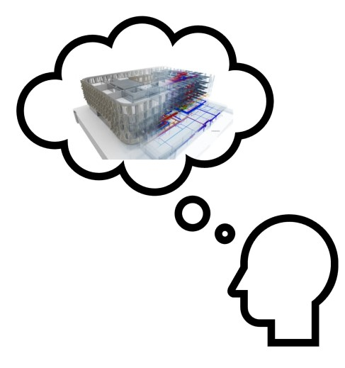

# Exchange Requirements

## What? Why? Who? How? When?

De quelles données avez-vous besoin de la part de qui pour votre planification ? 
Déterminez ce dont vous avez besoin auprès de chaque partie impliquée dans le projet. 

Comment ces données doivent-elles être décrites ?  
A quelle qualité doit correspondre la géométrie ?   
Quelles sont les informations dont vous avez besoin de la part de la contrepartie ?   
Quelle définition de vue de modèle est utilisée pour l'application ?   
Pour l'échange de données, nous recommandons la MVD CoordinationView pour IFC 2x3.   
Pour IFC 4, la vue DesignTransfer de MVD est recommandée.   

Une MVD (Model View Definition) définit un sous-ensemble de la spécification IFC (schéma IFC). Ce sous-ensemble se concentre sur les exigences (exigences d'échange) du créateur et du destinataire de l'information. Les exigences sont déterminées sur la base d'un IDM (Information Delivery Manual)[^1].
[^1]: [BIMcert Handbuch](https://bif.bauwesen.tuwien.ac.at/fortbildung/kurse/aktuelle-kurse/bimcert/)

Un IDM définit la portée et le type d'une exigence d'information qui doit être nécessaire ou fournie par les participants au projet à un moment précis (processus) (exigences d'échange).

Grâce à une définition précise des exigences d'échange au sein de l'équipe de projet, les modèles peuvent être échangés efficacement et intégrés dans le processus de planification. 

Les contenus respectifs sont divisés en modèles thématiques (dérivés du modèle de référence). Vérifiez le contenu des modèles (géométrie, informations). 
Au début du projet, un point zéro, la structure des étages ainsi que la procédure de planification (processus) doivent être définis.

[Checklist Modelling](../2.Modellierung/modelling.fr.md#ifc-model-setup-cadwork-export) :bulb:

## Types d'IFC pertinents pour la construction en bois (exemple de tableau - l'étendue des données dépend du projet)

Entities           | recommended                           | not recommended | comment
-----------------|:-----------------------------------:|:-------------:|
IfcBeam | :x:
IfcBuildingElementProxy | :x: | :x: | situationnel   Pour l'échange de niches, les BuildingElementProxy's avec le ObjectType **ProvisionForVoid** est nécessaire.
IfcChimney | | :x:
IfcColumn | :x:
IfcCovering | | :x: | Seulement si nécessaire pour la construction
IfcCurtainWall | :x: | |  comme un seul volume (pas de couches géométriques)
IfcDoor | | :x: | "commander" l'ouverture (élément d'ouverture) de la porte. Vérifiez avec soin la dimension de l'ouverture.
IfcFooting | :x:
IfcMember | :x:
IfcPile | | :x:
IfcPlate | :x:
IfcRailing | | :x:
IfcRamp | | :x:
IfcRampFlight | | :x:
IfcRoof | :x:
IfcShadingDevice | | :x:
IfcSlab | :x: |  | comme un seul volume (pas de couches géométriques)
IfcStair | :x: | :x: | situationnel
IfcStairFlight | | :x:
IfcWall | :x: |  | comme un seul volume (pas de couches géométriques)
IfcWindow | | :x: | dans la plupart des cas, c'est l'ouverture et non la fenêtre qui est pertinente. 
IfcOpeningElement | :x: | | Vérifiez avec soin la dimension de l'ouverture.
IfcDistributionControlElement | | :x:
IfcDistributionFlowElement | | :x:
IfcFurnishingElement | | :x: