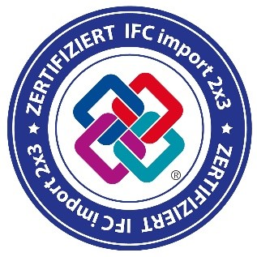
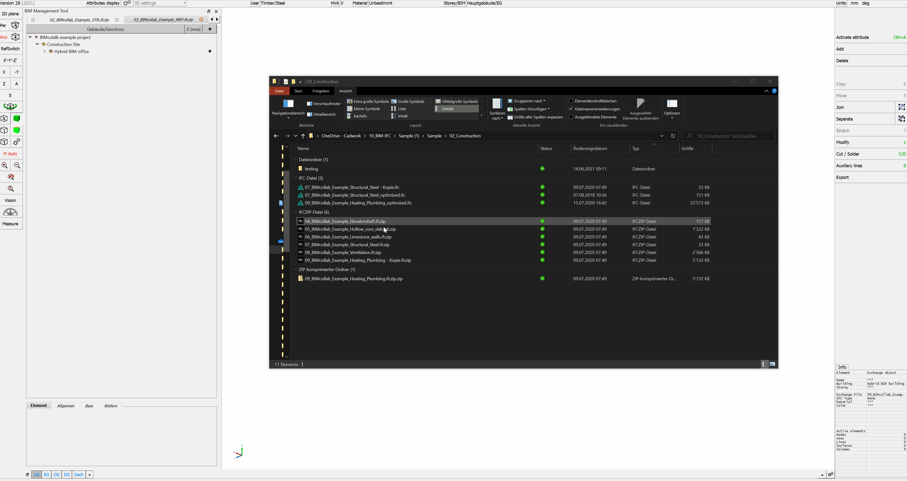
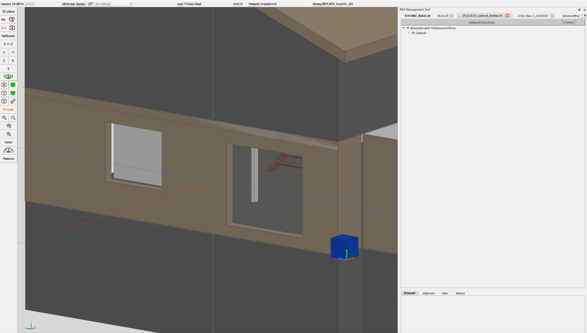
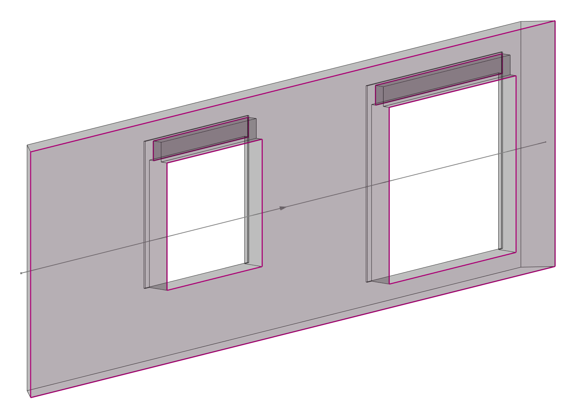
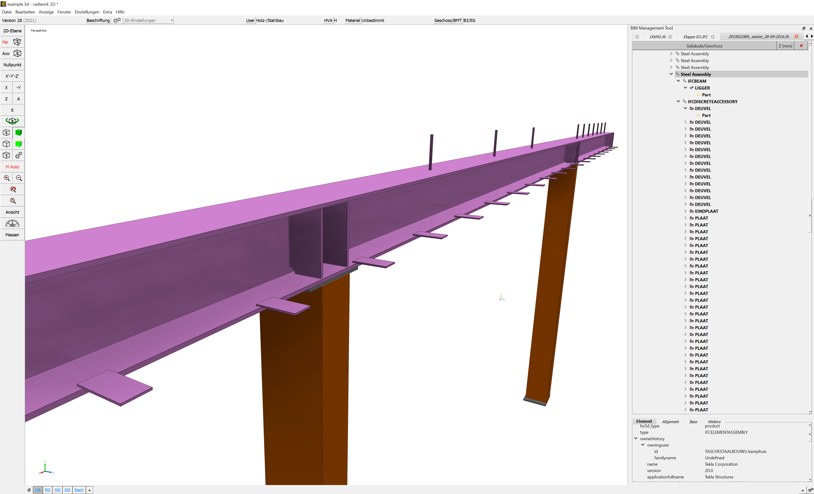

# IFC Import

Die schnell zunehmende technische Entwicklung im Bauwesen führt zu einer grossen Nachfrage sowie Forderungen eines digitalen Datenaustauschs von Gebäudemodellen.
Cadwork bietet Ihnen ab der Version 27 umfängliche Möglichkeiten im Datenaustausch mit dem IFC- und BCF-Schema. In diesem Dokument wird jedoch ausschliesslich die Version 28 (2021) behandelt. 

Cadwork ist für den Datenaustausch im Schema IFC2x3 zertifiziert.

 

Im Umgang mit IFC-Daten sind das Dateischema, die Version des Schemas, die [Model-View-Definition](../index.de.md#modelviewdefintion-mvd) sowie das Wissen um den Aufbau der Datei entscheidend. In den nächsten Abschnitten wird der Umgang mit dem IFC-Schema in cadwork erläutert. 

## Video IFC Import

<figure class="video_container">
  <iframe width="560" height="315" src="https://www.youtube.com/embed/aq0Y8BCePD8" title="YouTube video player" frameborder="0" allow="accelerometer; autoplay; clipboard-write; encrypted-media; gyroscope; picture-in-picture" allowfullscreen></iframe>
</figure>

**Dateien hinzufügen**  
IFC Dateien werden via BIM-Management-Tool in cadwork importiert. 
Das BIM Management Tool (BMT) ist für die Arbeit nach der BIM-Methode das zentrale Werkzeug. Von hier können alle zugehörigen Dialoge geöffnet und alle Einstellungen
getätigt werden. Öffnen Sie den BMT entweder über die Schaltfläche Geschoss/BMT in der Kopfzeile oder über das Menü; Fenster –> BIM Management Tool.
IFC- Dateien können entweder über das  "+" Symbol, oder mit «Drag and Drop» (mehrere Dateien möglich) hinzugefügt werden. 

{: style="width:900px"}

Importierte Elemente werden als **"Exchange-Objekt"** eingelesen, welches nur der Visualisierung dient. Sie können nicht in einer 2D-Ebene dargestellt oder in den Planausgaben exportiert werden. Sie können auch nicht bearbeitet oder zur Kollisionskontrolle genutzt werden. Die Exchange-Objekte sollen nicht als Referenzbauteile genutzt werden. Die benötigte Genauigkeit wird erst nach der Konvertierung der Elemente erreicht. 

### Elemente aktivieren
Mit «Aktivieren nach Attribut» können die Bauteile selektiert werden. So können Sie zum Beispiel die ++ctrl+"A"++ -Funktionen nutzen, um nur die Exchange-Objekte nach 

* IFC-Gebäude       ++ctrl+"A"+shift+"A"++ 
* IFC-Geschoss      ++ctrl+"A"+shift+"S"++
* IFC-Typ           ++ctrl+"A"+shift+"T"++
* Name              ++ctrl+"A"+"N"++
* Material          ++ctrl+"A"+"M"++
* Farbe             ++ctrl+"A"+"C"++ 

zu aktivieren, die Sie als cadwork Bauteile erzeugen möchten.

## Globaler - lokaler Nullpunkt

Um georeferenzierte Modelle in der geforderten Genauigkeit von cadwork halten und bearbeiten zu können, wird beim Import von georeferenzierten IFC Dateien der interne Nullpunkt verschoben. 
Zu weit vom Nullpunkt entfernte Elemente würden zu Genauigkeitsproblemen führen. 
Nach Bestätigung der Verschiebung, wird der Verschiebungsvektor intern gespeichert und die globalen Koordinaten gespeichert (Einstellungen -> Globaler Nullpunkt)

{: style="width:400px"}

Beim Export des geforderten Modellinhalts aus cadwork wird der Verschiebungsvektor berücksichtigt und der Modellursprung an derselben Stelle platziert. 

{: style="width:400px"}

## Struktur-Ansichten

Mit einem Rechtsklick auf das Projekt öffnet sich das Kontext Menü, welches die möglichen Optionen aufzeigt. 
Alternativ zur hierarchischen Ansicht, kann in die Ansicht nach IFC Typ gewechselt werden. 

{: style="width:900px"}

Mit einem Rechtsklick im BMT öffnet sich das Kontext-Menü über welches die Importeinstellungen vorgenommen werden können.

{: style="width:900px"}

## Das BMT Kontext Menü
{: style="width:600px"}

### 1. Sichtbarkeit 
* Durch das Anwählen der Schaltflächen wird die Sichtbarkeit der Elemente gesteuert

### 2. Elemente aktivieren, Treeview
* Durch das Anwählen der Schaltflächen Elemente aktivieren, oder Elemente deaktivieren, kann der Zustand der Elemente gesteurt werden. 
* Die "aufegklappte" Treeview wird über diese Schaltfläche minimiert.  
    {: style="width:400px"}

### 3. Bauteil erzuegen & BCF
* Importierte Bauteile lassen sich zu cadwork Elementen konvertieren. Somit können diese für die Planung weitergenutzt werden (z.B. als Referenzbauteile). Durch Klicken auf **als Bauteil erzuegen**, werden die selektierten Elemente zu cadwork Bauteilen konvertiert.   

    !!! info " **Tipp!**  Prüfen Sie den Inhalt der erhaltenen Daten immer zuerst in einem Viewer (**QualityGate**) anschliessend sind die importierten Daten in cadwork sorgfältig auf ihre Richtigkeit (Genauigkeit, Informationen) zu kontrollieren"

    :bulb: IFC Viewer -> [Liste-verschiedener-Viewer](https://bim-me-up.com/die-popularsten-ifc-viewer/){target=_blank}  

    Die Konvertierung kann über **Modifizieren -> als Bauteil erzeugen** vorgenommen werden, oder über das **Kontext Menü im BMT**. 
    Gültige Elemente werden nach ausführen der Konvertierung zu cadwork Elementen umgewandelt. Ungültige Elemente können nicht zu nativen cadwork Elementen konvertiert werden. Ungültig heisst, wenn z.B. die Geometrie inkorrekt beschrieben ist. 
    Kontrollieren Sie die Daten sorgfältig auf ihre Richtigkeit (Genauigkeit, Informationen). 

    **Geometriemanipulation**

    Cadwork bietet Ihnen Werkzeuge für Geometriemanipulationen an. Über **Modifizieren -> Optionen** sind die möglichen Optionen zur Geometriemanipulation der Elementtypen ersichtlich. 
    Wenn z.B. die Geometrie in der IFC-Datei über Flächen beschrieben ist (SurfaceModel -> kein Volumen), können Sie diese zu einem Volumen modifzieren (**Modifizieren -> Optionen -> Mehrere Flächen zu Volumen**). 

* Durch anklicken der Schaltfläche **BCF-Thema erstellen**, wir der BCF Manager aufgerufen. LINK ZU BCF KAPITEL

### 4. IFC-Import Einstellungen 
#### Bi-direktionale Aktivierung
Wenn die Bi-direktionale Aktivierung eingeschalten ist, springt der Zeiger in der Treeview auf das entsprechende Bauteil. (Fokus auf BMT - rechtes)
{: style="width:800px"}

#### IFC Import-Einstellungen
**Import Dialog - Konfiguration**

 

1.	**Öffnungen einschneiden**
    * Definiert ob Öffnungen nach dem Import hart/weich eingeschnitten werden sollen, oder ob das IfcOpeningElement zu einem Element mit dem Typ Öffnung generiert werden soll.
        * {: style="width:300px"}
        * {: style="width:300px"}
2.	**Achssystem regenerieren**
    * Das Achssystem der Elemente wird algorithmisch neu berechnet und ausgerichtet.
3.	**Korrigieren Facetten**
    * Facetten, die auf einer Ebene liegen, werden, wenn möglich korrigiert.
4.	**IfcElementAssembly** (zusammengesetztes Element)
    * Die IfcElementAssembly repräsentiert Elementbaugruppen, die aus mehreren Elementen zusammengesetzt sind.
    * z. B. Fachwerkbinder, Stahlträger und verschiedene Arten von Rahmen, können durch die Entität IfcElementAssembly dargestellt werden. 
    * 
    * Durch anwählen der Radiobuttons können Sie definieren, ob das IfcElementAssembly in cadwork **Ohne Zusammenfassung, als Gruppe verbinden (empfohlen), oder mit einem Containerelement** erzeugt werden soll.

5.	**Architektur-Hüllen erzeugen**
    * Generieren eines Hüllkörpers, um importierte Bauteile vom Typ Wand, Decke, Dach.
        * Exchange-Objekt
        * {: style="width:300px"}
        * konvertierte Elemente mit erzeugtem Hüllkörper
        * {: style="width:300px"}

6.  **Laden**
    * Laden der Einstellungsdaten im Benutzer Userprofil.

6.  **Speichern**
    * Speichern zur Verwaltung der Einstellungsdaten im Benutzer Userprofil.

#### IFC Attribut Mapper - PropertyMapping

<figure class="video_container">
<iframe width="560" height="315" src="https://www.youtube.com/embed/DKCo9oiGMUY" title="YouTube video player" frameborder="0" allow="accelerometer; autoplay; clipboard-write; encrypted-media; gyroscope; picture-in-picture" allowfullscreen></iframe>
</figure>

Der IFC Attribut Mapper ermöglicht das Mappen von Eigenschaften (Properties) aus der IFC Datei in die Attribute von cadwork Elementen. Der Attribut Mapper wird direkt aus dem Kontext Menü des BMT aufgerufen. 

[Attribut Mapper im Detail](../1.Import/property_mapper.de.md)

{: style="width:900px"}

#### Ansicht nach IFC-Typ

[Ansicht nach Typ](../1.Import/import.de.md#struktur-ansichten)
