# IFC import

The rapidly increasing technical development in construction industries leads to a great demand as well as requirements of a digital data exchange of building models.
cadwork offers extensive possibilities in data exchange with the IFC and BCF schema starting with version 27. In this document, however, only version 28 (2021) is discussed. 

cadwork is certified for data exchange in scheme IFC 2x3.

When dealing with IFC data, the file schema, the version of the schema, the [model-view-definition](../index.en.md#modelviewdefintion-mvd) as well as the knowledge about the structure of the file are crucial. In the next sections the handling of the IFC schema in cadwork will be explained. 
 
## Video IFC import

<figure class="video_container">
  <iframe width="560" height="315" src="https://www.youtube.com/embed/aq0Y8BCePD8" title="YouTube video player" frameborder="0" allow="accelerometer; autoplay; clipboard-write; encrypted-media; gyroscope; picture-in-picture" allowfullscreen></iframe>
</figure>

**Adding IFC-files**  
IFC-files are imported to cadwork via the  BIM-Management-Tool (BMT). 
The BMT is the central tool for working according to the BIM method. From here, all associated dialogs can be opened and all settings can be made. Open the BMT either via the Floor/BMT button in the header or via the menu; Window -> BIM Management Tool.
IFC files can be added either via the "+" symbol or with "Drag and Drop" (multiple files possible).

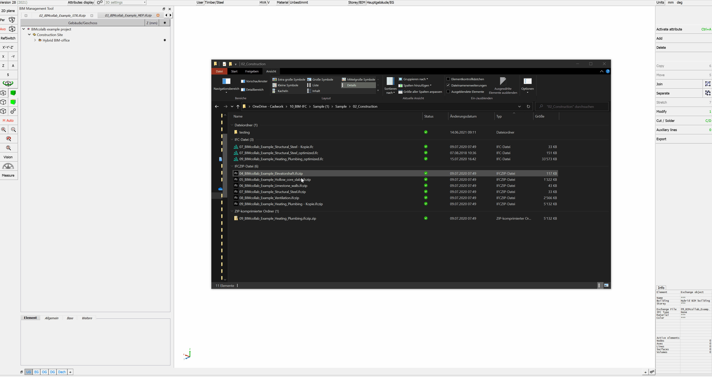{: style="width:900px"}

Imported elements are imported as **"Exchange objects"**, which are only used for visualization. They cannot be displayed in a 2D plane or exported to the shopdrawings. They also cannot be edited or used for collision checking. The Exchange objects should not be used as reference components. The required accuracy is achieved only after converting them.

### Activate elements

You can activate elements by attribute. Choose ++ctrl+"A"++ -function to activate exchange-objects by 

* IFC-building       ++ctrl+"A"+shift+"A"++ 
* IFC-storey      ++ctrl+"A"+shift+"S"++
* IFC-type        ++ctrl+"A"+shift+"T"++
* Name              ++ctrl+"A"+"N"++
* Material          ++ctrl+"A"+"M"++
* Color             ++ctrl+"A"+"C"++ 

Afterwards active elements can be converted to cadwork elements.

## Global - local zero point

In order to keep and edit georeferenced models in the required accuracy of cadwork, the internal zero point is shifted when importing georeferenced IFC files. Elements too far away from the zero point would lead to accuracy problems. After confirming the shift, the displacement vector is saved internally and the global coordinates are saved (Settings -> Global nil point).

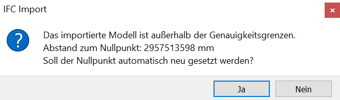{: style="width:400px"}

When exporting the required model content from cadwork, the displacement vector is taken into account and the model origin is placed at the original position. 

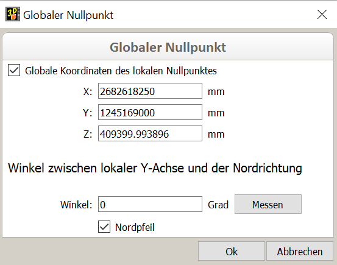{: style="width:400px"}

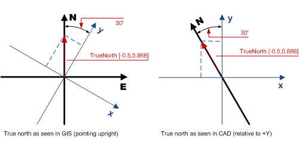
 
 

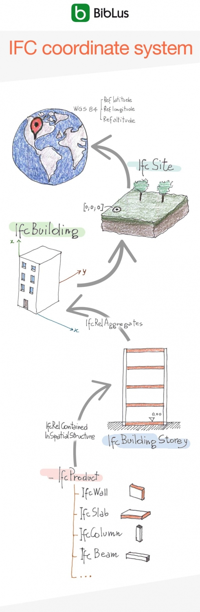
 
 

[IFC coordinate system BibLus](https://biblus.accasoftware.com/de/ifc-coordinate-system-und-georeferenzierung-des-projektss-hrfser-htfw-tkeah5t9weo/){ .md-button .md-button--primary }

## Changing hierarchical and structural view

On mouse right click in BMT you can change the treeview between hierarchical and structural view, which is sorted by types. 

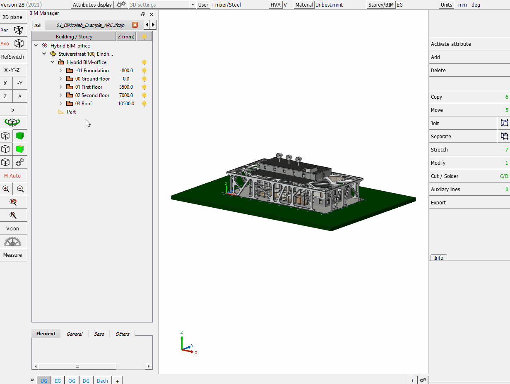{: style="width:900px"}

In this context menu you also can open the IFC-import-configuration dialogue.

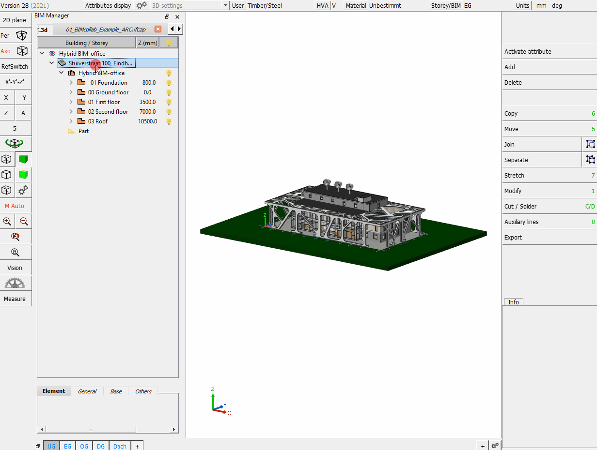{: style="width:900px"}

## The BMT context menu
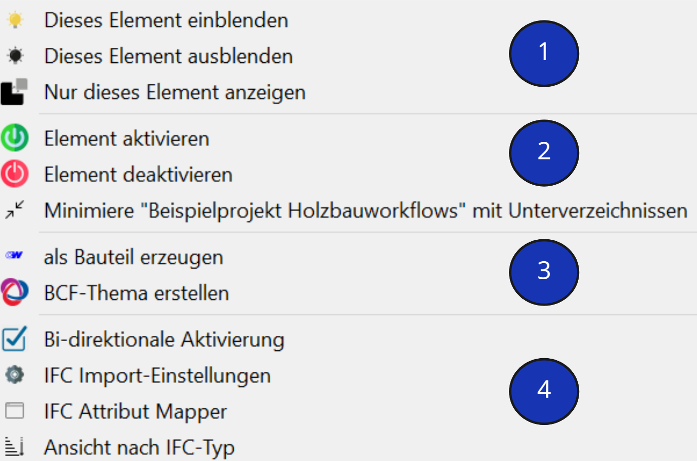{: style="width:600px"}

### 1. Visibility 
* Decide which elements are to be displayed.

### 2. Activate elements, Treeview
* The activation status of elements is set active or inactive. 
* The minimized treeview can be maximized and vice versa.  
    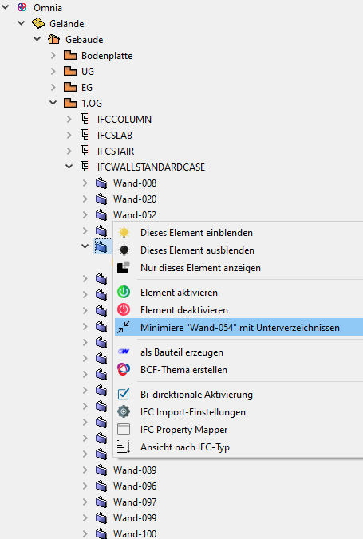{: style="width:400px"}

### 3. Add element in cadwork & BCF
* The imported exchange elements can be converted to cadwork elements with the option **Add element in cadwork**. Now they can be handled as normal constructive elements in 3D.  

    !!! info " **Tip!**  Check the IFC files´ elements before importing in an external viewer (**QualityGate**) and after conversion do again in cadwork for accuracy and completeness."

    :bulb: [list of external IFC-viewer](https://bim-me-up.com/die-popularsten-ifc-viewer/){target=_blank}  

    The conversion can be done via **Modify -> Add element in cadwork** or via the **context menu in BMT**. 
    Valid elements are converted to cadwork elements after performing the conversion. Invalid elements cannot be converted to native cadwork elements. Invalid means if e.g. the geometry is described incorrectly. 
    Check the data carefully for correctness (accuracy, information). 
	
    **Manipultion of geometries**

    cadwork offers tools for geometry manipulation. There are some function for manipulation available in the menu **Modify -> Options...**.
	For example if a model is described only via surfaces (SurfaceModel -> no volume), you can try to modify it to a volume (**Modify -> Options... -> Several surfaces in volume**).

	* On choosing **Create BCF-topic** the BCF manager is opened. For details check chapter 4, BCF.

### 4. Import settings 
#### Bi-directional Activation
If bi-directional activation is enabled, the element activated in 3d is also highlighted in the treeview list.
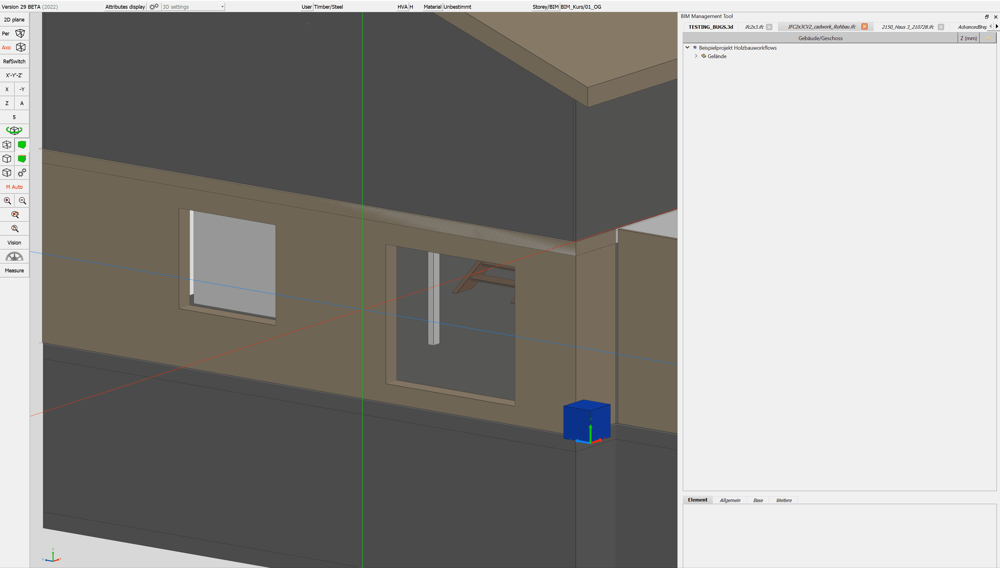{: style="width:800px"}

#### IFC import-configuration
**Configuration dialogue**

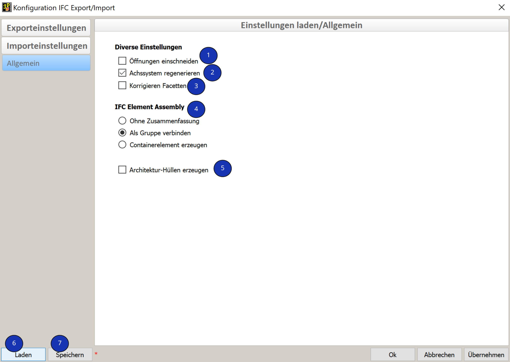 

1.	**Cut opening**
    * Definition if the opening is to be cut out from the wall container or if the IfcOpeningElement is to be generated as a panel with type opening.
        * {: style="width:300px"}
        * 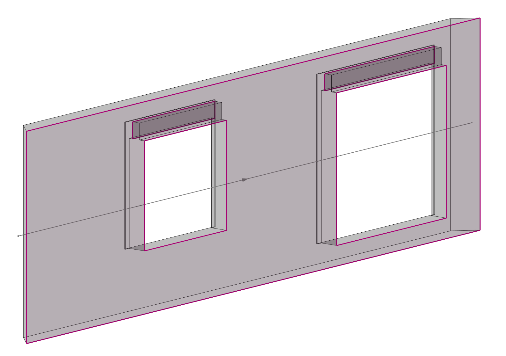{: style="width:300px"}
2.	**Recalculate local axes (Optimized for cadwork)**
    * The elements´ local axes are recalculated according element typical algorythms.
3.	**Correct facets after import automatically**
    * Facets in one plane are recalculated as one facet. Some triangulated facets may be reduced with this option.
4.	**IfcElementAssembly** (zusammengesetztes Element)
    * The IfcElementAssembly represents element composits like framed trusses, steel element groups or general framings.
    * 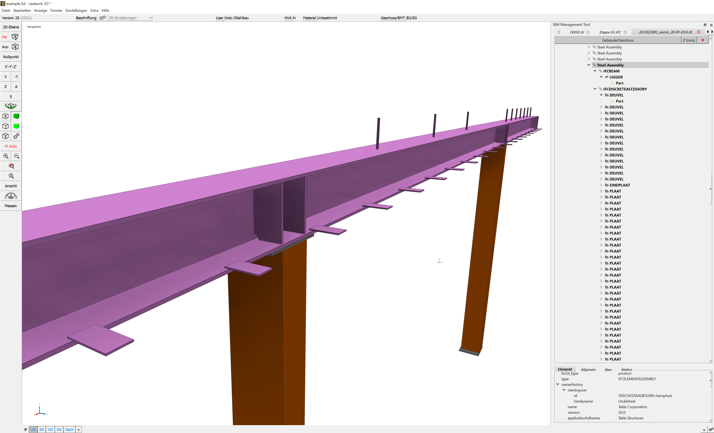
    * With the radiobuttons you can choose between **deleting the assembly structure (none), grouping the elements (Join) or generating container elements on them (Add container automatic).** 

5.	**Create architectural rough volume**
    * Here an architectural rough volume from type wall, roof or floor is generated over referenced elements
        * Exchange-Objekt
        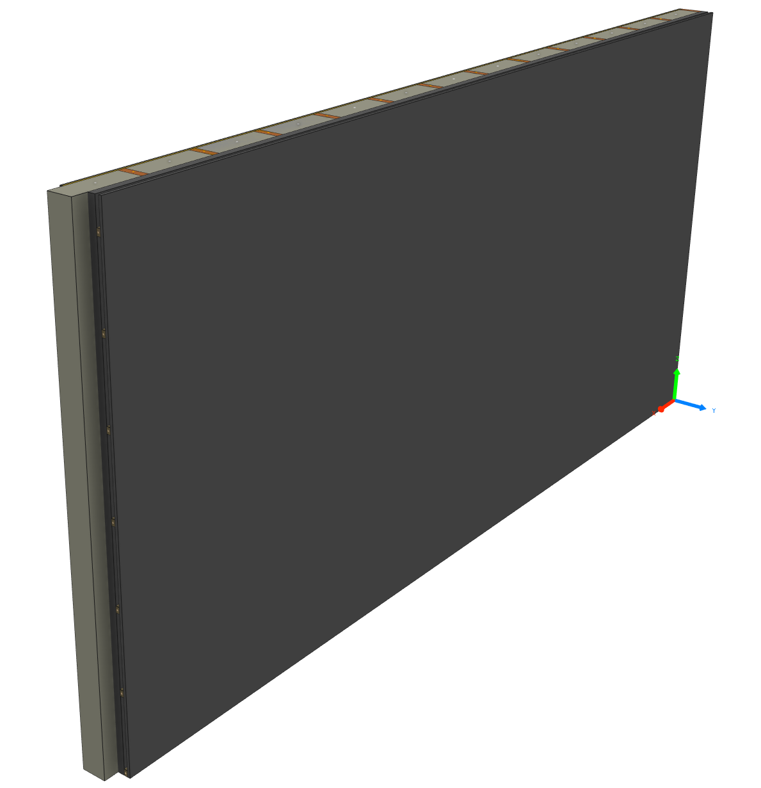{: style="width:300px"}
        * converted elements with rough volume
        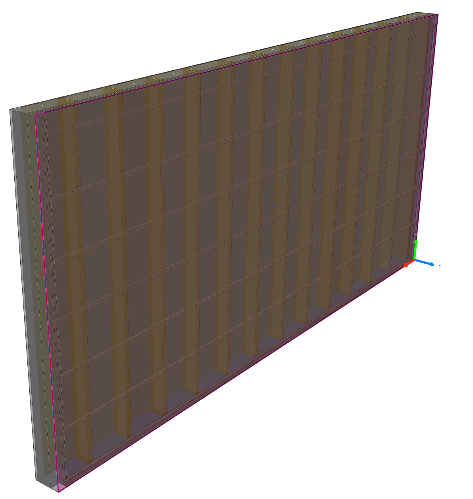{: style="width:300px"}

6.  **Load**
    * Loads import settings from userprofile.

6.  **Save**
    * Saves import setting in userprofile.

#### IFC property mapper

<figure class="video_container">
<iframe width="560" height="315" src="https://www.youtube.com/embed/DKCo9oiGMUY" title="YouTube video player" frameborder="0" allow="accelerometer; autoplay; clipboard-write; encrypted-media; gyroscope; picture-in-picture" allowfullscreen></iframe>
</figure>

The IFC property mapper allows to import any attribute from the IFC elements to the converted elements in cadwork. The mapper is opened from the BMT context menu directly. 

[Property Mapper in detail](../1.Import/property_mapper.en.md)

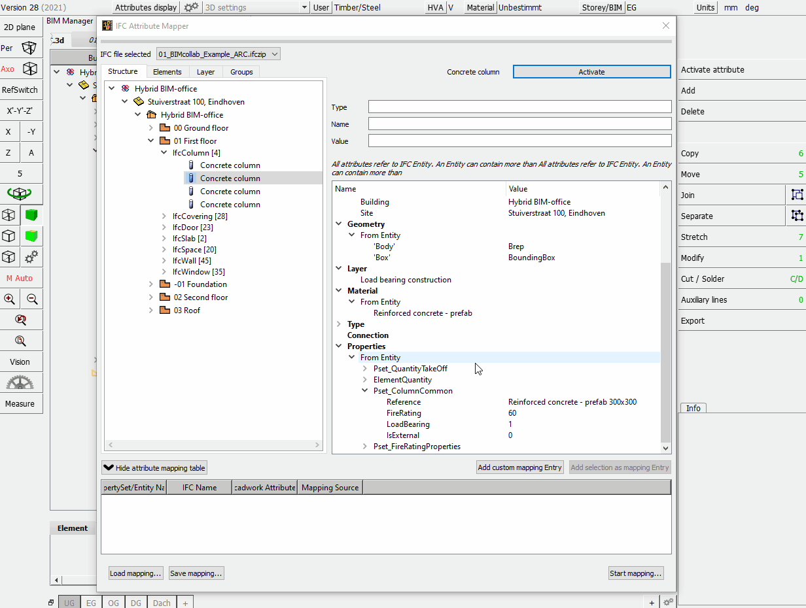{: style="width:900px"}

#### View by IFC-type

[View by IFC-type](../1.Import/import.en.md#Changing hierarchical and structural view)
