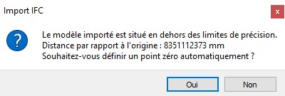
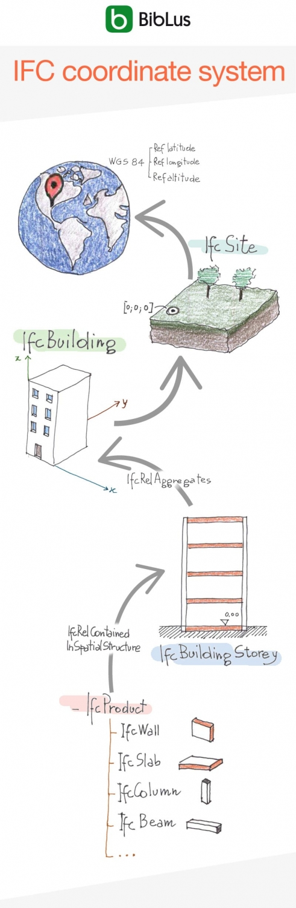
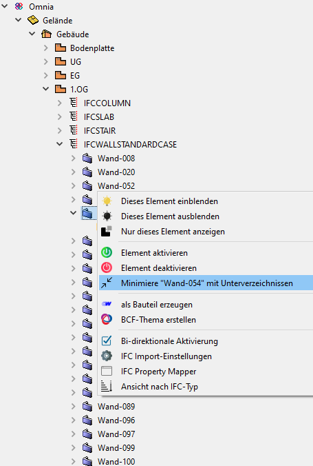
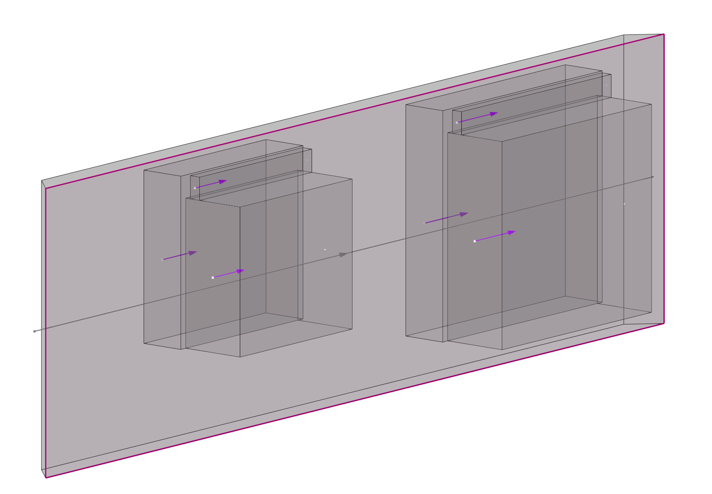
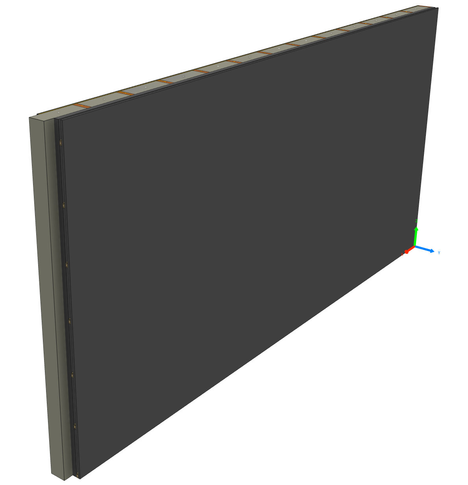

# Import IFC

L'évolution technique rapide dans le domaine de la construction entraîne une forte demande et des exigences d'échange de données numériques pour les modèles de bâtiments.
A partir de la version  27 ,Cadwork vous offre de nombreuses possibilités d'échange de données avec les schémas IFC et BCF. Ce document ne traite cependant que de la version 28 (2021). 

Cadwork est certifié pour l'échange de données dans le format IFC2x3.

 

Dans l'utilisation des données IFC, le format, la version, le MVD [Model-View-Definition](../index.md#modelviewdefintion-mvd)ainsi que la connaissance de la structure des données sont déterminants. Les prochains paragraphes expliquent comment utiliser le format IFC dans cadwork.  

## Video Import IFC

<figure class="video_container">
  <iframe width="560" height="315" src="https://www.youtube.com/embed/aq0Y8BCePD8" title="YouTube video player" frameborder="0" allow="accelerometer; autoplay; clipboard-write; encrypted-media; gyroscope; picture-in-picture" allowfullscreen></iframe>
</figure>

**Ajouter des fichiers**  
Les fichiers IFC sont importés dans cadwork via l'outil de gestion BIM, le BMT (BIM Management Tool).  
Le BIM Management Tool (BMT) est l'outil principal pour le travail selon la méthode BIM. Il permet d'ouvrir toutes les fenêtres de dialogues associées et d'effectuer tous les réglages.
Vous pouvez ouvrir le BMT soit en cliquant sur le bouton Storey(Etage)/BMT dans l'en-tête, soit via le menu Fenêtre  –> BIM Management Tool.
IFC- Dateien können entweder über das  "+" Symbol, oder mit «Drag and Drop» (mehrere Dateien möglich) hinzugefügt werden. 

{: style="width:900px"}

Les éléments  provenant de la maquette ifc sont des  **"Objects IFC Connectés"**. Ils ont un rôle de visualisation uniquement. Ils ne peuvent pas être représentés dans un plan de travail 2D ou exportés sur des plans. Ils ne peuvent pas non plus être édités ou utilisés pour le contrôle des collisions. Les objets IFC Connectés ne doivent pas être utilisés comme éléments de référence. La précision requise n'est atteinte qu'après la conversion des éléments. 

### Activer des éléments
Avec "Activer par attribut", les éléments de construction peuvent être sélectionnés. Ainsi, vous pouvez, par exemple, utiliser les fonctions ++Ctrl+"A "++ pour ne sélectionner que les objets IFC connectés par: 

* Bâtiment IFC       	++ctrl+"A"+shift+"A"++ 
* Étage IFC      		++ctrl+"A"+shift+"S"++
* Type IFC           	++ctrl+"A"+shift+"T"++
* Nom              		++ctrl+"A"+"N"++
* Materiau          	++ctrl+"A"+"M"++
* Couleur             	++ctrl+"A"+"C"++ 

Vous pourez les convertir en élément cadwork par la suite.

## Point d'origine global - local

Afin de pouvoir maintenir et traiter les modèles géoréférencés avec la précision requise par cadwork, le point zéro interne est décalé lors de l'import de fichiers IFC géoréférencés. 
Des éléments trop éloignés du point zéro entraîneraient des problèmes de précision. 
Après confirmation du décalage, le vecteur de décalage est enregistré en interne et les coordonnées globales sont enregistrées (Préférences -> Point zéro global).

{: style="width:400px"}

Lors de l'export d'éléments cadwork vers un fichier IFC, le vecteur de déplacement est pris en compte et l'origine du modèle est conservé.

{: style="width:400px"}

 
 

 
 

[IFC coordinate system BibLus](https://biblus.accasoftware.com/de/ifc-coordinate-system-und-georeferenzierung-des-projektss-hrfser-htfw-tkeah5t9weo/){ .md-button .md-button--primary }

## Affichage de l'arborescence IFC

Un clic droit sur le projet permet d'ouvrir le menu contextuel qui affiche les options possibles. 
Comme alternative à la vue hiérarchique, il est possible de passer à la vue par type IFC.  

{: style="width:900px"}

Un clic droit dans le BMT ouvre le menu contextuel qui permet de définir les paramètres d'import IFC.

{: style="width:900px"}

## Le menu contextuel du BMT
{: style="width:600px"}

### 1. Affichage 
* L'utilisation des ampoules permet de contrôler la visibilité des éléments.

### 2. Activation des éléments
* L'état des éléments peut être contrôlé en sélectionnant les boutons Activer cet élément ou Désactiver cet élément. 
* Le bouton "Développer" permet de développer l'arborescence.  
    {: style="width:400px"}

### 3. Ajouter élément dans cadwork et créer une requête BCF 
* Les éléments provenant de la maquette ifc, donc les objets IFC connectés peuvent être convertis en éléments cadwork. Ainsi, ils peuvent être utilisés pour la conception (par ex. comme éléments de référence). En cliquant sur **ajouter élément dans cadwork**, les éléments sélectionnés sont convertis en éléments cadwork.   

    !!! info " **Astuce!**   Vérifiez toujours le contenu des données reçues dans une visionneuse. (**QualityGate**) ensuite, les données importées dans cadwork doivent être soigneusement contrôlées(précision, informations)".

    :bulb: IFC Viewer -> [Liste-verschiedener-Viewer](https://bim-me-up.com/die-popularsten-ifc-viewer/){target=_blank}  

    La conversion peut être effectuée via **Modifier -> Ajouter élément dans cadwork** ou via le **menu contextuel dans le BMT**. 
    Les éléments valides sont convertis en éléments cadwork. Les éléments non valides ne peuvent pas être convertis en éléments cadwork natifs. Un élément non valide signifie, par exemple, que la géométrie est décrite de manière incorrecte. 
    Contrôlez soigneusement l'exactitude des données (précision, informations).  

    **Modification des géométries**

     Cadwork propose des outils de modification de la géométrie. Les options possibles pour la modification géométrique des types d'éléments sont visibles via **Modifier -> Option**. 
     Par exemple, si la géométrie dans le fichier IFC est décrite par des surfaces (SurfaceModel -> kein Volumen), vous pouvez les modifier en un volume  (**Modifier -> Option -> Plusieurs surfaces en volume**). 

* En cliquant sur le bouton **Créer une requête BCF**, on accède au gestionnaire de BCF. Voir chapitre 4. BCF

### 4. Paramètres d'import IFC 
#### Contrôle bidirectionnel activé
Lorsque le contrôle bidirectionnelle est activée, l'élement activé dans la fenêtre graphique est aussi activé dans l'arborescence IFC de BMT.
{: style="width:800px"}

#### Paramètres d'import IFC
**Configuration Import/Export IFC**

 

1.	**Entailler les ouvertures**
    * Définit si les ouvertures doivent être découpées après la conversion des objets IFC connectés en élément cadwork ou si l'élément IfcOpeningElement doit être généré pour devenir un élément de type ouverture.
        * {: style="width:300px"}
        * {: style="width:300px"}
2.	**Recalculer les axes locaux**
    * Le système d'axes des éléments est recalculé et réorienté si nécessaire, de manière algorithmique.
3.	**Correction automatique des facettes après l'import**
    * Les facettes qui se trouvent sur un même plan sont uniformisées si possible.
4.	**Groupe d'élements IFC** (IfcElementAssembly)
    * Un groupe délément IFC, un IfcElementAssembly représente des ensembles d'éléments qui sont composés de plusieurs éléments.
    * Par exemple, des fermes en treillis, des poutres en acier et différents types de cadres, peuvent être représentés par l'entité IfcElementAssembly. 
    * 
    * Vous pouvez définir si l'IfcElementAssembly doit être créé dans cadwork **Sans résumé (tous les éléments ne sont plus partis d'une sélection), joint (recommandé), ou avec l'ajout d'un élément container**.

5.	**Créer les enveloppes architectures**
    * Génération d'une d'enveloppe, de type mur, plafond, toit afin de pouvoir utiliser les fonctionnalités architecture.
        * Objet IFC Connecté
        * {: style="width:300px"}
        * éléments convertis avec enveloppe générée
        * {: style="width:300px"}

6.  **Charger**
    * Charger des réglages de la fenêtre "configuration Import / Export IFC"  depuis le userprofil.

7.  **Sauver**
    *  Enregistrer les réglages de la fenêtre "configuration Import / Export IFC" dans le Userprofil.

#### Mappage attributs IFC

<figure class="video_container">
<iframe width="560" height="315" src="https://www.youtube.com/embed/DKCo9oiGMUY" title="YouTube video player" frameborder="0" allow="accelerometer; autoplay; clipboard-write; encrypted-media; gyroscope; picture-in-picture" allowfullscreen></iframe>
</figure>

L'outil "Mappage d'attributs IFC" permet de mapper des propriétés (Propertieset) du fichier IFC dans les attributs des éléments cadwork. Il est appelé directement à partir du menu contextuel du BMT ou dans l'onglet Fenêtre.

[Mappage d'attributs IFC en détail](../1.Import/property_mapper.fr.md)

{: style="width:900px"}

#### Tri par vue Type IFC

[Tri par vue Type IFC](../1.Import/import.fr.md#struktur-ansichten)
