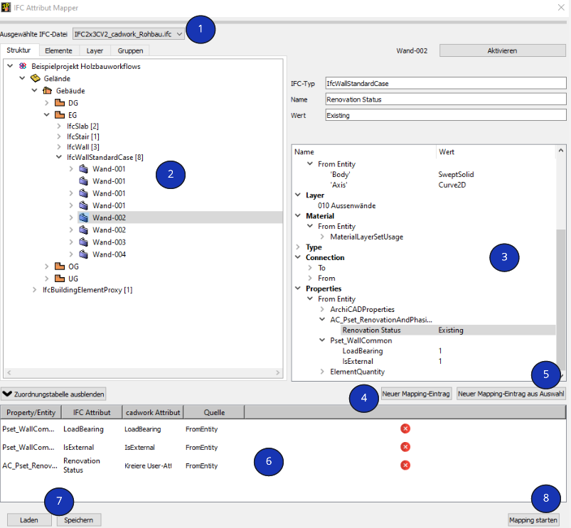

# Attribut Mapper

1. **Ausgewählte IFC-Datei**
    * Dropdown Auswahl der geladenen IFC-Dateien in cadwork 3D. Wenn mehrere IFC-Dateien geladen sind, kann über diese Auswahl die zu verwendende ausgewählt werden.

2. **Treeview IFC-Datei** 
    * Diese Ansicht zeigt, identisch wie im BMT, die hierarchische Struktur der IFC-Datei. Die Bi-direktionale Aktivierung ist auch hier implementiert. 

3. **Property Toolbar**
    * In der Property Toolbar werden die Informationen zur Entität (Attribute), Zugehörigkeit (räumliche Struktur), dem Material sowie die Properties angezeigt. 

4. **Neuer Mapping-Eintrag**
    * Über diese Schaltfläche kann ein manueller Eintrag für das Mapping von Eigenschaften aus dem PropertySet vorgenommen werden.
    * Der Mappingeintrag gilt für alle Elemente, die dieses Property haben!

5. **Neuer Mapping-Eintrag aus Auswahl (empfohlen)**
    * Wählen Sie im Tree Properties ein Property (Abbildung, angewähltes Property --> Renovation Status) an und klicken Sie anschliessend auf "Neuer Mapping-Eintrag aus Auswahl". Die Bezeichnungen des Properties werden automatisch in die Eingabefelder übernommen. Wenn Sie nun die Checkbox "Kreire User-Attribute gem. property-Name" aktiveren, wird beim Mapping, falls das Attribut noch nicht existiert, ein neues Attribut am Ende der Liste erstellt (siehe GIF). Dieses Attribut erhält automatisch den Namen des Propertys. 
    * Der Mappingeintrag gilt für alle Elemente, die dieses Property haben!

6. **Listenansicht zugeordnete Properties**
    * In der Zuordnungstabelle werden die definierten Mappingeinträge aufgelistet. 

7. **Laden/Speichern**
    * Laden/Speichern der projektspezifischen Mappingeinträge. Die Datei liegt im Projektordner. 

8. **Mapping starten**
    * Nachdem die Mappingeinträge erstellt sind, wird über anklicken dieses Buttons das Mapping gestartet. 

{: style="width:900px"}

**FromEntity**  
Klasse, auch Entität, Elementklasse, Entitytyp:  
Eine Entität ist laut IFC-Definition eine Informationsklasse, die durch gemeinsame Attribute und Einschränkungen definiert ist. Für jeden Entitytyp werden Attribute sowie Beziehungen zu anderen Entitytypen festgelegt. Das objektorientierte Konzept der Vererbung wird umgesetzt. Dadurch werden Attribute und Beziehungen an Subtypen weitergegeben.

!!! Info
    Führen Sie das Mapping standardmässig **FromEntity** aus. **FromType** soll nur gemappt werden, wenn bewusst jene Eigenschaften gefragt sind.  Objekttypen werden bei Software die mit Bauteilbibliotheken arbeiten verwendet. Diesen Objekten können Attribute und Eigenschaften zugewiesen werden. Die Objekte in der Bauteilbibliothek dienen beim Modellieren als Schablone. Die Eigenschaften vom Objekttyp (Katalogelement) können sich vom Entität-Typ (modifizierte Eigenschaften) unterscheiden. 
**FromType**  
Ein Objekttyp ist ähnlich der Klasse ebenfalls eine Art Schablone, die gemeinsame Charakteristiken mehrerer Instanzen vereint. Dabei werden jedoch bestimmte Grundparameter, die für wiederkehrende Bauteile gleichbleiben, bereits vor der eigentlichen Instanziierung festgelegt.  
In IFC wird das Konzept der Objekttypen bereitgestellt, um häufig wiederkehrende Bauteile effizient beschreiben zu können. Dafür wird ein wiederverwendbares Muster vordefiniert, also eine Art »Schablone«. Die Objekttypen können Attribute und Properties definieren, die dann automatisch an die verknüpften Objekte weitergegeben werden. Dies kann als Vorinstanziierung bezeichnet werden. Bei der tatsächlichen Instanziierung der Objekttypen werden nur noch Daten, wie etwa die räumliche Lage oder die Beziehungen zu anderen Objekten, festgelegt. Diese Daten können nicht über Objekttypen vorgegeben werden.
