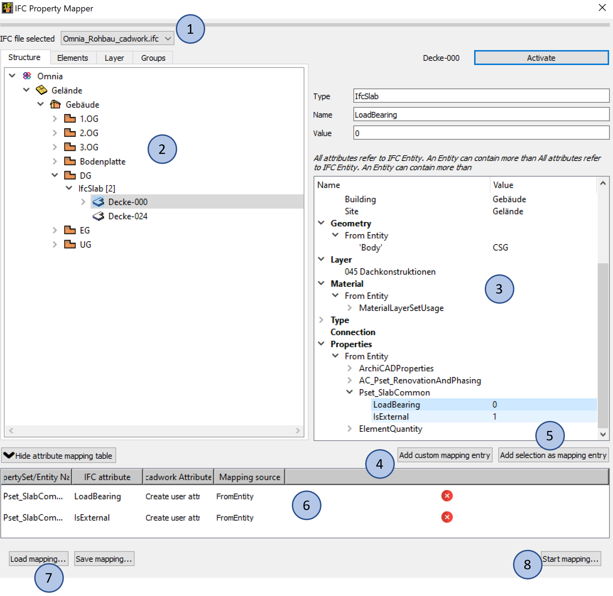

# Property Mapper

1. **Fichier IFC sélectionné**
    * Liste déroulante des fichiers IFC connectés à cadwork 3D. On peut choisir celui depuis lequel nous voulons mapper des attributs, s'il y a plusieurs fichiers importés dans le 3D.

2. **Arborescence du fichier IFC** 
    * Cette vue, identique à celle du BMT, montre la structure hiérarchique du fichier IFC. L'activation bidirectionnelle est également implémentée ici.  

3. **Fenêtre des propriétés IFC**
    * Dans cette fenêtre, les informations sur l'entité (attributs), l'appartenance (structure spatiale), le matériau ainsi que les propriétés sont affichées.  

4. **Nouvelle assignation**
    * Ce bouton permet d'effectuer une assignation, c'est à dire un mappage de propriétés IFC vers un attribut cadwork.
    * Ce mappage s'applique à tous les éléments qui possèdent cette propriété !

5. **Ajouter sélection comme assignation (recommandé)**
    * Dans la fenêtre des propriétés, sélectionnez une propriété (illustration, Property sélectionnée --> Renovation Status) et cliquez ensuite sur "Ajouter sélection comme assignation". Les désignations de la Property sont automatiquement reprises dans les champs de saisie. Si vous activez maintenant la case à cocher "Créer l'attribut utilisateur selon nom propriété" un nouvel attribut est créé à la fin de la liste lors du mappage, si l'attribut n'existe pas encore (voir GIF). Cet attribut reçoit automatiquement le nom du property. 
    * L'entrée du mappage s'applique à tous les éléments qui ont cette propriété !

6. **Listing des propriétés IFC attribuées**
    * Les différents mappages définies sont listées dans le tableau des assignations. 

7. **Charger/Sauver Assignation**
    * Chargement et sauvegarde des assignations spécifiques au projet. Le fichier modèle (.mapping) se trouve dans le dossier du projet, le dossier courant. 

8. **Démarrer assignation**
    * Une fois les assignations créées, il suffit de cliquer sur ce bouton pour démarrer le mappage. 

{: style="width:900px"}

**FromEntity**  
Classe, également entité, classe d'éléments, type d'entité :  
Selon la définition IFC, une entité est une classe d'informations définie par des attributs et des contraintes communs. Pour chaque type d'entité, des attributs ainsi que des relations avec d'autres types d'entités sont définis. Le concept d'héritage orienté objet est mis en œuvre. Cela signifie que les attributs et les relations sont transmis aux sous-types.

!!! Info
    En général, vous devez choisir l'option **FromEntity**. Vous ne devez choisir **FromType** que si ces informations doivent être explicitement prises en compte. Les types d'objets sont utilisés dans les logiciels qui fonctionnent avec des bibliothèques de composants. Des attributs et des propriétés peuvent être affectés à ces objets. Les objets de la bibliothèque de composants servent de modèle lors de la modélisation. Les propriétés du type d'objet (élément de catalogue) peuvent être différentes de celles du type d'entité (propriétés modifiées). 
**FromType**  
Un type d'objet, similaire à la classe, est également une sorte de modèle qui combine les caractéristiques communes de plusieurs instances. Cependant, certains paramètres de base qui restent les mêmes pour les composants récurrents sont définis avant l'instanciation réelle.  
Dans l'IFC, le concept de types d'objets est fourni afin de pouvoir décrire efficacement les composants récurrents. À cette fin, un modèle réutilisable est prédéfini, une sorte de "modèle". Les types d'objets peuvent définir des attributs et des propriétés, qui sont ensuite automatiquement transmis aux objets liés. C'est ce qu'on appelle la pré-instanciation. Lorsque les types d'objets sont réellement instanciés, seules les données, telles que l'emplacement ou les relations avec d'autres objets, sont spécifiées. Ces données ne peuvent pas être spécifiées via les types d'objets.
