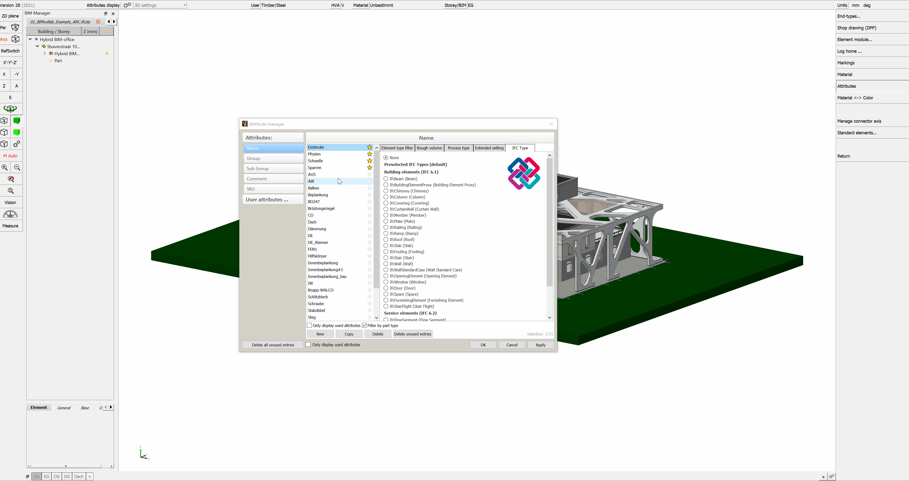

# Modellierung

## IFC Modellaufbau & Export aus cadwork

<figure class="video_container">
  <iframe width="560" height="315" src="https://www.youtube.com/embed/rGLje-72664" title="YouTube video player" frameborder="0" allow="accelerometer; autoplay; clipboard-write; encrypted-media; gyroscope; picture-in-picture" allowfullscreen></iframe>
</figure>

Checkliste Modellaufbau  :bulb:

Im Projektteam muss klar definiert sein, wie die Modelle aufzubauen sind. 

- [X] **Dateiname**
    * Stellen Sie sicher, dass eine einheitliche und konsistente Bezeichnung der (fachspezifischen) Modelle innerhalb des Projekts gewährleistet ist.
- [X] **Lokale Position und Ausrichtung**
    * Die lokale Position des Bauwerks ist abgestimmt und liegt nahe am Nullpunkt
    * Das Festlegen eines einheitlichen Projektkoordinatenursprungs und einheitliche Masseinheiten sind von enormer Bedeutung für das spätere Zusammenfassen der Teilmodelle. Der gemeinsame Referenzpunkt wird als x, y, z Koordinate und dem Winkel zur Nordrichtung (TrueNorth) festgelegt. Alle Projektbeteiligten müssen sich auf diesen Referenzpunkt beziehen. Der Referenzpunkt soll möglichst nahe am Gebäude liegen. 
- [X] **Gebäudegeschosse und Bezeichnung**
    * Bezeichnen Sie Gebäudegeschosse und definieren Sie die richtige Geschosshöhe. Weisen Sie allen Objekten das richtige Geschoss zu. Stellen Sie innerhalb des Projektes sicher, dass durch die Projektbeteiligten die exakte Bezeichnung konsistent genutzt wird, welche numerisch sortiert ist und eine textliche Beschreibung enthält. Alle Modelle, Stockwerke, Bauabschnitte und weitere gemeinsame Inhalte müssen einheitlichen Namenskonventionen folgen. 
    * Alle Fachmodelle sind nach den Gebäude-, Geschoss-, Bezeichnungsvorgaben aufzubauen. 
- [X] **Korrekte Verwendung von Entitäten**
    * Verwenden Sie den jeweils geeigneten IFC-Typ. Beispiel: Wand = ifcWall, Balken = ifcBeam, Stütze = ifcColumn, Treppe = ifcStair, Tür = ifcDoor etc.
    * Da in cadwork nicht mit Objekttools gearbeitet wird, sind die Elemente mit dem korrekten IfcTyp zu bezeichnen. 
- [X] **Detaillierung**
    * Detaillierungsgrade der Modellelemente für den Datenaustausch sind unter den Projektbeteiligten zu definieren. Elementen können viele Eigenschaften zugewiesen werden, doch nicht alle sind in jedem Projekt notwendig. Um ein unnötiges Anwachsen der Datenmenge sowie zu einer besseren Übersicht, sollte rechtzeitig festgelegt werden, welche Eigenschaften effektiv benötigt werden. 

## IFC Typen  :bulb:

Cadwork Element         | Anwendung                                             | IFC-Typ
------------------------|-------------------------------------------------------|-------------
Stab                    | Dachbauteile, Rahmenholz, Streben, etc. Ein IfcMember ist ein Strukturelement, das dazu dient, Lasten zwischen oder über Stützpunkte hinaus zu tragen. Es ist nicht erforderlich, dass es tragend ist. Die Ausrichtung des Stabs (horizontal, vertikal oder schräg) ist für seine Definition nicht relevant (im Gegensatz zu IfcBeam und IfcColumn).  (Anwendungsbeispiele: Strebe, Ständer, Balken, Ausholzung) | IfcMember
Stab	                | Ein IfcBeam ist ein waagerechtes oder nahezu waagerechtes Bauteil, das in erster Linie durch Biegung belastet werden kann  (Anwendungsbeispiele: Unterzug, Träger)| IfcBeam
Stab	                | IfcColumn ist ein vertikales oder nahezu vertikales Bauteil, das durch Druck das Gewicht der darüber liegenden Struktur auf andere darunter liegende Strukturelemente überträgt. Es ist jedoch nicht erforderlich, dass es tragend ist. (Anwendungsbeispiel: vertikale Stütze)| IfcColumn
Platte	                | Eine IfcPlatte ist ein planes und oft flaches Teil mit konstanter Dicke. Eine Platte kann ein Strukturteil sein, das Lasten zwischen oder über Stützpunkte hinaus trägt, sie muss jedoch nicht tragend sein. Die Lage der Platte (horizontal, vertikal oder schräg) ist für ihre Definition nicht relevant (im Gegensatz zu IfcWall und IfcSlab (als Bodenplatte)). (Anwendungsbeispiel: Beplankung) | IfcPlate
Platte	                | Ein Fundament ist ein Teil des Fundaments einer Struktur, der die Last auf den Boden verteilt und überträgt. Ein Fundament wird auch als Flach-gründung bezeichnet, bei der die Lasten in den Boden nahe der Oberfläche eingeleitet werden (Anwendungsbeispiel: Fundament) | IfcFooting
Platte	                | Eine Decke ist eine Komponente der Konstruktion, die normalerweise einen Raum vertikal umschliesst. Die Platte kann die untere Auflage (Fussboden) oder die obere Konstruktion (Dachplatte) in einem beliebigen Raum in einem Gebäude bilden. Es ist zu beachten, dass nur der Kern oder der konstruktive Teil dieser Konstruktion als Decke gilt. Der obere Abschluss (Fussboden, Dachhaut) und der untere Abschluss (Decke, abgehängte Decke) gelten als Belag. (Anwendungsbeispiel: Decken-, Dachelement, Bodenplatte) | IfcSlab
Fläche, Hilfsvolumen, Platte | Definition für Elemente, welche einen Teil eines anderen Elements abdecken und von diesem anderen Element abhängig ist.  (Anwendungsbeispiel: Oberfläche, Beschichtung, Behandlung). |IfcCovering
Platte	                | Vorhangfassade, nicht tragende Wand, die an der Aussenseite eines Gebäudes steht und dieses umschliesst. (Anwendungsbeispiel: Vorhangfassade) | IfcCurtainWall
Platte	                | Die Wand stellt eine vertikale Konstruktion dar, die Räume begrenzen oder gliedern kann. Wände sind in der Regel vertikale oder nahezu vertikale, flächige Elemente, die oft für die Aufnahme von statischen Lasten ausgelegt sind. Eine Wand muss jedoch nicht tragend sein  (Anwendungsbeispiel: Wand) | IfcWall
Raum                    | Ein Raum stellt eine tatsächlich oder theoretisch begrenzte Fläche oder ein Volumen dar. Räume sind Flächen oder Volumina, die bestimmte Funktionen innerhalb eines Gebäudes bereitstellen. | IfcSpace
Öffnung	                | Das Öffnungselement steht für Öffnungen (Fenster-, Türöffnung).  (Anwendungsbeispiel: Öffnung) | IfcOpeningElement
Achse (VBA, Bolzen)	    | Ein mechanisches Verbindungselement, das Bauelemente oder Teile mechanisch verbindet. Eine einzelne Instanz dieser Klasse kann ein oder mehrere tatsächliche mechanische Verbindungselemente darstellen, z. B. eine Reihe von Bolzen, Schrauben oder eine Reihe von Nägeln  (Anwendungsbeispiel: Bolzen, Verbindungsmittel) | IfcMechanicalFastener
Achse (VBA, Bolzen), Hilfsvolumen	    | Leimfuge: Eine Befestigungsverbindung, bei der Leim ver-wendet wird, um Elemente miteinander zu ver-binden.  Schweissnaht: Eine Schweissnaht, die zum Zusammenfügen von Bauelementen verwendet wird.  Fugenmörtel: Mörtel, der zum Zusammenfügen von Bauele-menten verwendet wird. Die Festigkeit der Ver-bindung kann bei Berechnungen berücksichtigt werden.  (Anwendungsbeispiel: Schweissnaht, Leimfuge, Fugenmörtel) | IfcFastener
Variante Fenster        | Konstruktion zum Verschliessen einer vertikalen oder nahezu vertikalen Öffnung in einer Wand oder einem Schrägdach, die Licht und ggf. Frischluft einlässt  (Anwendungsbeispiel: Fenster) | IfcWindow
Variante Türe	        | Konstruktion zum Verschliessen einer Öffnung, die in erster Linie für den Zugang mit Scharnier-, Dreh- oder Schiebebetrieb vorgesehen ist  (Anwendungsbeispiel: Türe) | IfcDoor
Treppe                  | Ein vertikaler Durchgang, der es den Bewohnern ermöglicht, von einer Geschossebene zu einer anderen Geschossebene auf einer anderen Höhe zu gehen (zu treten). Es kann ein Podest als Zwischenbodenplatte enthalten sein. (Anwendungsbeispiel: Treppe) | IfcStair
Treppe (Stab/Platte)    | Die Treppenstufen und eventuelle Wangen sind in diesem Objekt enthalten. | IfcStairFlight
Installation rund       | Das Verteilungsfluss-Element IfcFlowSegment definiert das Vorkommen eines Segments eines Flussverteilungssystems, das typischerweise gerade und zusammenhängend ist und zwei Anschlüsse hat (z. B. ein Abschnitt eines Rohrs oder Kanals). (Anwendungsbeispiel: Leitungen) | IfcFlowSegment
Diverse                 | Das Geländer ist eine Rahmenkonstruktion, die an den Verkehrsflächen und an einigen Raumbegrenzungen anstelle von Wänden oder als Ergänzung zu Wänden verwendet wird. | IfcRailing
Diverse	                | Der Typ BuildingElementProxy soll verwendet werden, um spezielle Typen von Gebäudeelementen auszutauschen, für die es im aktuellen IFC-Release noch keine semantische Definition gibt.  (Anwendungsbeispiel: Unbestimmte, im IFC Schema nicht klassifizierte Bauteile) | IfcBuildingElementProxy

Weitere IFC-Typen sind unter Modifizieren -> Attribute -> BIM -> IFC Typ wählbar.  
Die dokumentierten IFC-Typen finden Sie in der IFC Dokumentation von building-smart   [IFC-Entities Auflistung](https://standards.buildingsmart.org/IFC/RELEASE/IFC4/ADD2_TC1/HTML/){target=_blank} :point_left: 

IFC-Typ Zuweisungen unter Benutzereinstellungen -> Liste der Attribute vordefinieren
{: style="width:900px"}

## IfcProject - IfcSite

Die Bezeichnung des IfcProject sowie der IfcSite sind in den Projektdaten vorzunehmen.  
Projektdaten -> Allgemein -> **Projektname** (IfcProject) 
Projektdaten -> Projektort -> **Ortsbeschreibung Baustelle** (IfcSite)

