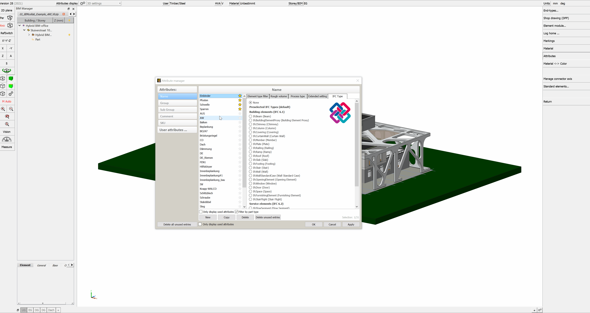
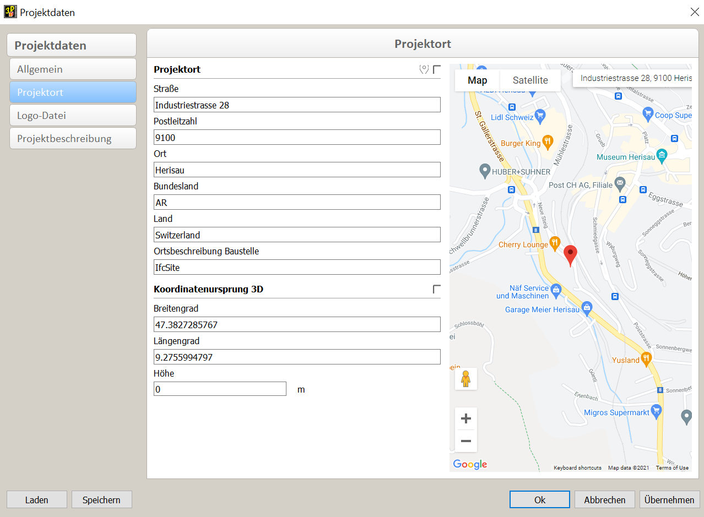

# Modeling

## IFC model setup & cadwork export

:bulb:
The project team must clearly define how the models are to be built. 

- [X] **Filename**
    * Always ensure uniform and consistent naming of aspect models within a project.
- [X] ** Local positioning**
    * Coordinate the local posititon of all the aspect models, close to the point of origin.
	* The definition of a uniform project coordinate origin and uniform units of measurement are of enormous importance for the later merging of the submodels. The common reference point is defined as x, y, z coordinates and the angle to the north direction (TrueNorth). All project participants must refer to this reference point. The reference point should be as close as possible to the building. 
- [X] **Construction level arrangement and naming**
    * Name storeys and define correct storey height. Assign the right storey to each element. Ensure that all stakeholders use consistent naming, sorted numerical with an alphanumeric description. All models, storeys, building sections and common content must follow uniform naming content. 
- [X] **Correct use of entities**
    * Use the most appropriate entitiy for the object and supplement it with a TypeEnumeration where possible. Examples: wall = ifcWall, beam = ifcBeam, column = ifcColumn, staircase = ifcStair, door = ifcDoor etc.
    * There are no objecttools available in cadwork, therefore you nee to assign a correct IfcType. 
- [X] **Detailing**
    * Levels of detail of model elements for data exchange are to be defined among project participants. Many properties can be assigned to elements, but not all of them are necessary in every project. In order to avoid an unnecessary increase in the amount of data as well as for a better overview, it should be determined in time which properties are effectively needed. 
	
## IFC types  :bulb:

cadwork element | Anwendung | IFC-type
----------------------------|-------------------------------------------------------|-------------
Beam | Roof members, framing lumber, braces, etc. An IfcMember is a structural element used to support loads between or beyond support points. It is not required to be load-bearing. The orientation of the member (horizontal, vertical or oblique) is not relevant to its definition (unlike IfcBeam and IfcColumn).  (example: strut, post, beam, logging) | IfcMember
Beam | An IfcBeam is a horizontal or nearly horizontal structural element that can be loaded primarily by bending  (examples: downstand beam, girder).| IfcBeam
Beam | IfcColumn is a vertical or near-vertical structural member that transfers the weight of the structure above it to other structural elements below it by applying pressure. It is not required to be load bearing. (example: vertical support) (Anwendungsbeispiel: vertikale Stütze)| IfcColumn
Panel | An IfcPlate is a planar and often flat part with constant thickness. A slab can be a structural member that carries loads between or beyond support points, but it need not be load-bearing. The position of the slab (horizontal, vertical or inclined) is not relevant to its definition (unlike IfcWall and IfcSlab (as a floor slab)). (example: planking). | IfcPlate
Panel | A footing is a portion of the foundation of a structure that distributes and transfers the load to the ground. A foundation is also called a shallow foundation, where the loads are transferred to the ground near the surface. (example: foundation)| IfcFooting
Panel | A slab is a component of construction that normally encloses a room vertically. The slab can be the lower support (floor) or the upper structure (roof slab) in any room in a building. It should be noted that only the core or structural part of this construction is considered a ceiling. The upper finish (floor, roof panel) and the lower finish (ceiling, suspended ceiling) are considered as covering.   Application example: ceiling, roof element, floor slab) | IfcSlab
Surface, auxiliary volume, panel | Definition for elements which cover a part of another element and is dependent on this other element.  (example: surface, coating, treatment)|IfcCovering.
Panel | Curtain wall, non-load-bearing wall that stands on the outside of a building and encloses it. (example: curtain wall)| IfcCurtainWall
Wall | The wall represents a vertical structure that can delimit or divide spaces. Walls are usually vertical or nearly vertical, planar elements that are often designed to support static loads. A wall does not have to be load-bearing. (example: wall)| IfcWall
Room | A room represents an actual or theoretical bounded area or volume. Rooms are areas or volumes that provide certain functions within a building.  | IfcSpace
Opening | The opening element represents openings (window, door opening). (example: opening) | IfcOpeningElement
Axis  (Connector axis bolt)	| A mechanical fastener that mechanically connects building elements or parts. A single instance of this class may represent one or more actual mechanical fasteners, e.g. a series of bolts, screws, or a series of nails.  (example: bolts, mechanical fasteners) | IfcMechanicalFastener
Axis  (Connector axis bolt)	| Glue joint: A fastening joint in which glue is used to join elements together. Weld: A weld used to join building elements together. Grout: Mortar used to join building elements together. The strength of the joint can be taken into account in calculations.  (Application example: welding seam, glue joint, grout). | IfcFastener
Variant opening | Konstruktion zum Verschliessen einer vertikalen oder nahezu vertikalen Öffnung in einer Wand oder einem Schrägdach, die Licht und ggf. Frischluft einlässt  (Anwendungsbeispiel: Fenster) | IfcWindow
Variant door | Construction for closing a vertical or nearly vertical opening in a wall or pitched roof that lets in light and possibly fresh air  (example of use: door) | IfcDoor
Staircase | A vertical passageway that allows occupants to walk (step) from one floor level to another floor level at a different elevation. A landing may be included as an intermediate floor panel. (example: stairs) | IfcStair
Staircase(beam, panel) | The stair treads and any stringers are included in this object. | IfcStairFlight
Circular MEP | The distribution flow element IfcFlowSegment defines the occurrence of a segment of a flow distribution system that is typically straight and contiguous and has two connections (e.g. a section of pipe or duct). (example: conduits) | IfcFlowSegment
Diverse | Railing is a framing structure used at circulation areas and at some space boundaries in place of or as an addition to walls. | IfcRailing
Diverse| The type BuildingElementProxy shall be used to exchange special types of building elements for which there is no semantic definition in the current IFC release yet. (example: undefined building elements not classified in the IFC schema) | IfcBuildingElementProxy

Further IFC types can be selected under Modify -> BIM -> IFC Type.   
The documented IFC types can be found in the IFC documentation from building-smart   [IFC-Entities Auflistung](https://standards.buildingsmart.org/IFC/RELEASE/IFC4/ADD2_TC1/HTML/){target=_blank} :point_left: 

Preset IFC-type-assignemnts can be set at Userp -> Timber... -> Attributes; Preselected IFC types.
{: style="width:900px"}

## IfcProject - IfcSite

The name of the IfcProject as well as the IfcSite are to be made in the project data. 
Preferences (top menu) -> Project data -> General -> **Project name** (IfcProject) 
Preferences (top menu) -> Project data -> Project location _> **Site description** (IfcSite)

