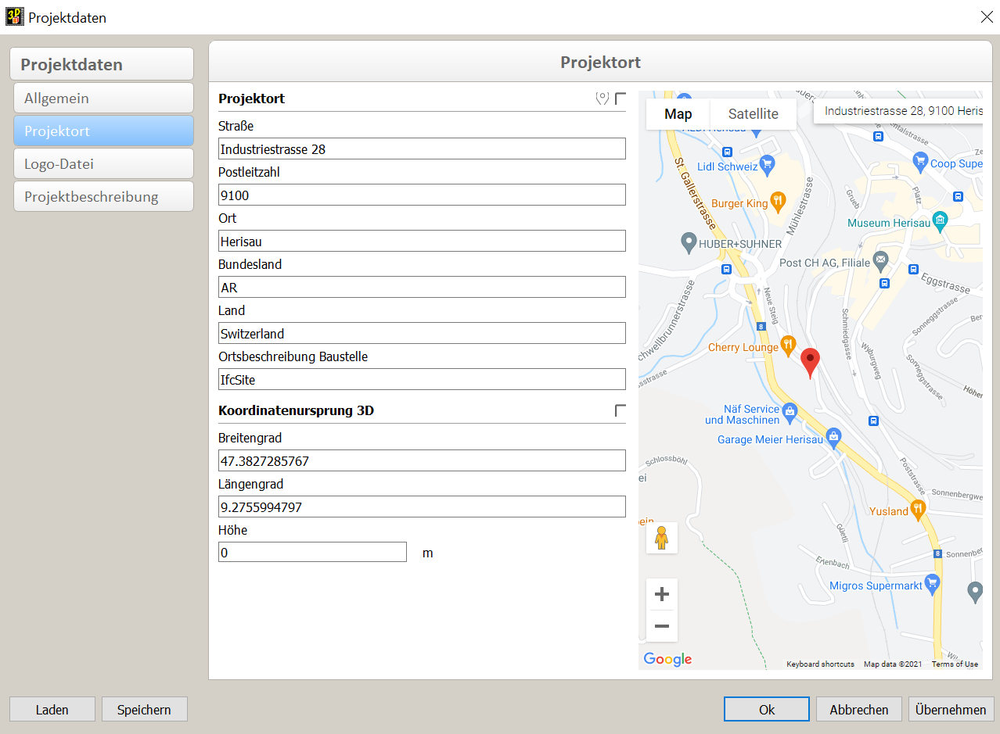

# Modélisation

## Construction de modèles IFC & export à partir de cadwork

Liste de contrôle pour la construction de modèles  :bulb:

L'équipe de projet doit définir clairement comment les modèles doivent être construits.

- [X] **Nom de fichier**
    * Veillez à ce qu'une désignation uniforme et cohérente des modèles (spécifiques à un domaine) soit garantie au sein du projet.
- [X] **Position et orientation locales**
    * La position locale de l'ouvrage est harmonisée et proche du point zéro
    * La définition d'une origine uniforme des coordonnées du projet et d'unités de mesure uniformes est d'une importance énorme pour le regroupement ultérieur des modèles partiels. Le point de référence commun est défini par les coordonnées x, y, z et l'angle par rapport à la direction du nord (TrueNorth). Tous les participants au projet doivent se référer à ce point de référence. Le point de référence doit être le plus proche possible du bâtiment.
- [X] **Étages (Storey) des bâtiments et désignation**
    * Désignez les étages du bâtiment et définissez la bonne hauteur d'étage. Attribuez le bon étage à tous les objets. Assurez-vous que les participants au projet utilisent de manière cohérente la désignation exacte, qui est triée numériquement et contient une description textuelle. Tous les modèles, étages, phases de construction et autres contenus communs doivent suivre des conventions de dénomination uniformes.
    * Tous les modèles spécialisés doivent être construits selon les prescriptions relatives aux bâtiments, aux étages et aux désignations. 
- [X] **Utilisation correcte des entités**
    * Utilisez le type IFC approprié. Exemple : Mur = ifcWall, poutre = ifcBeam, poteau = ifcColumn, escalier = ifcStair, porte = ifcDoor, etc.
    * Comme nous ne travaillons pas avec des objets dans cadwork, les éléments doivent être désignés avec le type Ifc correct.
- [X] **Détails**
    * Les niveaux de détail des éléments du modèle pour l'échange de données doivent être définis entre les participants au projet. De nombreuses propriétés peuvent être attribuées aux éléments, mais toutes ne sont pas nécessaires dans chaque projet. Afin d'éviter une augmentation inutile de la quantité de données et d'obtenir une meilleure vue d'ensemble, il convient de définir les propriétés qui sont effectivement nécessaires. 

## Types IFC  :bulb:

Élément Cadwork         | Application                                            | Type IFC
------------------------|-------------------------------------------------------|-------------
Barre                    | Éléments de toiture, bois d'encadrement, entretoises, etc. Un IfcMember est un élément structurel qui sert à supporter des charges entre ou au-delà de points d'appui. Il n'est pas nécessaire qu'il soit porteur. L'orientation de la barre (horizontale, verticale ou oblique) n'est pas pertinente pour sa définition (contrairement à IfcBeam et IfcColumn).  (exemples d'application : entretoise, montant, poutre, écharpe)| IfcMember
Barre	                | Un IfcBeam est un élément de construction horizontal ou presque horizontal qui peut être sollicité principalement en flexion.  (Exemples d'application : poutre, solive, panne.)| IfcBeam
Barre	                | IfcColumn est un élément de construction vertical ou presque vertical qui transmet le poids de la structure située au-dessus à d'autres éléments de structure situés en dessous. Il n'est toutefois pas nécessaire qu'il soit porteur. (exemple d'application : poteau, support vertical)| IfcColumn
Panneau	                | Un IfcPlate est une pièce plane et souvent plate d'épaisseur constante. Une dalle peut être un élément structurel qui supporte des charges entre ou au-delà des points d'appui, mais elle ne doit pas nécessairement être porteuse. La position de la dalle (horizontale, verticale ou inclinée) n'est pas pertinente pour sa définition (contrairement à IfcWall et IfcSlab (en tant que dalle de plancher)).br>(exemple d'application : parement)| IfcPlate
Panneau	                | Une fondation est une partie des fondations d'une structure qui répartit et transfère la charge sur le sol. Une fondation est également appelée fondation superficielle, dans laquelle les charges sont transmises dans le sol près de la surface. (Exemple d'application : fondation) | IfcFooting
Panneau	                | Une dalle est un élément de construction qui entoure normalement une pièce verticalement. La dalle peut être le support inférieur (plancher) ou la structure supérieure (dalle de toit) de n'importe quelle pièce d'un bâtiment. Il convient de noter que seule la partie centrale ou structurelle de cette construction est considérée comme un plafond. La finition supérieure (plancher, panneau de toiture) et la finition inférieure (plafond, faux plafond) sont considérées comme un revêtement. Exemple d'application : élément de plafond, de toit, dalle de sol) | IfcSlab
Surface, Volume auxiliaire, panneau | Définition pour les éléments qui couvrent une partie d'un autre élément et qui dépendent de cet élément.  (exemple d'application : surface, revêtement, traitement). |IfcCovering
Panneau	                | Mur-rideau, mur non porteur qui se trouve à l'extérieur d'un bâtiment et qui l'entoure. (Exemple d'application : mur-rideau)| IfcCurtainWall
Panneau	Paroi                | Le mur représente une construction verticale qui peut délimiter ou diviser des espaces. Les murs sont généralement des éléments plans verticaux ou presque verticaux, souvent conçus pour supporter des charges statiques. Un mur ne doit toutefois pas être porteur (exemple d'application : mur) | IfcWall
Pièce                    | Une pièce représente une surface ou un volume réellement ou théoriquement limité. Les pièces sont des surfaces ou des volumes qui assurent certaines fonctions au sein d'un bâtiment.| IfcSpace
Ouverture (porte / fenêtre)                | L'élément d'ouverture représente les ouvertures (ouverture de fenêtre, de porte).  (Exemple d'application : ouverture) | IfcOpeningElement
Axe d'assemblage	    | Un élément de fixation mécanique qui relie mécaniquement des éléments de construction ou des pièces. Une seule instance de cette classe peut représenter un ou plusieurs éléments de fixation mécanique réels, par exemple une série de boulons, de vis ou une série de clous.  (exemple d'application : boulons, moyens de fixation)| IfcMechanicalFastener
Axe d'assemblage, volume auxiliaire	    | Joint de colle : un joint de fixation dans lequel de la colle est utilisée pour relier des éléments entre eux.  Soudure : une soudure utilisée pour assembler des éléments de construction.  Mortier de jointoiement : mortier utilisé pour assembler des éléments de construction. La résistance du joint peut être prise en compte dans les calculs.  (exemple d'application : cordon de soudure, joint de colle, mortier de joint) | IfcFastener
Fenêtre (Architecture)        | Construction permettant de fermer une ouverture verticale ou presque verticale dans un mur ou un toit incliné, laissant passer la lumière et éventuellement l'air frais. (exemple d'application : fenêtre)| IfcWindow
Porte (Architecture)	        | Construction permettant de fermer une ouverture destinée principalement à l'accès par charnières, par rotation ou par coulissement  (exemple d'application : porte)| IfcDoor
Escalier                  | Un passage vertical qui permet aux occupants de passer (marcher) d'un niveau d'étage à un autre niveau d'étage à une hauteur différente. Il peut inclure un palier servant de plancher intermédiaire.br>(exemple d'application : escalier) | IfcStair
Escalier (barre/panneau)    | Les marches d'escalier et les limons éventuels sont inclus dans cet objet. | IfcStairFlight
Gaine technique (Installation CVC)      | L'élément de flux de distribution IfcFlowSegment définit l'occurrence d'un segment d'un système de distribution de flux, typiquement droit et contigu, avec deux raccords (par exemple, une section de tuyau ou de canal). (Exemple d'application : Tubes, Tuyaux, gaines) | IfcFlowSegment
Divers                 | Le garde-corps est une construction en cadre utilisée sur les zones de circulation et sur certaines limites de pièces à la place des murs ou en complément des murs.| IfcRailing
Divers	                | Le type IfcBuildingElementProxy doit être utilisé pour échanger des types spéciaux d'éléments de construction pour lesquels il n'existe pas encore de définition sémantique dans la version actuelle de l'IFC.  Exemple d'application : éléments de construction indéterminés, non classés dans le schéma IFC) | IfcBuildingElementProxy

D'autres types d'IFC sont disponibles sous Modifier -> BIM -> IFC Type (Type IFC).  
Vous trouverez les types IFC documentés dans la documentation IFC de building-smart   [Liste des entités IFC](https://standards.buildingsmart.org/IFC/RELEASE/IFC4/ADD2_TC1/HTML/){target=_blank} :point_left: 

Attributions de type IFC sous Préférences -> Option -> Attributs -> Prédéfinir le type IFC dans la liste des attributs en fonction du nom.
{: style="width:900px"}

## IfcProject - IfcSite

La désignation de l'IfcProject ainsi que de l'IfcSite doit être effectuée dans les données du projet. 
Préférences (Menu Windows)-> Données du projet -> Généralités -> **Nom du projet** (IfcProject) 
Préférences (Menu Windows)-> Données du projet -> Emplacement du projet ->**Description du site** (IfcSite)

