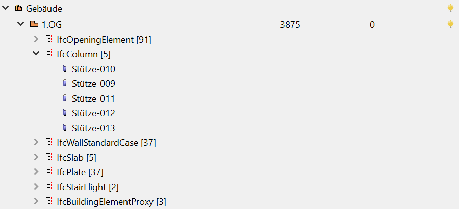
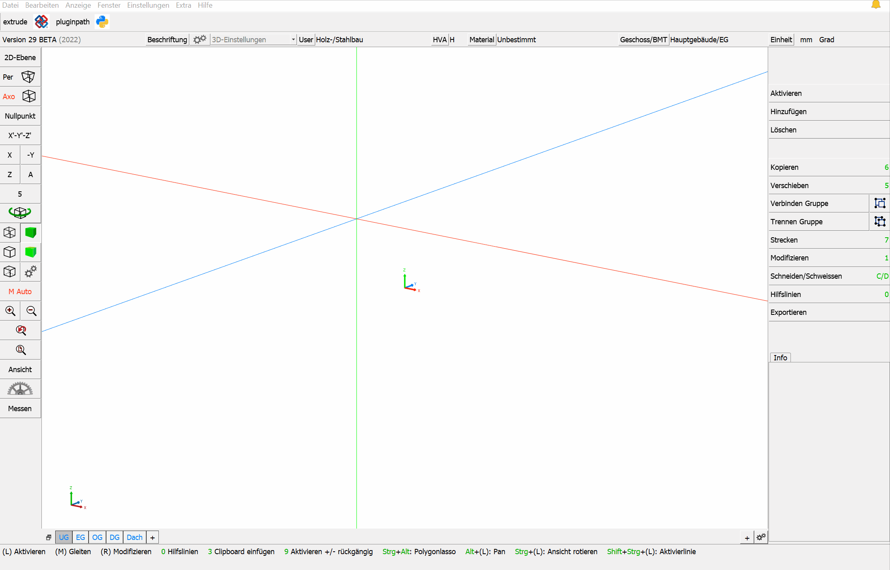
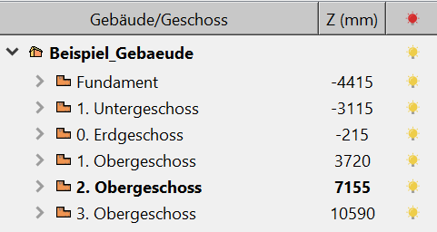
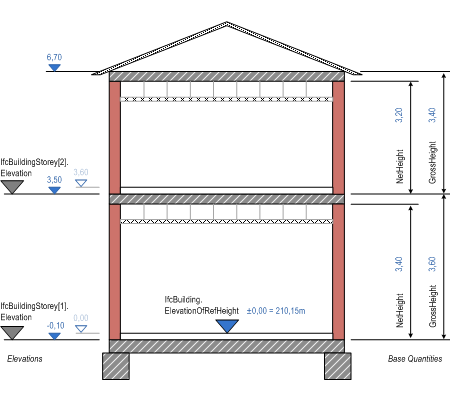
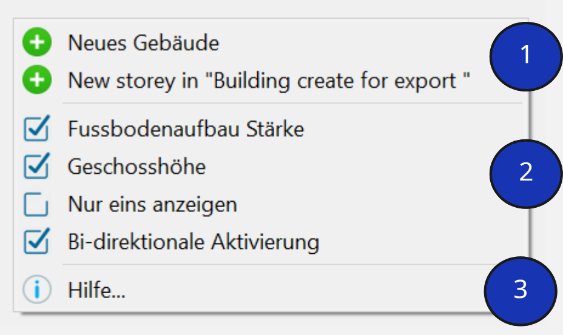
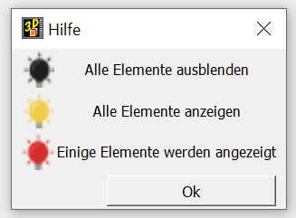
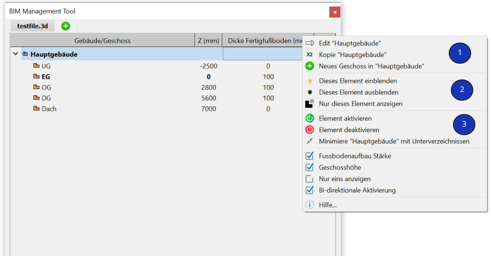
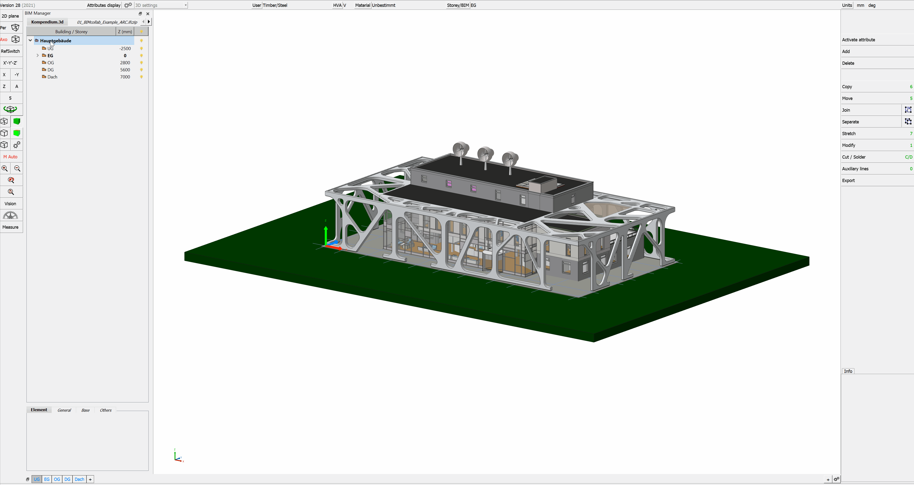

# Geschossmanager

Der Geschossmanager dient zur Strukturierung des Projekts. Im Geschossmanager lassen sich Gebäude und zugehörige Geschosse erstellen. 
Mit dem BIM-Management-Tool lassen sich Gebäude und Geschosszugehörigkeiten innerhalb von cadwork steuern. Anstelle der früheren Geschossstruktur über die Baugruppe kommt ab der Version 27 der Geschossmanager (BMT) zum Einsatz. 
Das Tool ermöglicht eine übersichtliche, strukturierte Ordnung der Geschosse und der zugehörigen Bauteile. 

{: style="width:900px"}

## Geschossmanager – BIM Management Tool  
Der Geschossmanager bzw. das BIM Management Tool (kurz: BMT) kann entweder an das linke oder 
rechte Menü angedockt, oder als zusätzliches Fenster genutzt werden.

Der Geschossmanager lässt sich über Fenster --> BIM Management Tool, oder in der oberen Konfigurationsleiste, durch klicken auf den Button "Geschoss/BMT" öffnen.

{: style="width:900px"}

## Das Geschoss
Ein Geschoss, auch Etage, Stockwerk und Stock, ist die Gesamtheit aller Räume in einem Gebäude, die auf einer Zugangsebene liegen und horizontal verbunden sind. Es ist möglich, dass ein Geschoss Höhenunterschiede aufweist. Entscheidend ist aber die horizontale Zusammengehörigkeit der Räume. Der Begriff wird heute unabhängig von der Art der Gebäudekonstruktion verwendet. [Quelle: Wikipedia](https://de.wikipedia.org/wiki/Geschoss_(Architektur))

Viele CAD-Software benötigen zusätzlich zur Geschossstruktur definierte Höhenangaben. In den Geschosseinstellungen können daher die Höhen definiert werden. 
Die Höhe ist, IFC-konform, immer als Oberkante Rohfussboden zu sehen (als Attribut IfcBuildingstorey: Elevation).

{: style="width:300px"}

Ein Geschoss umfasst jeweils die Decke und die sich "darauf befindenden" Bauteile (Wände, Stützen, etc.). 

{: style="width:600px"}

## Das Kontext Menü
Mit einem Rechtsklick in das BIM-Management-Tool öffnet sich das Kontext-Menü.
Über das Kontext-Menü lassen sich diverse Einstellungen vornehmen. Die Optionen im Kontext-Menü unterscheiden sich bei einem Rechtsklick auf ein Gebäude und einem Rechtsklick in den leeren Bereich des BMT.

### Rechtsklick in den leeren Bereich

{: style="width:400px"}

1. Erstellen eines neuen Gebäudes, oder ergänzen eine Geschosses im bestehenden Gebäude. 
2. Verhalten BMT
    * Anzeigen der Fussbodenaufbau-Stärke. Die Fussbodenaufbau-Stärke wird als absoluten Wert "eingegeben". 
    * Anzeigen der Geschosshöhe. Die Geschosshöhe wird in der Regel über die Oberkante Rohboden definiert. 
    * Nur ein Gebäude sichtbar zeigen
    * [Bi-direktionale Aktivierung](../1.Import/import.de.md#bi-direktionale-aktivierung)
3. Hilfe  
    * Unter "Hilfe" wird die Bedeutung der "Ampelsteuerung" bezogen auf die Sichtbarkeit der Elemente erläutert. 

    {: style="width:300px"}

### Rechtsklick auf ein bestehendes Gebäude

{: style="width:900px"}

1. Konfiguration Gebäude/Geschoss  
{: style="width:900px"}
2. Sichtbarkeit
    * Über die drei Schaltflächen, lässt sich die Sichtbarkeit der Elemente steuern. 
3. Zustand Elemente / Minimieren der Unterverzeichnisse
    * Elemente aktivieren / deaktivieren
    * aufgeklappte Verzeichnisse lassen sich über diese Schaltfläche minimieren

## Elemente zu Gebäude / Geschoss zuweisen

**Option A**

* Doppelklick auf das Geschoss im BMT -> aktiviert das Gebäude & Geschoss
    * neu modellierte Elemente werden direkt diesem Gebäude & Geschoss zugewiesen

**Option B**

* Bauteile aktivieren -> Modifizieren -> BIM -> Gebäude (Auswahl Gebäude) -> Geschoss (Auswahl Geschoss)

