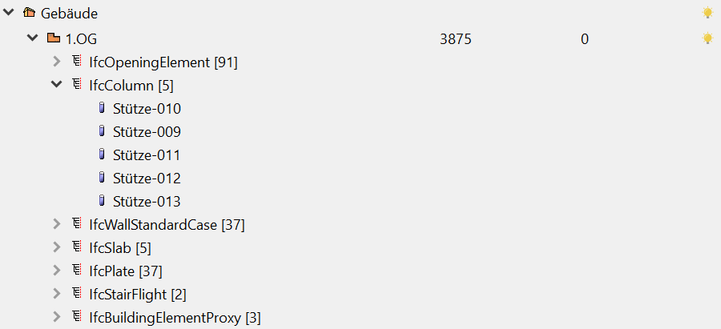
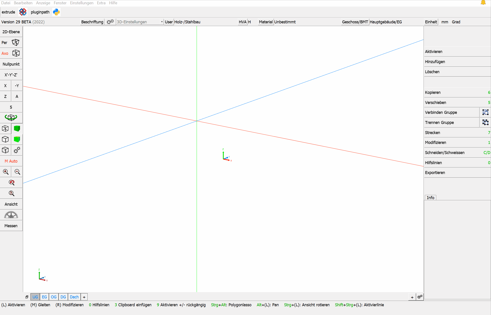
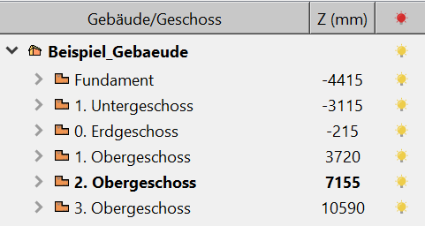
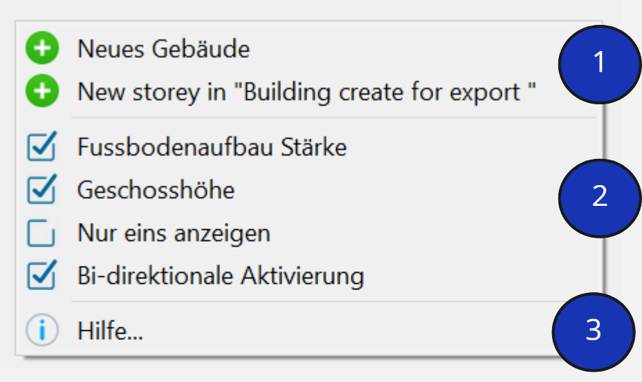

# Gestionnaire d'étage (Storey)

Le gestionnaire d'étages sert à structurer le projet. Le gestionnaire d'étages permet de créer des bâtiments et des étages correspondants. 
L'outil de gestion BIM permet de piloter les bâtiments et les appartenances d'étages au sein de cadwork. A partir de la version 27, le gestionnaire d'étages (BMT) remplace l'ancienne structure d'étages. 
Cet outil permet de classer les étages et les éléments de construction correspondants de manière claire et structurée. 

## BIM Management Tool - Outil de gestion BIM  
Le BIM Management Tool (BMT) peut être ancré au menu de gauche ou au menu de droite, soit utilisé comme fenêtre supplémentaire.

Le BMT peut être ouvert via fenêtre --> BIM Management Tool, ou dans la barre de configuration supérieure, en cliquant sur le bouton "Storey (Etage)/BMT".

{: style="width:900px"}

## Les étages (Storey)
Un étage, également appelé storey, est l'ensemble des pièces d'un bâtiment situées à un même niveau d'accès et reliées horizontalement. Il est possible qu'un étage présente des différences de hauteur. Toutefois, le facteur décisif est que les pièces soient reliées horizontalement. Le terme est utilisé quel que soit le type de construction.

De nombreux logiciels de CAO exigent des hauteurs définies en plus de la structure du plancher. Par conséquent, les hauteurs peuvent être définies dans les paramètres du plancher. La hauteur, conforme à l'IFC, doit toujours être considérée comme le bord supérieur du plancher non fini (comme attribut IfcBuildingstorey : Elevation).

{: style="width:300px"}

Un étage comprend toujours le plafond et les éléments de construction qui se trouvent "dessus" (murs, piliers, etc.). 

{: style="width:600px"}

## Le menu contextuel
Un clic droit dans l'outil de gestion du BIM, le BMT, ouvre le menu contextuel. Le menu contextuel permet d'effectuer divers réglages. En fonction de l'endroit où nous cliquons "droit", nous obtiendrons des options différentes: clic droit sur un bâtiment ou un clic droit dans la zone vide du BMT.

### Clic droit dans la zone vide de BMT

{: style="width:400px"}

1. Création d'un nouveau bâtiment et création d'un nouvel étage dans le bâtiment actif.
2. Option d'affichage dans le BMT
    * Épaisseur du sol fini: L'épaisseur du sol fini est la différence entre l'altimétrie du sol fini et de l'étage (storey), sol brut. Epaisseur de charge.
    * Altimétrie de l'étage: La hauteur de l'étage est basée sur le dessus du sol brut. Voir ci dessus.
    * Un étage, storey visible: Seul l'étage sélectionné est visible, les autres sont masqués.
    * Contrôle bi-directionnel activé: 
3. Aide 
    * La signification du système d'ampoule de BMT est rappelée.

    {: style="width:300px"}

### Clic droit sur un bâtiment existant / sur un étage existant de BMT

{: style="width:900px"}

1. Configuration du bâtiment/étage  
{: style="width:900px"}
2. Paramètres de visibilité
    * Trois options de filtrage pour la visibilité de l'élément choisi.
3. Affichage de l'arborescence IFC
    * Activer ou désactiver des éléments dans l'arborescence choisie.
    * Développer ou réduire l'élément sélectionné, bâtiments/étages ou Type IFC.

## Affecter des éléments à un bâtiment/étage

**Option A**

* Double-cliquez sur l'étage dans le BMT pour activer le bâtiment/étage.
    * Les nouveaux éléments créés sont directement affectés à ce bâtiment/étage.

**Option B**

* Les éléments activés peuvent être affectés à des bâtiments/étages existants via Modifier -> BIM -> Bâtiment ou via Modifier -> BIM -> Étage.

