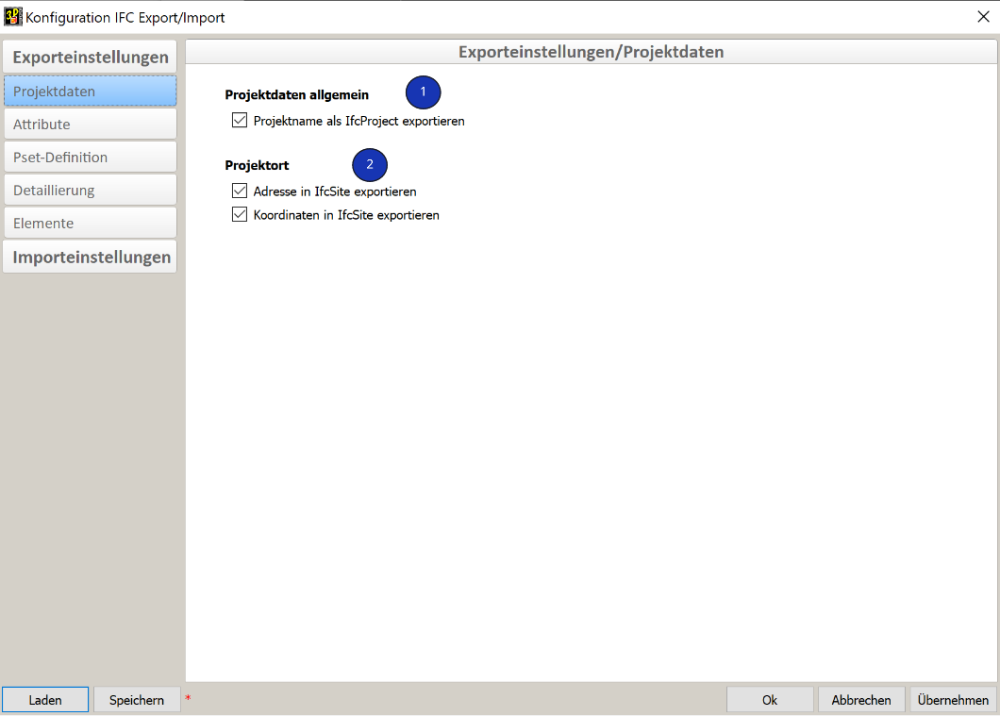

# Export

Der IFC-Export Konfigurationsdialog lässt sich via Exportieren --> Dateien... --> IFC-Datei öffnen. 

## Projektdaten

[Definition Projektname & Projektort](../2.Modellierung/modelling.de.md#ifcproject-ifcsite)

1. **Projektdaten allgemein**
    * Die Checkbox steuert, ob der Projektname ins IfcProject übernommen wird. 

2. **Projektort**
    * Die Checkbox steuert, ob die Angaben zum Projektort beim IFC-Export übernommen werden. 

## Attribute

1. **IFC-Layer**
    * Mit dem IFC-Layer bietet sich bei diversen Software eine weitere Möglichkeit zur Strukturierung der Daten. Empfohlen wird die Zuweisung des Attributs **Name**. 
2. **IFC-Tag**
    * Der Tag- (oder Label-) Identifikator für die jeweilige Instanz eines Produkts, ist z. B. die Seriennummer oder die Positionsnummer. Empfohlen wird die Zuweisung der Produktionsnummer. 
3. **Cadwork3dProperties**
    * cadwork schreibt standardmässig das PropertySet **Cadwork3dProperties**. In diesem PropertySet werden alle verwendeten Standard-, sowie Userattribute erfasst. 
4. **PropertySet Cadwork3dProperties**
    * Die Checkbox steurt, ob die Cadwork Attribute im PropertySet Cadwork3dProperties exportiert werden sollen. 
    * Die eingerückte Checkbox kommt dann zum Einsatz, wenn weitere Pset-Definitionen vorgenommen wurden. Diese Option verhindert, dass Attribute doppelt exportiert werden. 

##  Pset-Definition

Für den **"Advanced User"** gibt es die Möglichkeit eigene Psets anzulegen. Dies können entweder Standard-Psets wie z.B. das Pset_BeamCommon, oder benutzerdefinierte wie z.B. "Eigenschaften_Holzbau_XY" sein. 
Dazu werden in den User-Attributen die IfcProperty angelegt. Dies kann z.B. das Property LoadBearing auf User10 sein. Die für das Pset benötigten Eigenschaften werden dann im Exportdialog unter dem Register "Pset-Defintionen" zu einem Set zusammengefasst. 

1. **OptionMenu UserAttribute**
    * Klicken Sie auf "Benutzerattribut hinzufügen" --> anschliessend kann mit dem definieren des Eigenschaftenset gestartet werden. 
2. **Datentypen** 
    * Nachdem Sie die Schaltfläche Benutzerattribut hinzufügen gewählt haben, wählen Sie zunächst in der Option Menu-Liste die für das Pset gewünschten cadwork-Attribute aus. 
    
        IfcDataType             | Defintion                                                 | Value         
        ------------------------|-----------------------------------------------------------|-----------------------------------
        IfcInteger              | ganze Zahlen im positiven und negativen Bereich INTEGER   | 1,100,20        
        IfcReal	                | beliebige positive und negative Gleitkommazahlen REAL     | 0.1245, 1.458	                      
        IfcBoolean	            | Form mit zwei Zuständen 0 & 1 BOOLEAN                     | True/False, "1" oder "0", WAHR/FALSCH, Ja/Nein, Vrai, Faux
        IfcLabel                | beliebiger Text STRING                                    | Holz, Hersteller      

    * Für die angewählten Attribute kann mit einem Rechtsklick auf den Datentypen (z.B. IfcLabel) der Datentyp definiert werden (für Standard Psets zwingend notwendig). Im IFC Schema ist für jedes Property der Datentyp definiert. Damit die PropertySets korrekt exportiert werden, ist der Datentyp im Exportdialog zu bestimmen (Rechtsklick auf das Property).

        

3. **Eigenschaftenset - Name**
    * Im Eingabefeld in der mittleren Spalte definieren Sie den Namen des Eigenschaftenset. Das **Prefix Pset_** soll nur für Standard PropertySets aus dem IfcSchema verwendet werden. 

4. **Zuweisung Eigenschaftenset zu IfcTypen**
    * In der letzten Option Menu-Liste müssen Sie die IFC-Typen auswählen, für die dieses Pset ausgegeben werden soll. So ist es möglich, sehr differenziert Psets für unterschiedliche Bauteile anzulegen.

5. **Laden/Speichern**
    * Möchten Sie ein einmal angelegtes User Pset löschen, so können Sie am Ende der Zeile auf das Minus-Symbol klicken.
    * Auf die selbst angelegten User Psets können Sie über die Schaltflächen Laden und Speichern immer wieder zugreifen.

## Detaillierung

1. **Detaillierungsgrad** 
    * Die Detaillierung des Modellinhalts wird über die enthaltenen Checkboxen gesteuert. 
    * !!! info "**Achten Sie darauf, dass nur der geforderte Modellinhalt sowie Detaillierungsgrad exportiert wird.**"
2. **Implizite Geometriemethode**
    * Zur Option "Exportiere Geometrie mit der impliziten Methode (BETA)" finden Sie eine detailliertere Erläuterung im Kapitel [Geometrie](../index.de.md#geometrie).

## Elemente

{: style="width:900px"}

1. **Elemente zusammenfassen (empfohlen)**
    * Sind in einer 3D-Datei Architekturelemente mit Bauteilen angelegt (z.B. [Holzrahmenwand](../5.Beispiele/examples.de.md#holzrahmenbauwand)) sowie jeweils in Baugruppen oder Bauuntergruppen eingeteilt, so werden die zugehörigen Elemente mit dieser Option zusammengefasst, als z.B. IfcWall, in die IFC-Datei exportiert.

    * Werden Architekturelemente nach Baugruppen oder Bauuntergruppen zusammengefasst, werden die Hüllen (Holzrahmenbau- und Blockbauhüllen) nicht mit ausgegeben. Dies kommt daher, dass die einzelnen Bauteile zusammengefasst die Wand, Decke oder das Dach darstellen.
    {: style="width:400px"}

2. **IfcElementAssembly**

    * Die Entität IfcElementAssembly repräsentiert komplexe Elementbaugruppen, die aus mehreren Elementen zusammengesetzt sind. Dies können z.B. zusammengesetzte Stahlteile, Fachwerkbinder oder Treppen sein. Wenn die eingerückte Checkbox aktiviert wird, werden Elemente nicht als IfcWall, IfcSlab, oder IfcRoof zusammengefasst, sondern als IfcElementAssembly. 
    In cadwork verwenden wir für die Zusammenfassung von Elementen in einem IfcElementAssembly bereits seit langem Containerelemente. **Elemente, welche in Containerelementen zusammengefasst sind, werden in cadwork standardmässig als IfcElementAssembly exportiert.** Diese Funktion kann nicht beeinflusst werden. 

3. **Hüllelemente exportieren**

    * Ist der Export der Hüllen für weitere Schritte doch notwendig, können Sie durch Aktivieren dieser Option mit ausgegeben werden (nicht empfohlen). Massivwände, Massivdächer und Massivdecken werden immer exportiert, da diese als "reale" Bauteile vorliegen. Für Elemente dieses Typs ist das Aktivieren dieser Option nicht notwendig.

## Unterstützte IFC-Schemas
Für den Import sowie den Export unterstützt cadwork die Schemas IFC 2x3 und IFC4.  

Die IFC4-Version kombiniert eine Reihe von Funktionserweiterungen mit einer umfassenden Überarbeitung und Verbesserung der bestehenden IFC-Spezifikation. Das übergeordnete Ziel ist es, die Konsistenz im gesamten IFC-Schema zu verbessern, den für die Bestückung eines IFC-Datensatzes erforderlichen Modellfussabdruck zu reduzieren und die aus der aktuellen Implementierung und Nutzung gewonnenen Erkenntnisse anzuwenden. IFC4 wurde als die nächste Grundlage für die IFC-gestützte Interoperabilität von Gebäudedatenmodellen als Standard für Open BIM entwickelt.[^6]

{: style="width:900px"}

[^6]: [ifc2x3 vs ifc4](https://standards.buildingsmart.org/IFC/DEV/IFC4_2/FINAL/HTML/annex/annex-f/ifc2x3-to-ifc4/index.htm)