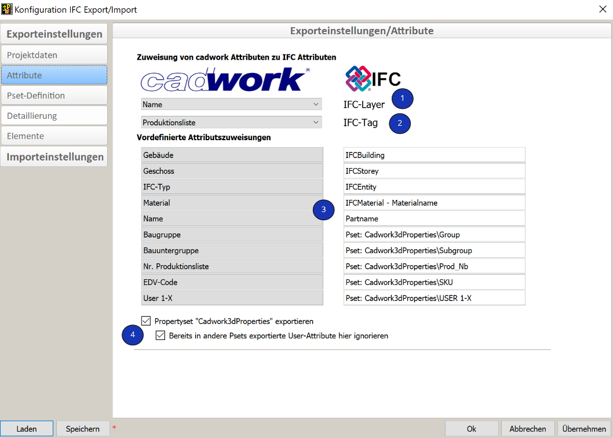
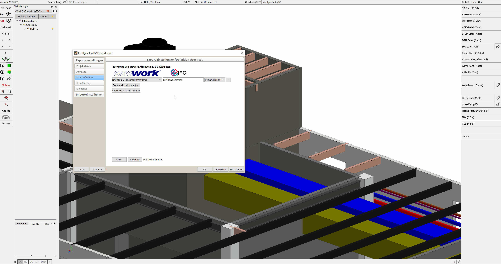
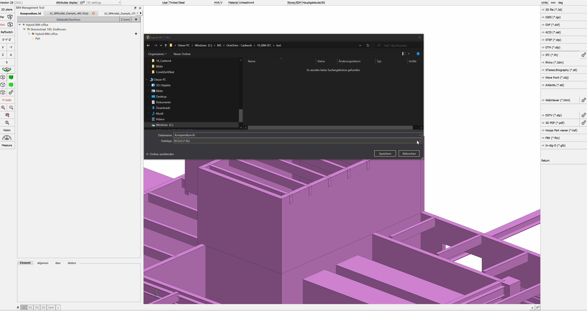

# Export

<figure class="video_container">
  <iframe width="560" height="315" src="https://www.youtube.com/embed/rGLje-72664" title="YouTube video player" frameborder="0" allow="accelerometer; autoplay; clipboard-write; encrypted-media; gyroscope; picture-in-picture" allowfullscreen></iframe>
</figure>

The IFC export configuration dialog can be opened via Export --> Files... --> Open IFC file. 

## Project data

[Definition Projektname & Projektort](../2.Modellierung/modelling.en.md#ifcproject-ifcsite)

1. **Project data general**.
    * The checkbox controls whether the project name is transferred to IfcProject. 

2. **Project location** * The checkbox controls
    * The checkbox controls whether the information about the project location is taken over in the IFC export. 
	
## Attributes

1. **IFC-Layer**
		* Mit dem IFC-Layer bietet sich bei diversen Software eine weitere Möglichkeit zur Strukturierung der Daten. Empfohlen wird die Zuweisung des Attributs **Name**.
2.	**IFC-Tag**
    * The tag (or label) identifier for the respective instance of a product, is e.g. the serial number or the item number. It is recommended to assign the production number. 
3. **Cadwork3dProperties**
    *  cadwork writes by default the PropertySet **Cadwork3dProperties**. In this PropertySet all used standard as well as user attributes are registered. 
4. **PropertySet Cadwork3dProperties**
    * The checkbox controls whether the Cadwork attributes should be exported in the PropertySet Cadwork3dProperties. 
    * The indented checkbox is used if further pset definitions have been made. This option prevents attributes from being exported twice. 

##  Pset-definitions

For the **"Advanced User "** there is the possibility to create own Psets. These can be either standard Psets like e.g. the Pset_BeamCommon, or user-defined ones like e.g. "Properties_Lumber_XY". 
For this purpose, the IfcProperty are created in the user attributes. For example, this can be the property LoadBearing on User10. The properties required for the pset are then combined into a set in the export dialog under the "Pset Definitions" tab. 

1. **Creating user defined property sets**
    * Choose "Add user attribute" to start defining property sets.
	
2. **Data types** 
    * After selecting the Add User Attribute button, first select the cadwork attributes you want for the pset from the Menu List option.
    
        IfcDataType             | Defintion                                                 | Value         
        ------------------------|-----------------------------------------------------------|-----------------------------------
        IfcInteger              | whole numbers in positive and negative range - INTEGER	| 1,100,20        
        IfcReal	                | any positive floating point numbers - REAL     			| 0.1245, 1.458	                      
        IfcBoolean	            | two states 0 & 1 - BOOLEAN                     			| True/False, "1" oder "0", WAHR/FALSCH, Ja/Nein, Vrai, Faux
        IfcLabel                | any text - STRING		                                    | Holz, Hersteller      

    * For the selected attributes the data type can be defined with a right click on the data type (e.g. IfcLabel) (mandatory for standard psets). In the IFC schema, the data type is defined for each property. To ensure that the property sets are exported correctly, the data type must be defined in the export dialog (right-click on the property).

        

3. **Property set - Name**
    * In the input field in the middle column you define the name of the property set. The **Prefix Pset_** should only be used for standard PropertySets from the IfcSchema. 
	* If you want to delete a user defined property set click the "minus-symbol" at end of the line.

4. **Assignment of userdefined property sets to IfcTypes**
    * In the last option menu list you have to select the IFC types for which this pset should be output. So it is possible to create very differentiated Psets for different parts.

5. **Load/Save**
    * After saving the user defined property sets you can reload them in any other project for further IFC-exports.

## Level of detail

1. **Level of detail** 
    * The model content detail level can be customized according to requirements. 
    * !!! info "**Make sure to export only the required content and detail levels are exported in order to minimise the amount of data.**"
2. **Implicit geometry method**
    * For the option "Export geometry using the implicit method (BETA)", you can find a more detailed explanation in chapter [Geometrie](../index.md#geometrie).

## Element group

{: style="width:900px"}

1. **Combine elements (recommended)**
    * If architectural elements with components are created in a 3D file (e.g. [Framed Wall](../5.Beispiele/examples.en.md)) as well as each divided into assemblies or building subgroups, the associated elements are exported to the IFC file summarized with this option, as e.g. IfcWall.

    * If architectural elements are summarized by assemblies or building subgroups, the envelopes (timber frame and block building envelopes) are not output. This is because the individual components combined represent the wall, ceiling or roof.
    {: style="width:400px"}

2. **Ifc Element Assembly**

    * The IfcElementAssembly entity represents complex element assemblies that are composed of multiple elements. These can be, for example, composite steel elements, trusses or stairs. When the indented checkbox is checked, elements are not grouped as IfcWall, IfcSlab, or IfcRoof, but as IfcElementAssembly. 
    In cadwork, we have long used container elements for grouping elements into an IfcElementAssembly. **Elements which are combined in container elements are exported as IfcElementAssembly by default in cadwork.** This function cannot be influenced. 

3. **Export architectural elements**

    * If the export of the shells is necessary for further steps, they can be exported by activating this option (not recommended). Solid walls, solid roofs and solid ceilings are always exported because they are "real" components. It is not necessary to activate this option for elements of this type.

## Supported IFC-schemes

For import as well as export cadwork supports the schemas IFC 2x3 and IFC4. 

The IFC4 version combines a number of functional enhancements with a comprehensive revision and improvement of the existing IFC specification. The overall goal is to improve consistency across the IFC schema, reduce the model footprint required to populate an IFC dataset, and apply lessons learned from current implementation and usage. IFC4 has been developed as the next foundation for IFC-based building data model interoperability as a standard for Open BIM.[^6]

{: style="width:900px"}

[^6]: [ifc2x3 vs ifc4](https://standards.buildingsmart.org/IFC/DEV/IFC4_2/FINAL/HTML/annex/annex-f/ifc2x3-to-ifc4/index.htm)