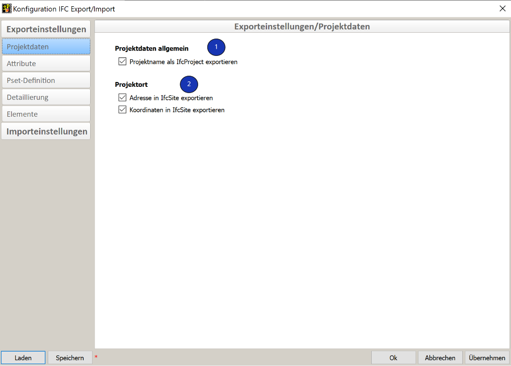
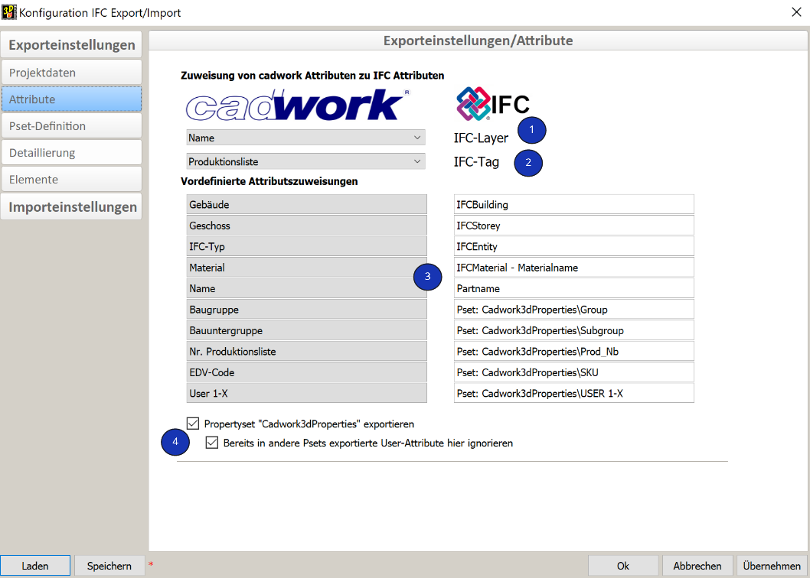
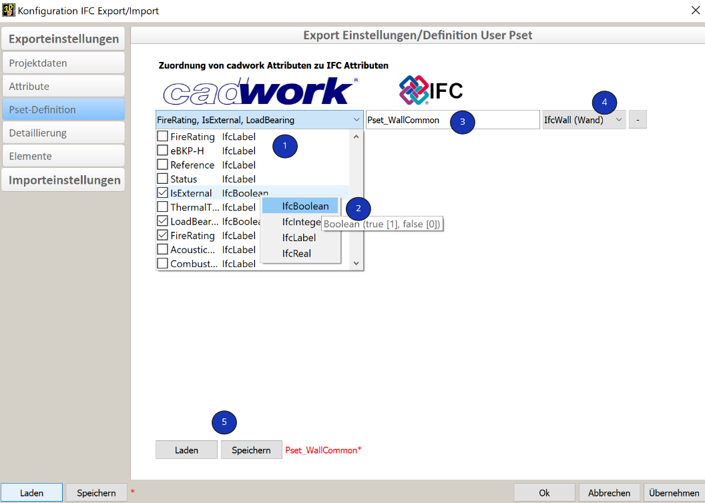
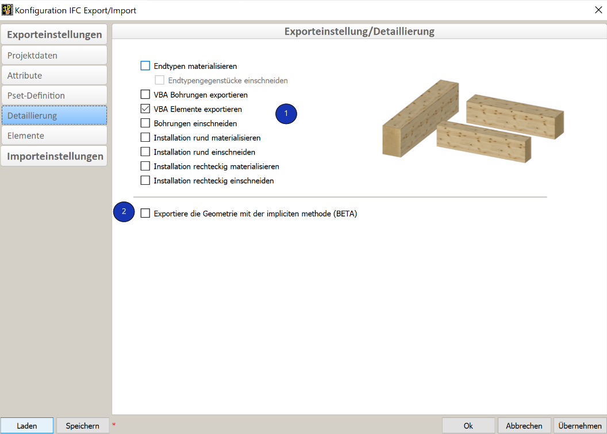
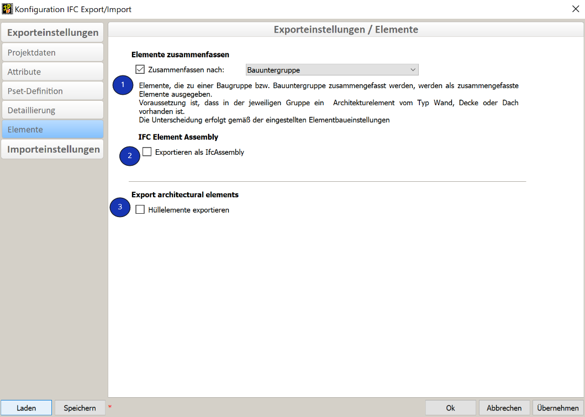

# Export IFC

<figure class="video_container">
  <iframe width="560" height="315" src="https://www.youtube.com/embed/rGLje-72664" title="YouTube video player" frameborder="0" allow="accelerometer; autoplay; clipboard-write; encrypted-media; gyroscope; picture-in-picture" allowfullscreen></iframe>
</figure>

La boîte de dialogue de configuration de l'export IFC peut être ouverte via Exporter --> Fichiers... --> engrenage à droite de Fichier IFC.

## Données du projet

[Définition du nom et du lieu du projet](../2.Modellierung/modelling.fr.md#ifcproject-ifcsite)

1. **Données de projet générales**
    * En cochant cette case, vous exporterez le nom de projet dans l'IfcProject du futur fichier IFC. 

2. **Emplacement du projet**
    * Ces cases à cocher permettent de transférer les données relatives au lieu du projet (IfcSite) lors de l'export IFC.

## Attributs

1. **IFC-Layer**
    * Avec le layer IFC, divers logiciels offrent une autre possibilité de structurer les données. Il est recommandé d'attribuer l'attribut **Nom**.
2. **IFC-Tag**
    * L'identifiant d'un produit est, par exemple, le numéro de série ou le numéro d'article. Il est recommandé d'attribuer le numéro de production.
3. **Cadwork3dProperties**
    * Cadwork écrit par défaut le PropertySet Cadwork3dProperties. Dans ce PropertySet sont enregistrés tous les attributs standards ainsi que ceux de l'utilisateur.
4. **PropertySet Cadwork3dProperties**
    * Cette case à cocher permet d'exporter les attributs Cadwork dans le PropertySet Cadwork3dProperties.
    * La deuxième coche permet d'éviter un double export si des user Psets sont paramétrés. VOir ci dessous.

##  Définition des Propotyset utilisateur

Pour les **"utilisateurs avancés"**  il est possible de créer ses propres correspondances entre attributs cadwork et Psets IFC. Il peut s'agir de Psets standard comme par exemple le Pset_BeamCommon, ou de Psets définis par l'utilisateur comme par exemple "Properties_Lumber_XY". Pour se faire, les IfcProperty sont créés dans les attributs utilisateur de cadwork. Par exemple, il peut s'agir de la propriété LoadBearing de l'utilisateur 10. Les propriétés requises pour le pset sont ensuite combinées en un ensemble, dans la boîte de dialogue d'export sous l'onglet "Définition Pset Utilisateur". 

1. **Choix des attributs utilisateur cadwork**
    * Cliquez sur "Ajouter un attribut utilisateur" --> vous pouvez ensuite commencer à définir les correspondances entre les attributs cadwork et les attributs IFC.
2. **Types de données** 
    * Après avoir sélectionné le bouton Ajouter un attribut utilisateur, choisissez dans le menu déroulant les attributs cadwork souhaités. 
    
        IfcDataType (Type de données ifc)  | Definition                                                 | Valeur          
        ------------------------|-----------------------------------------------------------|-----------------------------------
        IfcInteger              | Nombres entiers dans les plages positives et négatives - INTEGER     | 1,100,20        
        IfcReal	                | Nombre positif ou négatif avec nombre décimale - REAL      | 0.1245, 1.458	                      
        IfcBoolean	            | Forme à deux états 0 & 1 BOOLEAN                     | True/False, "1" oder "0", WAHR/FALSCH, Ja/Nein, Vrai, Faux
        IfcLabel                | texte quelconque STRING                                   | Bois, Fabricant     

    * Pour les attributs sélectionnés, le type de données peut être défini par un clic droit sur le type de données (par exemple IfcLabel) (obligatoire pour les psets standard). Dans le format IFC, le type de données est défini pour chaque propriété. Pour que les ensembles de propriétés soient exportés correctement, le type de données doit être défini dans le dialogue d'export (clic droit sur la propriété).

        

3. **Property set - Nom**
    * Dans le champ de saisie de la colonne du milieu, vous définissez le nom de l'ensemble de propriétés. Le préfixe Pset_ ne doit être utilisé que pour les PropertySets standard de l'IfcSchema. 

4. **Affectation des ensembles de propriétés définis par l'utilisateur aux IfcTypes**
    * Dans la dernière colonne de cette fenêtre, vous devez sélectionner les types IFC pour lesquels la correspondance doit être appliquée. Il est ainsi possible de créer des psets différents en fonction des éléments de construction.

5. **Charger/Sauver**
    * Si vous souhaitez supprimer un User Pset déjà créé, vous pouvez cliquer sur le symbole "moins" à la fin de la ligne.
    * Après avoir sauver des correspondances d'attributs, vous pouvez les charger dans n'importe quel autre projet pour d'autres export IFC.

## Niveau de détail (Level of detail - LOD)

1. **Niveau de détail** 
    * Le niveau de détail des éléments du modèle peut être personnalisé en fonction des besoins en cochant ou décochant les options.
    * !!! info "**Veillez à n'exporter que le contenu avec les niveaux de détail nécessaires afin de minimiser la quantité de données.**"
2. **Méthode de géométrie implicite - sous forme d'extrusion (csg)**
    * Pour l'option "Décrire la géométrie si possible sous forme d'extrusion (BETA)", vous trouverez une explication plus détaillée dans le chapitre [Geometrie](../index.md#geometrie).

## Groupe d'éléments

{: style="width:900px"}

1. **Combiner éléments (recommandé)**
    * Si des éléments architecturaux avec des composants sont créés dans un fichier 3d (z.B. [Holzrahmenwand](../5.Beispiele/examples.fr.md#plafond-a-ossature-bois)) avec des sous-groupes ou groupes renseignés en fonction des ensembles architecturaux, les éléments associés sont exportés vers le fichier IFC en tant qu'élements combinés, comme par exemple IfcWall.

    * Dans le cas d'enveloppes massives ou madrier, pour les parois, les plafonds ou toits, même s'ils sont combinés sous des groupes ou sous groupes, les éléments de constructions seront créés dans le fichier IFC sans combinaison d'éléments. En effet, les enveloppes représentent les éléments de constructions et ne sont pas de simples enveloppe de planification de l'IFC.
    {: style="width:400px"}

2. **IfcElementAssembly**

    * L'entité IfcElementAssembly représente des assemblages d'éléments complexes qui sont composés de plusieurs éléments. Il peut s'agir, par exemple, d'éléments composites en acier, de fermes ou d'escaliers. Lorsque la case est cochée, les éléments ne sont pas regroupés comme IfcWall, IfcSlab ou IfcRoof, mais comme IfcElementAssembly. Dans cadwork, nous utilisons depuis longtemps des éléments containers pour regrouper des éléments dans un IfcElementAssembly.  **Les éléments qui sont combinés dans des éléments containers sont exportés comme IfcElementAssembly par défaut dans cadwork.**  Cette fonction ne peut pas être modifiée. 

3. **Export d'éléments architecturaux**

    * Si l'export des enveloppes est nécessaire pour des étapes post export, elles peuvent être exportées en activant cette option (non recommandée). Les murs, toits et les plafonds massifs sont toujours exportés car ce sont des éléments "réels". Il n'est pas nécessaire d'activer cette option pour les éléments de ce type.

## Formats IFC supportées
Pour l'import comme pour l'export, cadwork est compatible avec les formats IFC 2x3 et IFC4.  

La version IFC4 combine un certain nombre d'améliorations fonctionnelles avec une révision et correction complètes de la norme IFC existante. L'objectif global est d'améliorer la cohérence du format IFC, de réduire la taille du modèle tout en alimentant un ensemble de données IFC et d'appliquer les leçons tirées de la mise en œuvre et de l'utilisation actuelles. L'IFC4 a été développé comme la précédente version, pour l'interopérabilité des modèles de données de construction basés sur l'IFC en tant que norme pour l'Open BIM.[^6]

{: style="width:900px"}

[^6]: [ifc2x3 vs ifc4](https://standards.buildingsmart.org/IFC/DEV/IFC4_2/FINAL/HTML/annex/annex-f/ifc2x3-to-ifc4/index.htm)