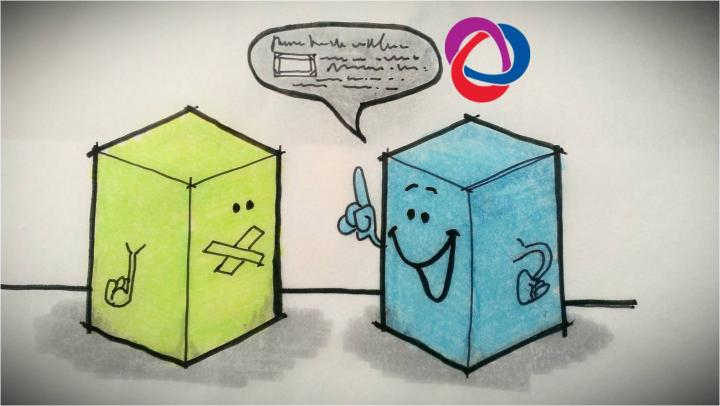
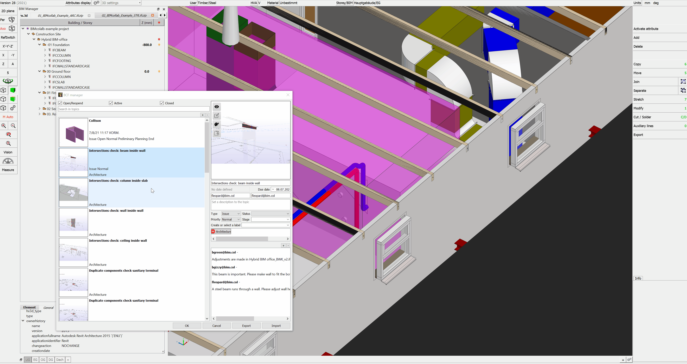
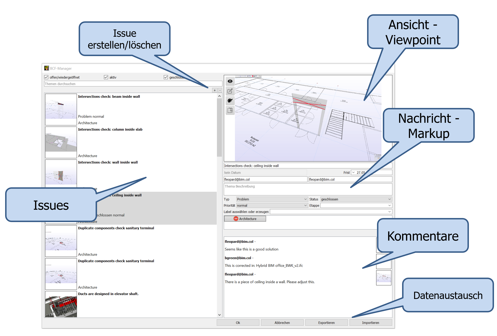

# BCF

## Was ist das BIM-Collaboratin-Format (BCF)? 

{: style="width:700px"}

BCF steht als Abkürzung für BIM Collaboration Format und ist ein offenes Datenformat für die modellbasierte Kommunikation. 

Im Allgemeinen ermöglicht das BIM Collaboration Format (BCF) in verschiedenen BIM-Anwendungen miteinander modellbasiert zu kommunizieren.
Die aktuelle Version BCF 2.1 ermöglicht die Übertragung
* modellbezogener Anmerkungen (sog. Issues),
* der betroffenen Elemente im Modell (über die Objekt-GUIDs) sowie 
* reproduzierbarer Bildschirmausschnitte
zwischen verschiedenen BIM-Applikationen. 
Diese modellbasierte Kommunikation verbessert die Koordination. Somit können Informationen über Probleme im Modell, deren Ort, Blickrichtung, Bauteil, Bemerkungen, Anwender, Zeitpunkt oder auch Änderungen im IFC-Datenmodell zielgerichtet ausgetauscht werden. 

Die Entwicklung von BCF begann im Jahr 2009 und wurde ursprünglich von zwei Mitgliedern der buildingSMART International Implementation Support Group (ISG), Solibri und Tekla, zusammen mit dem Institut für angewandte Bauinformatik (iabi) an der Hochschule München (Deutschland) konzipiert. Ihr Wunsch, eine offene Kommunikationstechnologie für IFC-basierte Arbeitsabläufe zu nutzen, führte zum Prototyping und schließlich zur vollständigen Entwicklung von BCF mit anderen ISG-Mitgliedern.

BCF wurde geschaffen, um die offene Kommunikation zu erleichtern und IFC-basierte openBIM-Prozesse zu verbessern, indem offene Standards (Dateiformate und Datenkommunikationsprotokolle) verwendet werden, um modellbasierte Probleme zwischen BIM-Software-Tools leichter zu identifizieren und auszutauschen, wobei proprietäre Formate und Workflows umgangen werden.

Es gibt eine Reihe von Anwendungsfällen, die von BCF-fähigen Workflows profitieren können, bei denen Informationen aus dem BIM abgeleitet und mit dem BIM für objektspezifische Informationen zurück verbunden werden können. Diese Fälle können folgendes umfassen:

* Entwurfsphase
    * Dokumentieren von Qualitätssicherungs-/Qualitätsprüfungselementen
    * Identifizierung von Problemen bei der Designkoordination (auch bekannt als Clash Detection) zwischen Domänen-BIMs
    * Kommentierung von Entwurfsoptionen, Objektsubstitutionen und Materialauswahlen
* Beschaffungsphase
    * Koordinationspunkte und Klärungen für die Ausschreibung
    * Kosten- und Lieferanteninformationen für Objekte, Baugruppen und/oder Systeme
* Bauphase
    * Aufzeichnungen zur Qualitätssicherung/Qualitätsprüfung
    * Verfolgung der Verfügbarkeit von Objekten/Materialien und Koordination von Substitutionen
    * Sammlung von Last-Minute-Informationen für die Übergabe an den Eigentümer/Betreiber als Teil der COBie-Leistungen
* Betriebsphase
    * Notizen zu Übergabemodellen, wenn während der Nutzung Änderungen an der Anlage und ihren vielen Elementen vorgenommen werden
    * Notizen des Eigentümers über benötigte Upgrades

BCF ist nun ein buildingSMART International openBIM-Standard, wie IFC und das Data Dictionary (bSDD), offen für alle. [^5]

## BCF in cadwork 

<figure class="video_container">
  <iframe width="560" height="315" src="https://www.youtube.com/embed/3uY7HpMijuA" title="YouTube video player" frameborder="0" allow="accelerometer; autoplay; clipboard-write; encrypted-media; gyroscope; picture-in-picture" allowfullscreen></iframe>
</figure>

Den BCF-Manager öffnen Sie direkt über das BIM_Management-Tool, oder über Fenster -> BCF Manager. Klicken Sie auf die Schaltfläche "+", um ein neues Thema zu erstellen.
Es wird eine Aufnahme der aktuellen Ansicht erstellt. Diese beinhaltet neben dem eigentlichen Screenshot auch einen Viewpoint (Kamerakoordinaten im 3D-Raum), die Sichtbarkeiten der Elemente sowie den Status der aktiven
Bauteile.

{: style="width:900px"}

Den BCF-Manager können Sie alternativ auch nativ unter cadwork Anwendern nutzen. Somit können Sie z.B. Änderungen im Projekt protkollieren. 

[^5]: [BIMcert](https://technical.buildingsmart.org/standards/bcf/)

