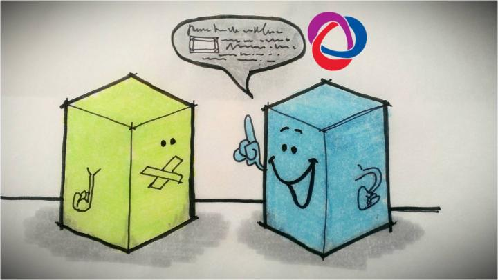

# BCF

## Qu'est-ce que le format BIM-Collaboration-Format (BCF)? 

{: style="width:700px"}

BCF est l'abréviation de BIM Collaboration Format, qui est un format ouvert pour la communication basée sur un modèle, un format normalisé.

En général, le format BCF permet à différentes applications BIM, de communiquer entre elles en se basant sur un modèle. Entre différentes applications, la version actuelle BCF 2.1 permet la transmission des éléments suivants
* des remarques relatives au modèle (appelées requêtes ou notes),
* les éléments affectés dans le modèle (via les GUIDs des objets) ainsi que
* des captures d'écrans mettant en valeur les éléments en quetions.

Cette communication basée sur le format bcf améliore la coordination. Ainsi, il est possible d'échanger de manière ciblée des informations sur les problèmes du modèle, leur emplacement, la direction de vue, le composant, les remarques, l'utilisateur, l'heure ou même les modifications du modèle de données IFC.

Le développement de BCF a commencé en 2009 et a été conçu à l'origine par deux membres du groupe international de soutien à la mise en œuvre de buildingSMART (ISG), Solibri et Tekla, en collaboration avec l'Institut d'informatique appliquée à la construction (iabi) de l'Université des sciences appliquées de Munich, en Allemagne. Leur désir d'utiliser une technologie de communication ouverte pour les flux de travail basés sur IFC a conduit au prototypage et au développement complet de BCF avec d'autres membres de l'ISG.

BCF a été créé pour faciliter la communication ouverte et améliorer les processus openBIM basés sur l'IFC en utilisant des normes ouvertes (formats de fichiers et protocoles de communication de données) pour faciliter l'identification et l'échange de problèmes basés sur les modèles entre les outils logiciels, en contournant les formats et les flux de travail propriétaires.

Il existe un certain nombre de cas d'usage qui peuvent bénéficier des flux de travail BCF au  sein ou non d'un process BIM. Ces cas peuvent être les suivants :

* Phase de conception
    * Documenter les éléments d'assurance et d'examen de la qualité.
    * Identifier les problèmes de coordination de la conception (détection des collisions, clash) entre les différents domaines du projet.
    * Commenter les options de conception, les substitutions d'objets et les choix de matériaux.
* Appel d'offre - Avant Projet
    * Points de coordination et clarifications pour l'appel d'offres.
    * Informations sur les coûts et les fournisseurs pour les objets, les assemblages et/ou les systèmes.
* Phase de construction
    * Dossiers d'inspection de la qualité.
    * Suivi de la disponibilité des objets/matériaux et coordination des substitutions.
    * Collecte d'informations de dernière minute pour la remise au propriétaire/exploitant/ maitrise d'ouvrage, dans le cadre des services COBie.
* Phase d'exploitation
    * Notes sur les modèles de transfert lorsque des changements sont apportés à l'installation et à ses nombreux éléments au cours de son utilisation.
    * Notes de la maitrise d'ouvrage sur les améliorations nécessaires.

BCF est une norme openBIM de buildingSMART International, comme IFC et le dictionnaire de données (bSDD), qui est ouverte à tous.  [^5]

## Les BCF dans cadwork 

<figure class="video_container">
  <iframe width="560" height="315" src="https://www.youtube.com/embed/3uY7HpMijuA" title="YouTube video player" frameborder="0" allow="accelerometer; autoplay; clipboard-write; encrypted-media; gyroscope; picture-in-picture" allowfullscreen></iframe>
</figure>

Ouvrez le gestionnaire de BCF directement depuis le BMT avec un clic droit, ou depuis Fenêtre -> gestionnaire de BCF . Cliquez sur le bouton "+" pour créer un nouveau sujet. Une capture d'écran de la vue actuelle sera créée. En plus de la capture d'écran proprement dite, celle-ci contient également un point de vue (coordonnées de la caméra dans l'espace 3D), les visibilités des éléments et l'état des composants actifs.

{: style="width:900px"}

Vous pouvez également utiliser le gestionnaire de BCF sur votre maquette cadwork. Ainsi, vous pouvez par exemple enregistrer des modifications dans le projet, ou échanger avec vos collègues en interne.

[^5]: [BIMcert](https://technical.buildingsmart.org/standards/bcf/)

