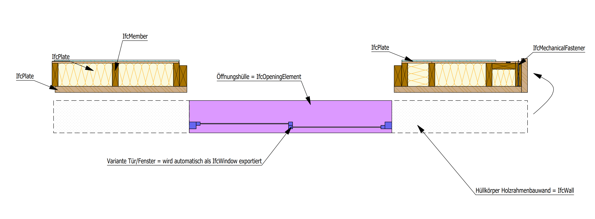

# Beispiele

Folgend sind Beispiele von cadwork Elementen mit deren zugehörigen IfcTyp dargestellt. Die Hüllkörper wurden zur besseren Darstellung von den Bauteilen versetzt platziert. 

## Architektur - Hüllkörper Elemente
Für den IFC-Export von Hüllkörpern ist unter den Exporteinstellungen -> Elemente -> :white_check_mark: Hüllelemente exportieren die Checkbox zu aktieren.
Bauteile der Elementgruppen Raum, Wand, Decke, Dach, Öffnung, Fenster, Tür sind mit Architekturelementen zu modellieren. Öffnungen in Wänden werden beim Modellieren in cadwork nicht eingeschnitten, sondern mit dem Elementtyp **Öffnung** modelliert. 

* IfcWall
    * IfcOpeningElement

### Wände und Öffnungen

* IfcWall
    * IfcOpeningElement

### Fenster und Türen
Fenster und Türen sind über die Architekturelemente --> Tür/Fenster (Variante) zu erstellen. Bei dieser Vorgehensweise, werden diese Elemente korrekt als IfcWindow respektive IfcDoor exportiert. 

* IfcWall
    * IfcOpeningElement
        * IfcWindow / IfcDoor

## Holzrahmenbaudecke

* IfcSlab
    * IfcPlate
    * IfcMember
    * ...

Die Bauteile sind nach Bauunter-, oder nach Baugruppe zusammengefasst.   
!!! info "  In den Exporteinstellungen -> Elemente -> Zusammenfassen nach: Bauunter-, Baugruppe ist die Checkbox :white_check_mark: zu aktivieren. Bei aktiver Checkbox werden die Elemente zum Bauteil (z.B. IfcSlab) zusammengefasst. Die Checkbox -> Hüllelemente exportieren soll deaktiviert :x: werden."

Treeview einer Holzrahmendecke in einem IfcViewer

Die Hülle dient als "Container" für die einzelnen Elemente des Holzrahmens. Beim Export werden die zugehörigen Elemente zur IfcSlab (Hülle) zusammengefasst.

!!! Tipp
    Nutzen Sie auch für Dachelemente den IfcTyp -> IfcSlab. In den Elementbaueigenschaften Ctrl+E ist der Typ Rahmenbaudach zu wählen. Somit resultiert im Ifc Export der Typ **IfcSlab mit dem PredefinedType ROOF**. 

## Holzrahmenbauwand

* IfcWall
    * IfcPlate
    * IfcMember
    * ...
    * IfcOpeningElement
        * IfcWindow

Die Bauteile sind nach Bauunter-, oder nach Baugruppe zusammengefasst.  

## Assemblies
!!! info "   Die IfcElementAssembly stellt komplexe Elementbaugruppen dar, die aus mehreren Elementen zusammengesetzt sind.  BEISPIEL Holz-, oder Stahlkonstruktionsbaugruppen, wie z. B. Fachwerke und verschiedene Arten von Rahmen, können durch die Entität IfcElementAssembly dargestellt werden. Auch Treppenabschnitte und andere vorgefertigte Elemente sind Beispiele für die allgemeine Entität IfcElementAssembly"

* IfcElementAssembly
    * IfcPlate
    * IfcMember
    * IfcMechanicalFastener

### Stahlteile

## Treppe

* IfcStair
    * IfcPlate
    * IfcStairFlight
    * IfcRailing
    * ...

Treppen werden mit dem Werkzeug Treppenmodul erstellt. Die zur Treppe zugehörigen Elemente werden beim IFC-Export automatisch als IfcStair zusammengefasst. 
Den in der Treppe enthaltenen Bauteilen wie Platte, Wange, Geländer etc. ist der passende IfcTyp zuzuweisen. 

