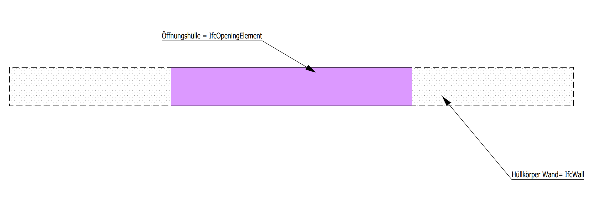
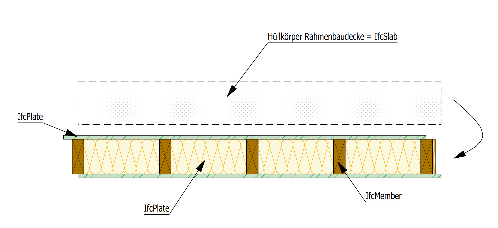
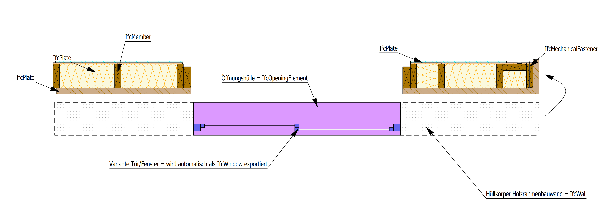
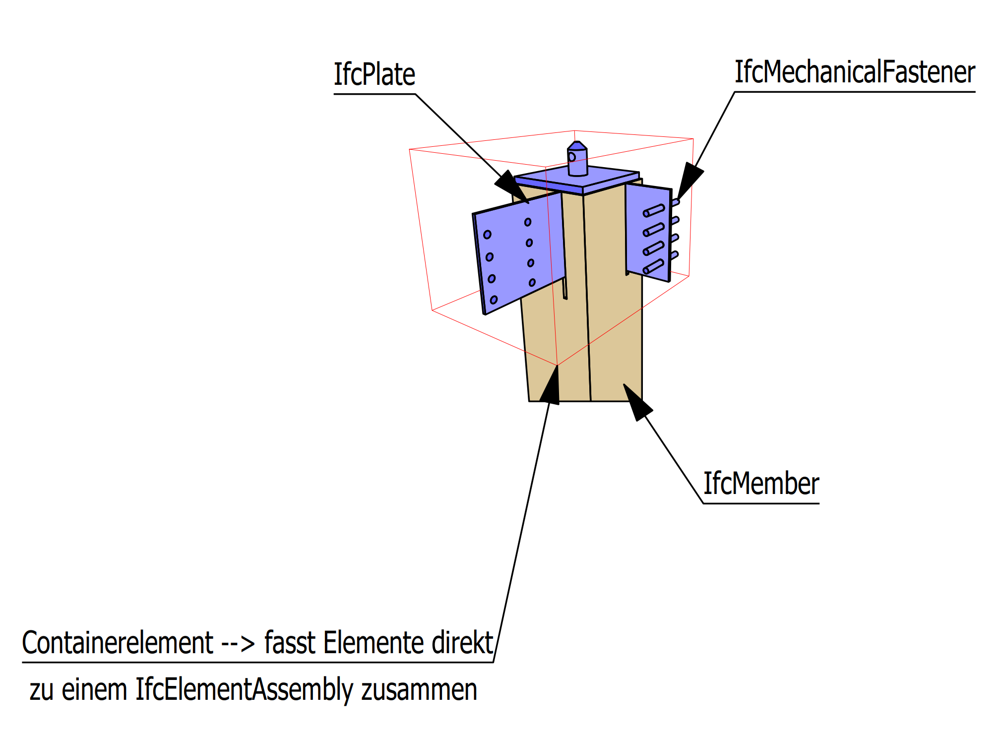

# Samples

Here you will find some examples from cadwork elements with there corresponding IFC type. The architectural covers have been placed offset from the components for better representation. 

## (Architectural) cover elements
For exporting architectural cover elements like walls, floors, roofs or openings you may check the option :white_check_mark: Export Rough Volume Geometry in Export configuration -> Element group -> Export architectural elements.

## Framed roof
Elements are grouped as subgroup or group.   
!!! info "  Activate the checkbox :white_check_mark: Combine by ... in Export configuration -> Element group. With active checkbox the elements are combined to form the component (e.g. IfcSlab). The checkbox -> Export Rough Volume Geometry should be deactivated :x: then."

!!! Tip
    Use the IfcTyp -> IfcSlab also for roof elements. In thel element module settings Ctrl+E the type framed roof is to be chosen. This will result in the type **IfcSlab with PredefinedType ROOF** in IFC-export. 

## Framed wall
Elements are grouped as subgroup or group.  

## Assemblies
!!! info "   IfcElementAssembly is used for complex element combined from several single parts.  EXAMPLE: Functional groups from timber or steel like framings can be represented by the entity IfcElementAssembly. It also may be used for staircases or other precasted elements."

