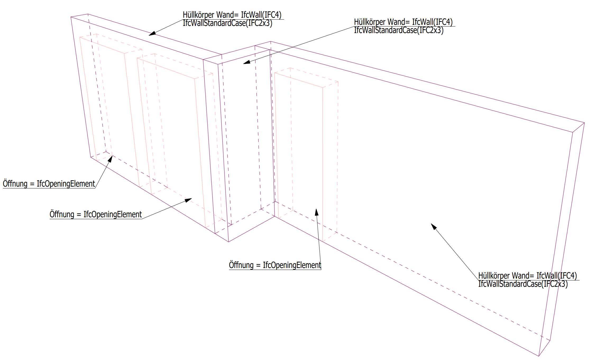
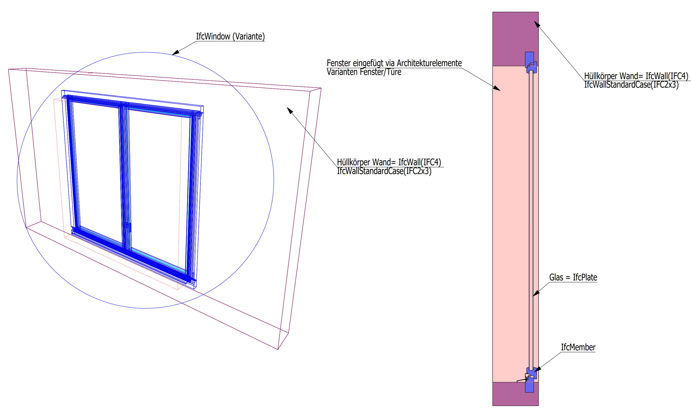
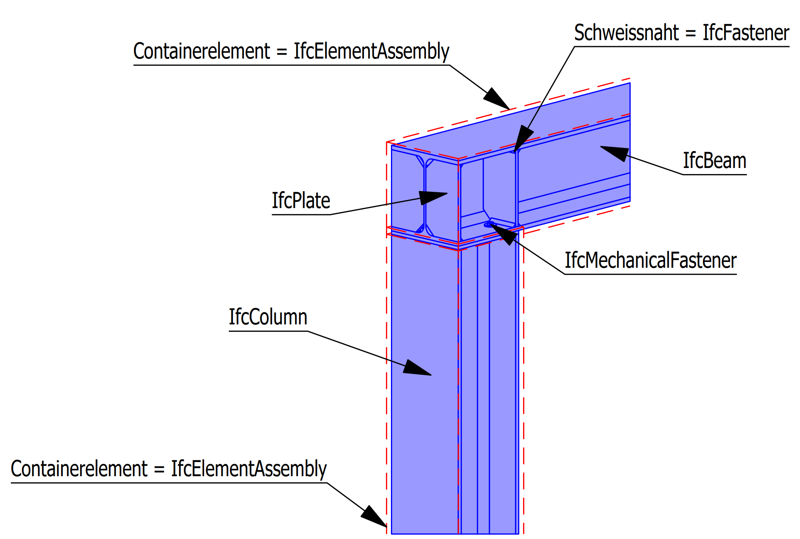
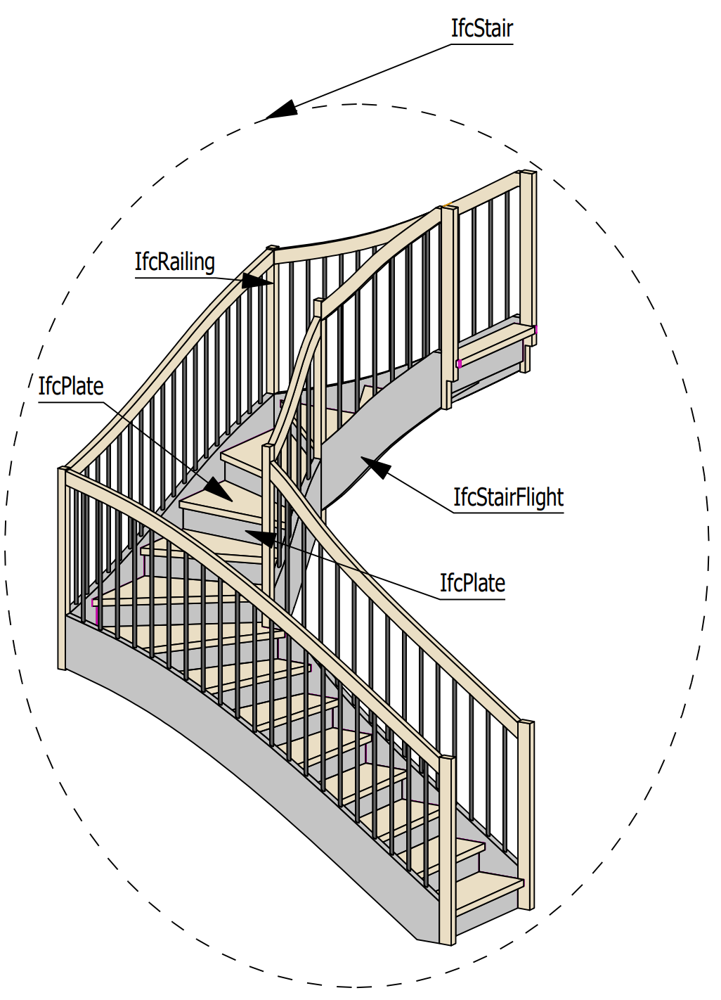

# Exemples

Ci-dessous sont représentés des exemples d'éléments cadwork avec leur type Ifc correspondant. Les corps enveloppants ont été placés de manière décalée par rapport aux éléments de construction pour une meilleure représentation. 

## Architecture - Enveloppe
Pour l'export des enveloppes type architecture, la case à cocher doit être activée dans la fenêtre de configuration d'export IFC -> Groupe d'éléments -> :white_check_mark: Hüllelemente exportieren die Checkbox zu aktieren.
Si des éléments d'architecture sont modélisés pour l'extraction de données, ils doivent obligatoirement être modélisés avec les éléments d'architecture. Les ouvertures dans les murs ne sont pas découpées, mais modélisées avec le type d'élément  **Ouverture**. 

### Murs et ouvertures

### Fenêtres et portes
Les fenêtres et les portes sont reliées par les éléments architecturaux--> porte/fenêtre (variante). Avec cette procédure, ces éléments seront correctement exportés en tant que IfcWindow ou IfcDoor. 

## Plafond à ossature bois
Les éléments de construction sont regroupés par sous-ensemble, ou par groupe de construction.    
!!! info "  Activez la case à cocher :white_check_mark: dans la fenêtre de configuration d'export IFC -> Groupe d'éléments -> Combiner par : Sous-groupe, Groupe. Avec la case à cocher active, les éléments sont combinés pour former un élément de construction (par ex. IfcSlab). La case à cocher -> Exporter la géométrie de l'enveloppe doit être désactivée:x:."

!!! Conseil
    Utilisez également TypeIfc -> IfcSlab pour les éléments de toiture. Dans les propriétés de l'élément Ctrl+E, il faut choisir le type Toit ossature. Au moment de l'export Ifc, vous obtiendrez le TypeIfc **IfcSlab avec PredefinedType ROOF**. 

## Mur à ossature bois
Les éléments sont combinés par sous-groupe ou par groupe, comme vu ci dessus.  

## Ensembles d'éléments et Assemblages
!!! info "   Les IfcElementAssembly représente des ensembles d'éléments complexes composés de plusieurs éléments.  EXEMPLE-, Les groupes fonctionnels des charpentes en bois ou en acier peuvent être représentés par l'entité IfcElementAssembly. Elle peut également être utilisée pour les escaliers ou d'autres éléments préfabriqués."

### Pièces en acier

### Pièces en acier

## Escalier

* IfcStair
    * IfcPlate
    * IfcStairFlight
    * IfcRailing
    * ...

Les escaliers sont créés à l'aide de l'outil Module escalier. Les éléments associés à l'escalier sont automatiquement regroupés en tant que IfcStair lors de l'exportation IFC. 
Le type Ifc approprié doit être attribué aux éléments de construction contenus dans l'escalier, tels que plaque, limon, garde-corps, etc. 

