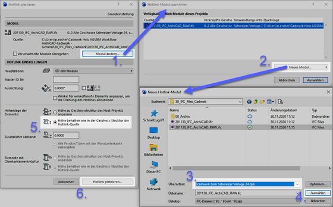

# Workflow ArchiCAD 24

## open BIM Workflow I ArchiCAD 24 – cadwork Holzbau v28

## Allgemein

Diese Anleitung beschreibt den open BIM Workflow auf der Basis von IFC 2x3 CV2.0 zwischen ArchiCAD und cadwork Holzbau.

<iframe width="560" height="315" src="https://www.youtube.com/embed/bbDkPNFKdl4" title="YouTube video player" frameborder="0" allow="accelerometer; autoplay; clipboard-write; encrypted-media; gyroscope; picture-in-picture" allowfullscreen></iframe>

## IFC-Export ArchiCAD

Modellaufbau in ArchiCAD
Entwickeln Sie ein Gebäudemodell in ArchiCAD mit den gängigen Modellierungs-Werkzeugen. Beachten Sie, dass das Gebäudemodell geschossweise aufgebaut wird und orientieren Sie sich beim Modellaufbau an den Grundlagen aus der ArchiCAD ACADEMY [Modul 1 Einführung](http://www.ac-academy.ch/?id=4357). Beachten Sie ergänzend bei der Modellierung Folgendes:

-	Zwischen tragenden Wänden und nicht tragenden Wänden sollte es keine Verschneidungen über Eckverbindungen geben. Dies ist besonders zu beachten, wenn nur das Tragwerk für den IFC-Export gefiltert wird.
-	Wände sollten, wenn immer möglich, ein- oder mehrschichtig aufgebaut sein. Komplexe Profile sollten nur dort eingesetzt werden, wo eine besondere Detaillierung in der Wandstruktur notwendig ist.
Berücksichtigen Sie folgende Eigenschaften beim Modellaufbau:
-	Struktur der mehrschichtigen Bauteile/Profile (Kern, Bekleidung, Andere)
-	Tragende Funktion der Elemente (Nicht tragende Elemente, Tragende Elemente)

**IFC-Export**

Da es sich beim IFC-Export um eine Weitergabe von intelligenten 3D-Elementen handelt, sollten Sie vor dem Export ins 3D-Fenster wechseln. Hier gilt es, aus dem entwickelten Architekturmodell über Filter ein Exportmodell für den Holzbauer zu erzeugen.
Nutzen Sie dazu die folgenden Funktionen, um das Architekturmodell ohne Räume, Möblierung und Umgebung als Rohbaumodell anzeigen zu können. Der Holzbauplaner benötigt lediglich die herausgefilterten Elemente vom Architekturmodell.

{: style="width:600px"}

**Elemente in 3D filtern und schneiden**: Elemente, welche der Holzbauplaner nicht benötigt, ausblenden (Fenster, Tür, Dachfenster, evtl. Lichtquelle und Objekte und besonders Räume werden nicht benötigt).

**Strukturdarstellung**: Hier sollte die Option Nur der Kern oder allenfalls Nur der Kern der tragenden Elemente gewählt werden. Die optimale Wahl ist davon abhängig, ob auf der Seite des Architekten bereits klar definiert wurde, welche Bauteile tragend sind und welche nicht.

**Ebenen**: Eine Ebenen-Kombination erstellen bei der Elemente herausgefiltert werden, welche über die 3D-Filterfunktion nicht entfernt werden konnten, damit nur die relevanten Gebäudeelemente sichtbar sind.

{: style="width:300px"}

In den Einstellungen des IFC-Übersetzers (Ablage/Externe Daten/IFC) sind die Einstellungen unter Geometriekonvertierungen für den IFC Export ausgehend vom Export Übersetzer cadwork zu prüfen und ggf. die markierte Option zu wählen.

{: style="width:600px"}

Erstellen Sie über den Navigator einen Ausschnitt direkt vom 3D-Fenster nachdem die Filter korrekt gesetzt wurden. Nun können Sie über Ablage/sichern als… das Modell als IFC-Datei sichern. Wählen Sie unter Export die Option Sichtbare Elemente auf allen Geschossen, damit die zuvor definierten Filter für den Export angewendet werden und unter Übersetzer wählen Sie cadwork.
**Tipp** :bulb: : Sie können den Ausschnitt aus dem 3D-Fenster über den Organisator in ein Publisher-Set für den IFC-Export verknüpfen, um neben den Filtern auch den Übersetzer für den IFC-Export zu sichern.

**Kontrolle der IFC-Datei (Quality Gate)**
Vor der Weitergabe Ihres Modells sollten Sie dessen Inhalt prüfen. Nutzen Sie für eine regelbasierte Prüfung Solibri Office oder für eine einfachere visuelle Prüfung diverse IFC-Viewer, welche Sie kostenlos herunterladen können (z.B. Solibri Anywhere, FZK Viewer, usw.).

 
## IFC-Import cadwork

Diese Anleitung beschreibt die Einstellungen für einen optimalen Import von IFC-Modellen in cadwork, welche aus ArchiCAD exportiert wurden.

**Eingangskontrolle der IFC-Datei (Quality Gate)**

Die Datei wird in einem IFC-Viewer geöffnet und auf den, für den Datenaustausch definierten Inhalt, geprüft (Bezeichnungen, Nullpunkt, Rotation, Bauteilklassifizierung, Genauigkeit, etc.). 

**IFC-Import**

Die IFC-Datei via BIM-Management-Tool (BMT) in cadwork importieren. Die IFC-Hierarchie (Klassenstruktur, Zuordnung) wird nach dem Import im BMT übernommen. Die einzelnen Geschosse oder Elemente können aktiviert und ein- bzw. ausgeblendet werden.

Die Elemente werden als Showobjekte importiert, welche zur Visualisierung dienen. Showobjekte können nicht zur Kollisionskontrolle oder zur Planausgabe genutzt werden. 
Die IFC-Elemente können zum optischen Abgleich mit der Konstruktion verwendet werden. Ebenso ist es möglich, Punkte abzugreifen, um z.B. Messungen durchzuführen. 
Im Info, Quickinfo und im Menü «Modifizieren» werden die wichtigsten Informationen des Elements dargestellt.

Damit die IFC-Elemente bearbeitet bzw. für cadwork Funktionen genutzt werden können, müssen sie zuerst in Cadwork Elemente umgewandelt werden. Dies erfolgt entweder im Modifizieren Menü mit der Funktion «Modifizieren  als Bauteil» erzeugen, oder im Kontextmenü innerhalb des BIM Management Tools. Sobald die Bauteile in cadwork Elemente umgewandelt wurden, werden sie im IFC-Reiter ausgegraut und im Cadwork-3D Reiter in der entsprechenden IFC-Struktur dargestellt. 	

{: style="width:300px"}

Bauteile wie Wand, Decke, Öffnung oder Dach werden nach dem Import in cadwork direkt mit dem richtigen Element-Typ (Wand, Decke, Öffnung, Dach) erkannt. 

Um mit den Bauteilen weiterarbeiten zu können, sind die Ecksituationen, sowie geometrische Abmessungen zu prüfen.

{: style="width:600px"}

	 
Profilbauteile aus ArchiCAD werden in Schichten und nicht als «einheitliches» Volumen importiert. Um diese Wände als Hüllkörper, z.B. für eine Elementierung nutzen zu können, ist ein verschweissen der einzelnen Schichten des Bauteils nötig. Mit der Funktion «Bearbeitung löschen <Strg + D>» werden anschliessend vorhandene Bearbeitungen rückgängig gemacht. 

{: style="width:600px"}

 > links Profilbauteil (ArchiCAD)
 	 
 > rechts modifizierte Wand (cadwork)

 
**Öffnungen - Openings**

Unter den IFC-Einstellungen kann definiert werden, ob Öffnungen in den Elementen eingeschnitten, oder automatisch «Openings» generiert werden sollen. 

**Tipp** :bulb: : Um die Öffnungskörper beim Import automatisch zu generieren, wird die Funktion «Öffnungen einschneiden» nicht aktiviert.

{: style="width:500px"}

In den Austauschanforderungen des Projekts muss zwingend definiert sein, wie die Abmessung des Openings definiert ist. 

Vertikalschnitt «Opening»

{: style="width:300px"}
	

Das Opening Element besteht aus drei Volumen. Empfohlen wird, mit dem folgend markierten Volumen weiterzuarbeiten. 

**Wichtig**: Überprüfen Sie die Abmessungen des Openings!

{: style="width:600px"}	 

## IFC-Export cadwork

Diese Anleitung beschreibt die Exporteinstellungen für IFC-Modelle, welche in ArchiCAD eingelesen werden sollen. Für den erfolgreichen Datenaustausch mittels des IFC-Schemas sind vorgängig Austauschdefinitionen zu erstellen. 
IFC-Export

-	Alle Elemente sind dem richtigen Geschoss zugeordnet.
-	Alle Elemente besitzen einen eindeutigen Namen.
-	**Tipp** :bulb: : Weisen Sie dem IFC-Layer das Attribut «Name» zu. Dies ermöglicht der Architektur optimale «Filter»-Möglichkeiten der Bauteile.

    {: style="width:600px"}
 
  

-	Korrekte Geschossbezeichnung 
-	Korrekte Angabe zur Geschosshöhe
-	cadwork Elemente beinhalten die korrekte Bezeichnung des IFC-Typs
-	Die lokale Position des Bauwerks ist abgestimmt
-	**Tipp** :bulb: : Nutzen Sie ein physisches Objekt als Nullpunkt (z.B. Pyramide)

{: style="width:600px"} 

Exportiert werden nur die in den Austauschanforderungen definierten Elemente. Die Detaillierungsgrade lassen sich über die Exporteinstellungen steuern. 

**Tipp** :bulb: : Datenaustausch - **so viel wie nötig, aber so wenig wie möglich** (Informationen sowie Geometrie und deren Detaillierungsgrad).

{: style="width:600px"} 

**Export Elementbau**

Für die korrekte Gliederung zusammengesetzter Bauteile (Elementbau) im IFC-Schema sind folgende Einstellungen empfohlen. 

-	Hüllkörper sind für den Export sichtbar (Informationen des Hüllkörpers werden exportiert, (zwingend für eine korrekte IFC-Hierarchie)
-	Hüllkörper beinhaltet die korrekte IFC-Entität (Wall, Opening, Slab, Roof, …).
 

{: style="width:600px"} 

 
**Kontrolle der IFC-Datei (Quality Gate)**

Vor der Weitergabe Ihres Modells sollten Sie dessen Inhalt prüfen. Nutzen Sie für eine visuelle Prüfung einen von diversen IFC-Viewern, welche Sie kostenlos herunterladen können (z.B. Solibri Anywhere, FZK Viewer, usw.).

## IFC-Import ArchiCAD

**IFC-Import**

ArchiCAD bietet Ihnen verschiedene Methoden an, um ein IFC-Modell importieren zu können. Damit Projektänderungen möglichst einfach aktualisiert werden können, wird die Methode via Hotlink/Modul empfohlen. Wählen Sie dazu im Menü Ablage / Hotlinks/Module / Hotlink platzieren… Im nebenstehenden Screenshot sind die Einstellungen hervorgehoben, damit der Import optimal funktioniert.

{: style="width:600px"} 

Bei dieser Methode wird das Modell lediglich referenziert und kann per Knopfdruck aktualisiert werden. Alle weiteren Varianten sind in der Kurzhilfe «IFC-Import» in der IDC-Supportdatenbank auffindbar.

Mithilfe der grafischen Überschreibung können Sie im 3D-Fenster die Übereinstimmung des Holzbaumodells mit dem Architekturmodell prüfen.

{: style="width:600px"} 

 
**Holzbaukonstruktion in Pläne integrieren**

{: style="width:600px"} 

Sofern Sie ein auf die Holzbaukonstruktion reduziertes Modell erhalten, können Sie die Bestandteile daraus als ergänzende, plangrafische Elemente für Grundrisse oder Schnitte einsetzen.
Beachten Sie dabei einige Optimierungs-möglichkeiten seitens Werkzeug-Grundeinstellungen und IFC-Übersetzereinstellungen, welche Sie vor dem Import prüfen resp. anpassen sollten.
IFC-Importeinstellungen
Öffnen Sie die IFC-Übersetzereinstellungen im Menü Ablage / Externe Daten / IFC / IFC-Übersetzer… und wählen Sie unter dem Register Übersetzer zum Importieren den Übersetzer cadwork aus. Ausgehend von dessen Grundeinstellungen sollten Sie bei zwei Optionen eine Optimierung vornehmen:

1.	Unter Geometriekonvertierung sollte bei Gebäudeelemente die Option Konstruktionselemente, sonst Morphs gewählt sein. Da bei Morph Elementen im gegensatz zu Objekten eine echte Grundriss-darstellung erzeugt wird.

    {: style="width:400px"} 

2.	Unter Material und Oberflächenkonvertierung sollte der Standardbaustoff von Beton auf Holz oder Holz, Konstruktion geändert werden. Allenfalls kann auch eine detaillierte Baustoff-zuordung erzeugt werden, damit die Schraffurdarstellung in Bezug auf die Elemente der Holzbaukostruktion Ihren Wünschen entspricht.

    {: style="width:400px"} 

 
**Grundeinstellungen Morph-Werkzeug**

Damit im Grundriss nur die geschnittenen Elemente von der Holzbaukonstruktion sichtbar sind, sollten Sie vor dem IFC-Import die Grundeinstellungen vom Morph-Werkzeug prüfen. Wählen Sie dort unter Grundrissdarstellung die Option Nur Schnitt aus.

{: style="width:400px"} 

**Tipp** :bulb: :

Wenn Sie z.B. beim Dachgeschoss die Holzbaukonstruktion als Untersicht sehen möchten, müssen Sie dieses Geschoss einzeln als Hotlink importieren und zuvor bei den Einstellungen vom Morph-Werkzeug die Grundeinstellung bezüglich Grundrissdarstellung (Projiziert mit Untersicht) wählen.

## OpenBIM - Workflow-Sheets
[OpenBIM Workflow-Sheets](https://openbim.ch/workflow-sheets/){target=_blank} :point_left:

