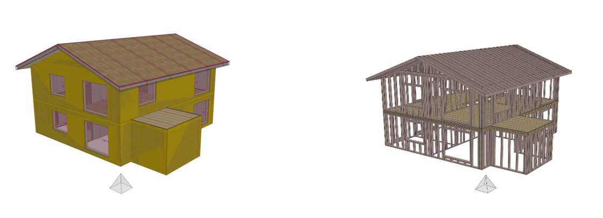
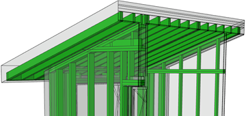

# Workflow ArchiCAD 24

## open BIM Workflow I ArchiCAD 24 – cadwork Holzbau v28

## General

This manual describes the open BIM workflow based on IFC 2x3 CV2.0 between ArchiCAD and cadwork Timber.

<iframe width="560" height="315" src="https://www.youtube.com/embed/bbDkPNFKdl4" title="YouTube video player" frameborder="0" allow="accelerometer; autoplay; clipboard-write; encrypted-media; gyroscope; picture-in-picture" allowfullscreen></iframe>

## IFC-export ArchiCAD

Model setup in ArchiCAD
Develop a building model in ArchiCAD using the common modeling tools. Note that the building model is constructed floor-by-floor and use the basics from the ArchiCAD ACADEMY [Module 1 Introduction](http://www.ac-academy.ch/?id=4357) as a guide when constructing the model. In addition, note the following when modeling:

-	There shouldn´t be any intersections via corner connections between load-bearing walls and non-load-bearing walls. This should be especially noted when only the load-bearing structure is filtered for IFC export.
-	Walls should be single or multi-layered whenever possible. Complex profiles should only be used where special detailing is required in the wall structure.

Consider the following properties in model construction:
-   Structure of the multilayer components/profiles (core, cladding, other).
-   Load-bearing function of the elements (non-load-bearing elements, load-bearing elements)

**IFC-Export**

Since the IFC export is a transfer of intelligent 3D elements, you should switch to the 3D window before exporting. Here, you need to use filters to create an export model for the woodworker from the developed architectural model.
To do this, use the following functions to display the architectural model without rooms, furnishings and surroundings as a shell model. The timber construction planner only needs the filtered elements from the architectural model.

{: style="width:600px"}

**Filtering and cuttin elements in 3D**: Elements not needed for timberconstruction should be hidden. Elements such as windows, doors, roof windows, lighting elements, and especially rooms are not needed.

**Structural representation**: Select the option "only core" or at most only "only core of load bearing elements" here. The optimal choice depends on whether it has already been clearly defined on the architect's side which components are load-bearing and which are not.

**Layers**: Create a layer combination that filters out elements that could not be removed using the 3D filter function, so that only the relevant building elements are visible.

{: style="width:300px"}

In the IFC translator settings (File/External data/IFC) check the settings under Geometry conversions for IFC export starting from the export translator cadwork and select the marked option if necessary.

{: style="width:600px"}

Create a section directly from the 3D window via the Navigator after the filters have been set correctly. Now you can save the model as an IFC file via File/Save as.... Under Export select "Visible elements on all floors" so that the previously defined filters are applied for the export and at translator select "cadwork".
**Tip** :bulb: : You can link the section from the 3D window via the organizer into a publisher set for IFC export in order to add the translator for IFC export to the filter choice.

**Checking the IFC-file (Quality Gate)**
Before sharing your model, you should check its content. For a rule-based check use Solibri Office, or for a simpler visual check use various IFC viewers that you can download for free (e.g. Solibri Anywhere, FZK Viewer, etc.).

 
## IFC-import cadwork

This tutorial describes the settings for an optimal import of IFC models into cadwork, which were exported from ArchiCAD.

**Incoming checking of IFC-file (Quality gate)**

The file is opened in an IFC viewer and checked for the content defined for the data exchange (designations, zero point, rotation, component classification, accuracy, etc.). 

**IFC-import**

Import the IFC file via BIM Management Tool (BMT) into cadwork. The IFC hierarchy (class structure, assignment) is adopted in the BMT after the import. The individual floors or elements can be activated and shown or hidden.

The elements are imported as show objects, which are used for visualization. Show objects cannot be used for collision control or for plan outputs.  
The IFC elements can be used for visual alignment with the construction. It is also possible to pick up points, e.g. to perform measurements. 
In the Info, Quickinfo and in the menu "Modify" the most important information of the element is displayed. 

In order to edit the IFC elements or use them for cadwork functions, they must first be converted into cadwork elements. This is done either in the Modify menu with the function "Add element in cadwork", or in the context menu within the BIM Management Tool. Once the parts have been converted to cadwork elements, they will be grayed out in the IFC tab and displayed in the cadwork-3D tab in the corresponding IFC structure. 

{: style="width:300px"}

Components like wall, ceiling, opening or roof are directly recognized with the correct element type (wall, ceiling, opening, roof) after conversion in cadwork. 
In order to continue working with the components, the corner situations, as well as the geometric dimensions must be checked.

{: style="width:600px"}

	 
Profile components from ArchiCAD are imported in layers and not as a "uniform" volume. In order to be able to use these walls as an envelope for an element, for example, it is necessary to weld the individual layers of the component. With the function "Delete edit <Ctrl + D>" existing edits are undone afterwards. 

{: style="width:600px"}

 > left modified wall (ArchiCAD)
 	 
 > right modified wall (cadwork)

 
**Openings**

In the IFC settings, you can define whether openings are to be cut into the elements, or whether "opening containers" are to be generated automatically.

**Tip** :bulb: : For generating opening containers automatically, please disable the option "Cut openings".

{: style="width:500px"}

It is mandatory to define how the dimension of the opening is defined in the exchange requirements of the project. 
Vertical section «Opening»

{: style="width:300px"}
	

The opening element consists of three volumes. We advise you to go on working with the element shown as active here.

**Important**: Please check the dimension of openings!

{: style="width:600px"}	 

## IFC-export cadwork

These instructions describe the export settings for IFC models that are to be read into ArchiCAD. For successful data exchange using the IFC schema, exchange definitions must be created before. 
IFC-export

-	All elements are assigned to the correct storey.
-	All elements have a unique name.
-	**Tip** :bulb: : Assign the "Name" attribute to the IFC layer. This allows the architecture optimal "filter" possibilities of the components.

    {: style="width:600px"}
 
  

-	correct storey 
-	correct storey heights
-	cadwork definition of IFC-type
-	the buildings´ local position is coordinated
-	**Tip** :bulb: : Use an existing element as file origin (e.g. a pyramid)

{: style="width:600px"}

Only the elements defined in the exchange requirements are exported. The level of detail can be controlled via the export settings. 

**Tip** :bulb: : Data exchange - **as much as necessary but as less as possible.**

{: style="width:600px"} 

**Export composite components**

The following settings are recommended for the correct outline of composite components (element construction) in the IFC schema. 

-	Architectural covers are visible for export (information of the envelope is exported, (mandatory for correct IFC hierarchy).
-	Covers contain the correct IFC entity (Wall, Opening, Slab, Roof, ...).

 
{: style="width:600px"} 

 
**Control of IFC-file (quality gate)**

Before sharing your model, you should check its content. For a visual check, use one of various IFC viewers that you can download for free (e.g. Solibri Anywhere, FZK Viewer, etc.).

## IFC-import ArchiCAD

**IFC-import**

ArchiCAD offers different methods for importing IFC-models. In order to update project changes as easily as possible, the method via Hotlink/Module is recommended. To do this, select File / Hotlinks/Module / Place Hotlink... Settings are highlighted in the screenshot for optimal import.

{: style="width:600px"} 

With this method, the model is simply referenced and can be updated with the click of a button. All other variants can be found in the "IFC import" quick help in the IDC support database.

With the graphical override you can check the correspondence of the timber construction model with the architectural model in the 3D window.

{: style="width:600px"} 

 
**Integrate timber constructions in plans**

{: style="width:600px"} 

If you receive a model reduced to the timber construction, you can use the components from it as supplementary elements for floor plans or sections. Please note that there are some optimization possibilities regarding the basic tool settings and IFC translator settings, which you should check or adjust before importing.

IFC import settings

Open the IFC translator settings in the menu File / External data / IFC / IFC translator... and select the translator cadwork in the tab Translator for import. Based on its basic settings, you should optimize two options:

1. In geometry conversion the option Construction elements should be selected for building elements, otherwise Morphs. With morph elements in contrast to objects a real ground plan representation is produced.

    {: style="width:400px"} 

2.	In material and surface conversion the default building material should be changed from concrete to wood or wood, construction. If necessary, a detailed building material assignment can also be created so that the hatching representation in relation to the elements of the timber construction corresponds to your wishes.

    {: style="width:400px"} 

 
**Basic settings for morphing tool**

In order to see only the cut elements from the timber construction in the ground view you should check the morphing tool´s basic setting before importing the IFC data. Choose the option Only sections in the basic setting.

{: style="width:400px"} 

**Example** :bulb: :

If you want to see the wooden construction of the attic as an underside view, you must import this floor individually as a hotlink and first select the basic setting for the Morph tool in the settings for the floor plan display (Projected with underside view).

## OpenBIM - workflow-sheets
[OpenBIM Workflow-Sheets](https://openbim.ch/workflow-sheets/){target=_blank} :point_left:

