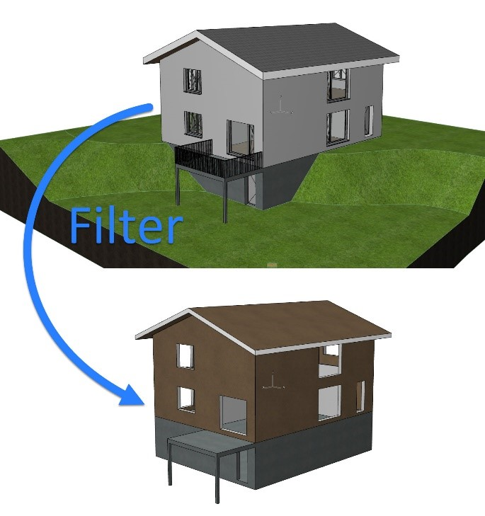
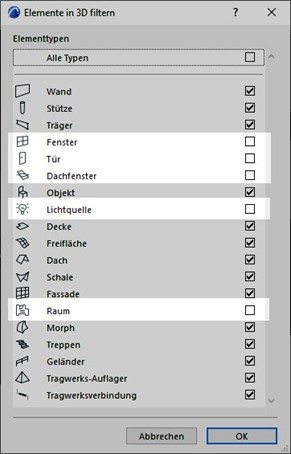
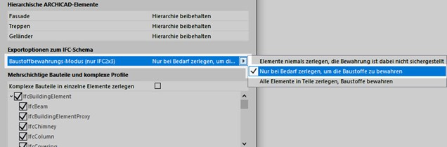
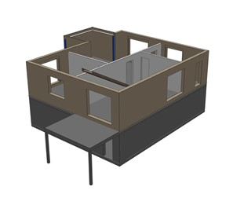
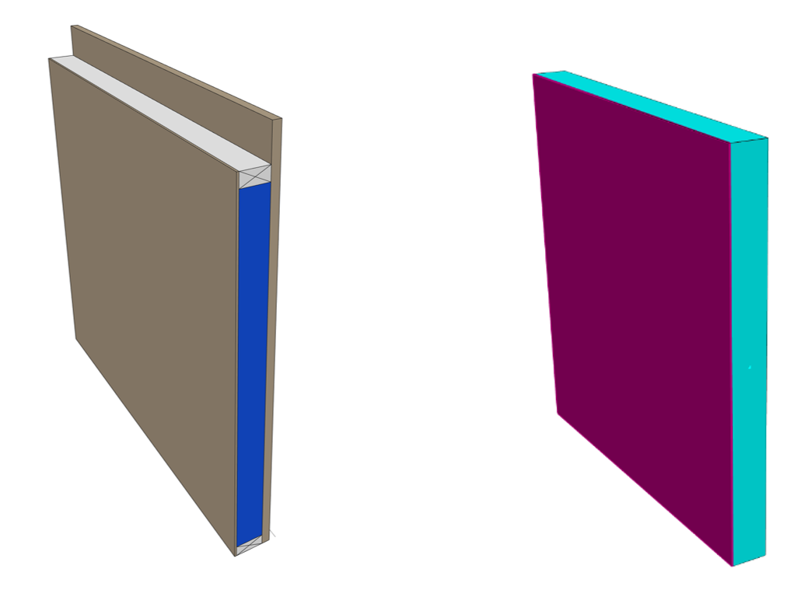
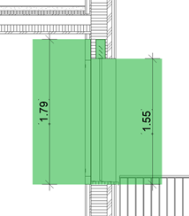
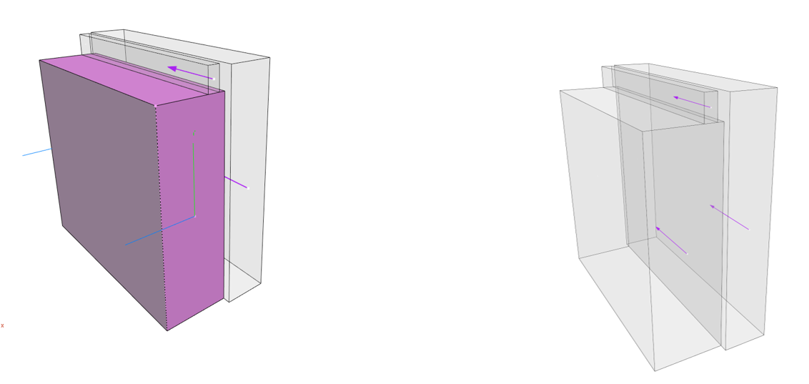
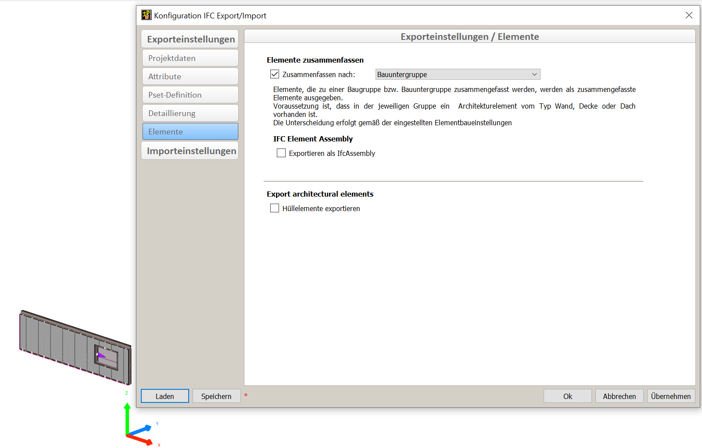

# Workflow ArchiCAD 24

## Workflow Open BIM ArchiCAD 24 - cadwork V28

## Généralités

Ce manuel décrit le flux de travail BIM ouvert basé sur IFC 2x3 CV2.0 entre ArchiCAD et cadwork.

<iframe width="560" height="315" src="https://www.youtube.com/embed/bbDkPNFKdl4" title="YouTube video player" frameborder="0" allow="accelerometer; autoplay; clipboard-write; encrypted-media; gyroscope; picture-in-picture" allowfullscreen></iframe>

## IFC-Export ArchiCAD

Structure du modèle dans ArchiCAD
Développez un modèle de bâtiment dans ArchiCAD à l’aide d’outils de modélisation courants. Notez que le modèle de bâtiment est construit étage par étage et orientez-vous vers les bases de l’ArchiCAD ACADEMY [Modul 1 Einführung](http://www.ac-academy.ch/?id=4357). De plus, lors de la modélisation, veuillez noter :

-	Il ne doit pas y avoir d’intersections avec coupe d’onglet entre les murs porteurs et les murs non porteurs. Ceci est particulièrement important si seule la structure de support est filtrée pour l’exportation IFC.
-	Les murs devraient, dans la mesure du possible, être construits en une ou plusieurs couches. Les profilés complexes ne doivent être utilisés que lorsque des détails spéciaux dans la structure du mur sont nécessaires.
Tenez compte des caractéristiques suivantes lors de la création d’un modèle :
-	Structure des composants/profils multicouches (Structure, revêtements, autres)
-	Fonction portante des éléments (éléments non porteurs, éléments porteurs)

**IFC-Export**

Étant donné que l’exportation IFC est un transfert d’éléments 3D intelligents, vous devez passer à la fenêtre 3D avant d’exporter. Il est nécessaire de créer un modèle d’exportation pour le constructeur bois à partir du modèle architectural développé via des filtres.
Utilisez les fonctions suivantes pour afficher le modèle architectural sous la forme d’un modèle de coque sans pièces, sans meubles et environnements. Le responsable construction bois n’a besoin que des éléments filtrés du modèle architectural.

{: style="width:600px"}

**Filtrer et masquer les éléments en 3D**: Masquez les éléments dont le responsable construction bois n’a pas besoin (fenêtres, portes, fenêtres de toit, éventuellement source de lumière et objets et surtout pièces ne sont pas nécessaires).

**Représentation de la structure**: l’option Seul le noyau ou, si nécessaire, uniquement le noyau des éléments porteurs doit être sélectionné. Le choix optimal dépend du fait que l’architecte a déjà clairement défini quels composants sont porteurs et lesquels ne le sont pas.

**Calques**: Créez une combination de calques dans laquelle les éléments sont filtrés, qui n’ont pas pu être supprimés via la fonction de filtre 3D, de sorte que seuls les éléments de construction pertinents soient visibles.

{: style="width:300px"}

Dans les paramètres du traducteur IFC (Stockage/Données externes/IFC), les paramètres sous Conversions de géométrie pour l’exportation IFC doivent être vérifiés à partir de l’exportation CAO et, si nécessaire, l’option sélectionnée doit être sélectionnée.

{: style="width:600px"}

Utilisez le navigateur pour créer une section directement à partir de la fenêtre 3D une fois que les filtres ont été définis correctement. Vous pouvez maintenant utiliser Fichier/Enregistrer sous... Enregistrez le modèle en tant que fichier IFC. Sous Exporter, sélectionnez Éléments visibles sur tous les étages pour appliquer les filtres définis précédemment pour l’exportation, puis sous Traducteur, sélectionnez cadwork.
**Conseil** :bulb: : Vous pouvez lier la section de la fenêtre 3D via l’organisateur à un ensemble d’éditeurs pour l’exportation IFC afin d’enregistrer le traducteur pour l’exportation IFC en plus des filtres.

**Contrôle du fichier IFC**
Avant de partager votre modèle, vous devez examiner son contenu. Pour une inspection visuelle simple, vous pouvez utiliser différentes visionneuses IFC, que vous pouvez télécharger gratuitement (ex : FZK Viewer, BIM Vision, Solibri, etc.).

 
## Cadwork Import IFC

Ce manuel décrit les paramètres pour une importation optimale des modèles IFC dans cadwork, qui ont été exportés à partir d’ArchiCAD.

**Contrôle du fichier IFC**

Le fichier est ouvert dans une visionneuse IFC et vérifié pour le contenu défini pour l’échange de données (désignations, point zéro, rotation, classification des composants, précision, etc.).

**Import IFC**

Importez le fichier IFC dans cadwork via BIM Management Tool (BMT). La hiérarchie IFC (structure de classe, affectation) est adoptée dans le BMT après l’importation. Les étages ou éléments individuels peuvent être activés et affichés ou masqués.

Les éléments sont importés en tant qu’objets ifc connectés, qui sont utilisés pour la visualisation. Les objets ifc connectés ne peuvent pas être utilisés pour le contrôle des collisions ou la sortie du plan.
Les objets ifc peuvent être utilisés pour la comparaison visuelle avec la construction. Il est également possible de récupérer des points afin d’effectuer des mesures.
Les informations les plus importantes de l’élément sont affichées dans la rubrique info et dans le menu « Modifier ».

Pour que les objets ifc connectés puissent être modifiés et utiliser les fonctions de cadwork, ils doivent être convertis en éléments cadwork.
- Soit dans le menu Modifier avec la fonction « Modifier / Ajouter élément dans cadwork »
- Soit dans le menu contextuel de l’outil de BMT (Clic droit / ajouter élément dans cadwork).
Dès que les composants ont été convertis en éléments cadwork, ils sont grisés dans l’onglet IFC de BMT et affichés dans l’onglet cadwork.3d. L’arborescence ifc est conservée (Batiments, étages, Types IFC)

{: style="width:300px"}

Les éléments tels que le mur, le plafond, l’ouverture ou le toit sont reconnus directement après l’importation dans cadwork, en tant élément Type (paroi, plafond, ouverture, toit).

Afin de pouvoir continuer à travailler avec les éléments, les situations d’angle et les dimensions géométriques doivent être vérifiées.

{: style="width:600px"}

	 
Les composants de profil en ArchiCAD sont importés en couches et non en tant que volume « unique ». Pour utiliser ces murs comme enveloppes, et pouvoir l’utiliser pour la création d’éléments de structure, il est nécessaire de souder des couches individuelles du composant. La fonction « Supprimer l’édition <Ctrl +D> » est ensuite utilisée pour annuler les modifications existantes.

{: style="width:600px"}

 > Composant de profil (ArchiCAD)
 	 
 > Mur modifié(cadwork)

 
**Ouvertures**

Dans les paramètres IFC, vous pouvez définir si les parois doivent être coupées au passage des ouvertures ou non.

**Astuce** :bulb: : Afin de générer automatiquement les corps d’ouverture lors de l’importation, la fonction « Entailler les ouvertures » n’est pas activée.

{: style="width:500px"}

Il est impératif de définir la composition des ouvertures en amont du projet. 

Coupe Verticale « Ouvertures »

{: style="width:300px"}
	

Dans l’exemple, l’élément d’ouverture se compose de trois volumes. Il est recommandé de continuer à travailler avec le volume indiqué ci-dessous.

**Important**: Vérifiez les dimensions de l’ouverture !

{: style="width:600px"}	 

## Cadwork Export IFC

Ce manuel décrit les paramètres d’exportation des modèles IFC depuis cadwork vers ArchiCAD.
Export IFC

-	Tous les éléments sont affectés au bon étage.
-	Tous les éléments ont un nom unique.
-	**Conseil** :bulb: : Attribuez l’attribut « Nom » à la couche IFC. Cela permet à l’architecture de « filtrer » de manière optimale les options pour les composants.

    {: style="width:600px"}
 
  

-	Désignation correcte de l’étage
-	Indication correcte de la hauteur du sol
-	Les éléments Cadwork contiennent la désignation correcte du type IFC
-	La position locale du bâtiment est coordonnée
-	**Astuce** :bulb: : Utilisez un objet physique comme point zéro (e.B pyramide)
Ou encore mieux, utiliser la maquette architecte géoréférencée, en tant que base pour votre maquette structure bois.

{: style="width:600px"} 

Seuls les éléments définis dans les demandes d’échange sont exportés. Les niveaux de détail peuvent être contrôlés via les paramètres d’exportation.

**Conseil** :bulb: : Échange de données - autant que nécessaire, mais aussi peu que possible (informations et géométrie).

{: style="width:600px"} 

**Exporter Groupe d’éléments**

Les paramètres suivants sont recommandés pour la structuration correcte des composants assemblés (groupe d’éléments) dans le schéma IFC. 

-	Les enveloppes sont visibles pour l’exportation (les informations de l’enveloppe sont exportées (obligatoire pour une hiérarchie IFC correcte).
-	L’enveloppe contient l’entité IFC correcte (paroi, ouverture, dalle, toit,...) .
 

{: style="width:600px"} 

 
**Contrôle du fichier IFC**

Avant de partager votre modèle, vous devez examiner son contenu. Pour une inspection visuelle, utilisez un viewer ifc.

## ArchiCAD import IFC

**Import IFC**

ArchiCAD vous propose différentes méthodes pour importer un modèle IFC. Pour que les modifications de projet soient mises à jour aussi facilement que possible, la méthode via Hotlink/ Modul est recommandée. Pour ce faire, sélectionnez Fichier / Hotlinks / Modules / Placer Hotlink... Dans la capture d’écran ci-contre, les paramètres sont mis en surbrillance afin que l’importation fonctionne de manière optimale.

{: style="width:600px"} 

Avec cette méthode, le modèle est simplement référencé et peut être mis à jour en appuyant simplement sur un bouton. Toutes les autres variantes peuvent être trouvées dans l’aide abrégée « IFC Import » .

À l’aide de la substitution graphique, vous pouvez vérifier la conformité du modèle de construction en bois avec le modèle architectural dans la fenêtre 3D.

{: style="width:600px"} 

 
**Intégration de la construction en bois dans les plans**

{: style="width:600px"} 

Si vous obtenez une maquette construction bois, vous pouvez utiliser les composants de celui-ci comme éléments graphiques supplémentaires pour les plans d’étage ou les coupes.
Réglages Import IFC
Ouvrez les paramètres ifc translator dans le menu Fichier / Données externes / IFC / IFC Translator... et sélectionnez la solution cao de traduction sous l’onglet Traducteurs pour l’importation. Sur la base de ses paramètres de base, vous devez optimiser deux options:

1.	Sous Conversion géométrique, l’option Éléments de construction, sinon Morphes, doit être sélectionnée pour les éléments de construction, étant donné qu’avec les éléments Morph, contrairement aux objets, une représentation réelle du plan d’étage est créée.

    {: style="width:400px"} 

2.	Dans le cadre de la conversion des matériaux et des surfaces, le matériau de construction standard doit être remplacé du béton au bois. Si nécessaire, une affectation détaillée des matériaux de construction peut également être générée afin que la représentation des hachures en ce qui concerne les éléments de la construction en bois correspondent à vos souhaits.

    {: style="width:400px"} 

 
**Outil Morph des paramètres de base**

Pour vous assurer que seuls les éléments coupés de la construction en bois sont visibles dans le plan d’étage, vous devez vérifier les paramètres de base de l’outil Morph avant l’IFC-Import. Sous Affichage du plan d’étage, sélectionnez Section uniquement.

{: style="width:400px"} 

**Conseil** :bulb: :

Si vous souhaitez voir la structure de construction en bois en arrière-plan, vous devez importer cet étage individuellement en tant que lien et sélectionner le paramètre de base concernant la représentation du plan d’étage (Projeté avec vue du bas) dans les paramètres de l’outil Morph.

## OpenBIM - Workflow-Sheets
[OpenBIM Workflow-Sheets](https://openbim.ch/workflow-sheets/){target=_blank} :point_left:

