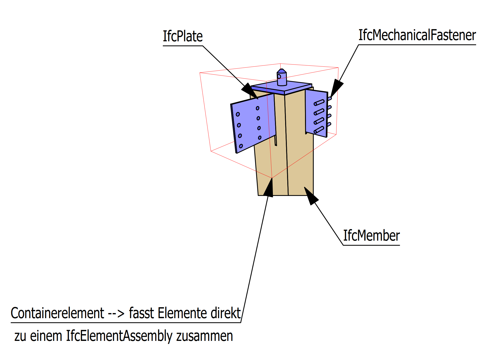

Folgend sind Beispiele von cadwork Elementen mit deren zugehörigen IfcTyp dargestellt. Die Hüllkörper wurden zur besseren Darstellung von den Bauteilen versetzt platziert. 

## Hüllkörper Elemente
Für den Export von Hüllkörpern ist unter den Exporteinstellungen -> Elemente -> :white_check_mark: Hüllelemente exportieren die Checkbox zu aktieren.

## Holzrahmenbaudecke
Die Bauteile sind nach Bauunter-, oder nach Baugruppe zusammengefasst.   
!!! info "  In den Exporteinstellungen -> Elemente -> Zusammenfassen nach: Bauunter-, Baugruppe ist die Checkbox :white_check_mark: zu aktivieren. Bei aktiver Checkbox werden die Elemente zum Bauteil (z.B. IfcSlab) zusammengefasst. Die Checkbox -> Hüllelemente exportieren soll deaktiviert :x: werden."
[Export - zusammengesetzte Bauteile](ifc.md#Elemente)

!!! Tipp
    Nutzen Sie auch für Dachelemente den IfcTyp -> IfcSlab. In den Elementbaueigenschaften Ctrl+E ist der Typ Rahmenbaudach zu wählen. Somit resultiert im Ifc Export der Typ **IfcSlab mit dem PredefinedType ROOF**. 

## Holzrahmenbauwand
Die Bauteile sind nach Bauunter-, oder nach Baugruppe zusammengefasst.  

## Assemblies
!!! info "   Die IfcElementAssembly stellt komplexe Elementbaugruppen dar, die aus mehreren Elementen zusammengesetzt sind.  BEISPIEL Holz-, oder Stahlkonstruktionsbaugruppen, wie z. B. Fachwerke und verschiedene Arten von Rahmen, können durch die Entität IfcElementAssembly dargestellt werden. Auch Treppenabschnitte und andere vorgefertigte Elemente sind Beispiele für die allgemeine Entität IfcElementAssembly"

