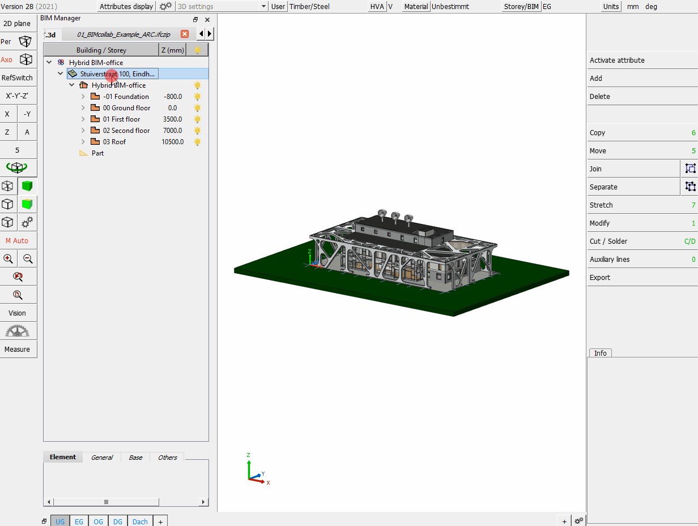
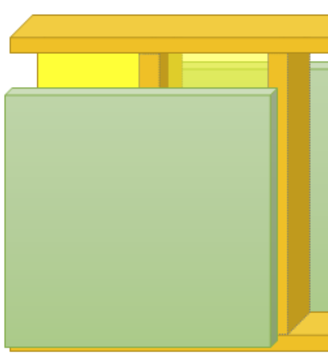

Die schnell zunehmende technische Entwicklung im Bauwesen führt zu einer grossen Nachfrage sowie Forderungen eines digitalen Datenaustauschs von Gebäudemodellen.
Cadwork bietet Ihnen ab der Version 27 umfängliche Möglichkeiten im Datenaustausch mit dem IFC- und BCF-Schema. In diesem Dokument wird jedoch ausschliesslich die Version 28 (2021) behandelt. 

Cadwork ist für den Datenaustausch im Schema IFC2x3 zertifiziert.

 

Im Umgang mit IFC-Daten sind das Dateischema, die Version des Schemas, die [Model-View-Definition](index.md#ModelViewDefintion MVD) sowie das Wissen um den Aufbau der Datei entscheidend. In den nächsten Abschnitten wird der Umgang mit dem IFC-Schema in cadwork erläutert. 

# IFC Import in cadwork

<figure class="video_container">
  <iframe width="560" height="315" src="https://www.youtube.com/embed/aq0Y8BCePD8" title="YouTube video player" frameborder="0" allow="accelerometer; autoplay; clipboard-write; encrypted-media; gyroscope; picture-in-picture" allowfullscreen></iframe>
</figure>

**Dateien hinzufügen**  
IFC Dateien werden via BIM-Management-Tool in cadwork importiert. 
Das BIM Management Tool (BMT) ist für die Arbeit nach der BIM-Methode das zentrale Werkzeug. Von hier können alle zugehörigen Dialoge geöffnet und alle Einstellungen
getätigt werden. Öffnen Sie den BMT entweder über die Schaltfläche Geschoss/BMT in der Kopfzeile oder über das Menü; Fenster –> BIM Management Tool.
IFC- Dateien können entweder über das  "+" Symbol, oder mit «Drag and Drop» hinzugefügt werden. 

{: style="width:900px"}

Importierte Elemente werden als **"Exchange-Objekt"** eingelesen, welches nur der Visualisierung dient. Sie können nicht in einer 2D-Ebene dargestellt oder in den Planausgaben exportiert werden. Sie können auch nicht bearbeitet oder zur Kollisionskontrolle genutzt werden.
Mit «Aktivieren nach Attribut» können die Bauteile selektiert werden. So können Sie zum Beispiel die ++ctrl+"A"++ -Funktionen nutzen, um nur die Exchange-Objekte nach IFC-Gebäude ++ctrl+shift+"A"++ , IFC-Geschoss, IFC-Typ, Name, Material und Farbe zu aktivieren, die Sie als cadwork Bauteile erzeugen möchten.

## Globaler - lokaler Nullpunkt

Um georeferenzierte Modelle in der geforderten Genauigkeit von cadwork halten und bearbeiten zu können, wird beim Import von georeferenzierten IFC Dateien der interne Nullpunkt verschoben. 
Zu weit vom Nullpunkt entfernte Elemente würden zu Genauigkeitsproblemen führen. 
Nach Bestätigung der Verschiebung, wird der Verschiebungsvektor intern gespeichert und die globalen Koordinaten eingetragen (Einstellungen -> Globaler Nullpunkt)

{: style="width:400px"}

Beim Export des geforderten Modellinhalts aus cadwork wird der Verschiebungsvektor berücksichtigt und der Modellursprung an derselben Stelle platziert. 

{: style="width:400px"}

## Struktur - Ansichten

Mit einem Rechtsklick auf das Projekt öffnet sich das Kontext Menü, welches die möglichen Optionen aufzeigt. 
Alternativ zur hierarchischen Ansicht, kann in die Ansicht nach IFC Typ gewechselt werden. 

{: style="width:900px"}

Mit einem Rechtsklick im BMT öffnet sich das Kontext-Menü über welches die Importeinstellungen vorgenommen werden können.

{: style="width:900px"}

**Einstellungsmöglichkeiten**

1.	Öffnungen einschneiden
    * Definiert ob Öffnungen hart/weich eingeschnitten werden sollen, oder ob das IfcOpeningElement zu einem Element mit dem Typ Öffnung generiert werden soll.
2.	Achssystem regenerieren
    * Das Achssystem wird algorithmisch neu berechnet und ausgerichtet.
3.	Korrigieren Facetten
    * Unnötige Facetten werden, wenn möglich, korrigiert
4.	IfcElementAssembly (zusammengesetztes Element)
    * Die IfcElementAssembly repräsentiert Elementbaugruppen, die aus mehreren Elementen zusammengesetzt sind.
    * z. B. Fachwerkbinder und verschiedene Arten von Rahmen, können durch die Entität IfcElementAssembly dargestellt werden. 
5.	Architektur-Hüllen erzeugen
    * Generieren eines Hüllkörpers (Wand, Decke, Dach)

## Bauteile erzeugen

Importierte Bauteile lassen sich zu cadwork Elementen konvertieren. Somit können diese für die Planung weitergenutzt werden (Referenz).  

!!! info " **Tipp!**  Prüfen Sie den Inhalt der erhaltenen Daten immer zuerst in einem Viewer (**QualityGate**) anschliessend sind die importierten Daten in cadwork sorgfältig auf ihre Richtigkeit (Genauigkeit, Informationen) zu kontrollieren"

IFC Viewer -> ([FZK-Viewer](https://www.iai.kit.edu/1302.php){target=_blank}, [Liste-verschiedener-Viewer](https://bim-me-up.com/die-popularsten-ifc-viewer/){target=_blank})  

Die Konvertierung kann über **Modifizieren -> als Bauteil erzeugen** vorgenommen, oder über das Kontext Menü im BMT. 
Gültig Elemente werden nach ausführen der Konvertierung zu cadwork Elementen umgewandelt. Ungültige Elemente können nicht zu nativen cadwork Elementen konvertiert werden. Ungültig heisst, wenn z.B. die Geometrie inkorrekt beschrieben ist. 
Kontrollieren Sie die Daten sorgfältig auf ihre Richtigkeit (Genauigkeit, Informationen). 

**Geometriemanipulation**

Cadwork bietet Ihnen Werkzeuge für Geometriemanipulationen an. Über **Modifizieren -> Optionen** sind die möglichen Optionen zur Geometriemanipulation der Elementtypen ersichtlich. 
Wenn z.B. die Geometrie in der IFC-Datei über Flächen beschrieben ist (SurfaceModel -> kein Volumen), können Sie diese zu einem Volumen modifzieren (**Modifizieren -> Optionen -> Mehrere Flächen zu Volumen**). 

## IFC Attribut Mapper - PropertyMapping

<figure class="video_container">
  <iframe width="560" height="315" src="https://www.youtube.com/embed/DKCo9oiGMUY" title="YouTube video player" frameborder="0" allow="accelerometer; autoplay; clipboard-write; encrypted-media; gyroscope; picture-in-picture" allowfullscreen></iframe>
</figure>

Der IFC Attribut Mapper ermöglicht das Mappen von Eigenschaften (Properties) aus der IFC Datei in die Attribute von cadwork Elementen. Der Attribut Mapper wird direkt aus dem Kontext Menü des BMT aufgerufen. 

{: style="width:900px"}

**FromEntity**  
Klasse, auch Entität, Elementklasse, Entitytyp:  
Eine Entität ist laut IFC-Definition eine Informationsklasse, die durch gemeinsame Attribute und Einschränkungen definiert ist. Für jeden Entitytyp werden Attribute sowie Beziehungen zu anderen Entitytypen festgelegt. Das objektorientierte Konzept der Vererbung wird umgesetzt. Dadurch werden Attribute und Beziehungen an Subtypen weitergegeben.

!!! Info
    Führen Sie das Mapping standardmässig **FromEntity** aus. **FromType** soll nur gemappt werden, wenn bewusst jene Eigenschaften gefragt sind.  Objekttypen werden bei Software die mit Bauteilbibliotheken arbeiten verwendet. Diesen Objekten können Attribute und Eigenschaften zugewiesen werden. Die Objekte in der Bauteilbibliothek dienen beim Modellieren als Schablone. Die Eigenschaften vom Objekttyp (Katalogelement) können sich vom Entität-Typ (modifizierte Eigenschaften) unterscheiden. 
**FromType**  
Ein Objekttyp ist ähnlich der Klasse ebenfalls eine Art Schablone, die gemeinsame Charakteristiken mehrerer Instanzen vereint. Dabei werden jedoch bestimmte Grundparameter, die für wiederkehrende Bauteile gleichbleiben, bereits vor der eigentlichen Instanziierung festgelegt.  
In IFC wird das Konzept der Objekttypen bereitgestellt, um häufig wiederkehrende Bauteile effizient beschreiben zu können. Dafür wird ein wiederverwendbares Muster vordefiniert, also eine Art »Schablone«. Die Objekttypen können Attribute und Properties definieren, die dann automatisch an die verknüpften Objekte weitergegeben werden. Dies kann als Vorinstanziierung bezeichnet werden. Bei der tatsächlichen Instanziierung der Objekttypen werden nur noch Daten, wie etwa die räumliche Lage oder die Beziehungen zu anderen Objekten, festgelegt. Diese Daten können nicht über Objekttypen vorgegeben werden.

## IFC Modellaufbau & Export aus cadwork

<figure class="video_container">
  <iframe width="560" height="315" src="https://www.youtube.com/embed/rGLje-72664" title="YouTube video player" frameborder="0" allow="accelerometer; autoplay; clipboard-write; encrypted-media; gyroscope; picture-in-picture" allowfullscreen></iframe>
</figure>

Checkliste Modellaufbau  :bulb:

Im Projektteam muss klar definiert sein, wie die Modelle aufzubauen sind. 

- [X] **Dateiname**
    * Stellen Sie sicher, dass eine einheitliche und konsistente Bezeichnung der (fachspezifischen) Modelle innerhalb des Projekts gewährleistet ist.
- [X] **Lokale Position und Ausrichtung**
    * Die lokale Position des Bauwerks ist abgestimmt und liegt nahe am Nullpunkt
    * Das Festlegen eines einheitlichen Projektkoordinatenursprungs und einheitliche Masseinheiten sind von enormer Bedeutung für das spätere Zusammenfassen der Teilmodelle. Der gemeinsame Referenzpunkt wird als x, y, z Koordinate und dem Winkel zur Nordrichtung (TrueNorth) festgelegt. Alle Projektbeteiligten müssen sich auf diesen Referenzpunkt beziehen. Der Referenzpunkt soll möglichst nahe am Gebäude liegen. 
- [X] **Gebäudegeschosse und Bezeichnung**
    * Bezeichnen Sie Gebäudegeschosse und definieren Sie die richtige Geschosshöhe. Weisen Sie allen Objekten das richtige Geschoss zu. Stellen Sie innerhalb des Projektes sicher, dass durch die Projektbeteiligten die exakte Bezeichnung konsistent genutzt wird, welche numerisch sortiert ist und eine textliche Beschreibung enthält. Alle Modelle, Stockwerke, Bauabschnitte und weitere gemeinsame Inhalte müssen einheitlichen Namenskonventionen folgen. 
    * Alle Fachmodelle sind nach den Gebäude-, Geschoss-, Bezeichnungsvorgaben aufzubauen. 
- [X] **Korrekte Verwendung von Entitäten**
    * Verwenden Sie den jeweils geeigneten IFC-Typ. Beispiel: Wand = ifcWall, Balken = ifcBeam, Stütze = ifcColumn, Treppe = ifcStair, Tür = ifcDoor etc.
    * Da in cadwork nicht mit Objekttools gearbeitet wird, sind die Elemente mit dem korrekten IfcTyp zu bezeichnen. 
- [X] **Detaillierung**
    * Detaillierungsgrade der Modellelemente für den Datenaustausch sind unter den Projektbeteiligten zu definieren. Elementen können viele Eigenschaften zugewiesen werden, doch nicht alle sind in jedem Projekt notwendig. Um ein unnötiges Anwachsen der Datenmenge sowie zu einer besseren Übersicht, sollte rechtzeitig festgelegt werden, welche Eigenschaften effektiv benötigt werden. 

## IFC Typen  :bulb:

Cadwork Element         | Anwendung                                             | IFC-Typ
------------------------|-------------------------------------------------------|-------------
Stab                    | Dachbauteile, Rahmenholz, Streben, etc. Ein IfcMember ist ein Strukturelement, das dazu dient, Lasten zwischen oder über Stützpunkte hinaus zu tragen. Es ist nicht erforderlich, dass es tragend ist. Die Ausrichtung des Stabs (horizontal, vertikal oder schräg) ist für seine Definition nicht relevant (im Gegensatz zu IfcBeam und IfcColumn).  (Anwendungsbeispiele: Strebe, Ständer, Balken, Ausholzung) | IfcMember
Stab	                | Ein IfcBeam ist ein waagerechtes oder nahezu waagerechtes Bauteil, das in erster Linie durch Biegung belastet werden kann  (Anwendungsbeispiele: Unterzug, Träger)| IfcBeam
Stab	                | IfcColumn ist ein vertikales oder nahezu vertikales Bauteil, das durch Druck das Gewicht der darüber liegenden Struktur auf andere darunter liegende Strukturelemente überträgt. Es ist jedoch nicht erforderlich, dass es tragend ist. (Anwendungsbeispiel: vertikale Stütze)| IfcColumn
Platte	                | Eine IfcPlatte ist ein planes und oft flaches Teil mit konstanter Dicke. Eine Platte kann ein Strukturteil sein, das Lasten zwischen oder über Stützpunkte hinaus trägt, sie muss jedoch nicht tragend sein. Die Lage der Platte (horizontal, vertikal oder schräg) ist für ihre Definition nicht relevant (im Gegensatz zu IfcWall und IfcSlab (als Bodenplatte)). (Anwendungsbeispiel: Beplankung) | IfcPlate
Platte	                | Ein Fundament ist ein Teil des Fundaments einer Struktur, der die Last auf den Boden verteilt und überträgt. Ein Fundament wird auch als Flach-gründung bezeichnet, bei der die Lasten in den Boden nahe der Oberfläche eingeleitet werden (Anwendungsbeispiel: Fundament) | IfcFooting
Platte	                | Eine Decke ist eine Komponente der Konstruktion, die normalerweise einen Raum vertikal umschliesst. Die Platte kann die untere Auflage (Fussboden) oder die obere Konstruktion (Dachplatte) in einem beliebigen Raum in einem Gebäude bilden. Es ist zu beachten, dass nur der Kern oder der konstruktive Teil dieser Konstruktion als Decke gilt. Der obere Abschluss (Fussboden, Dachhaut) und der untere Abschluss (Decke, abgehängte Decke) gelten als Belag. (Anwendungsbeispiel: Decken-, Dachelement, Bodenplatte) | IfcSlab
Fläche, Hilfsvolumen, Platte | Definition für Elemente, welche einen Teil eines anderen Elements abdecken und von diesem anderen Element abhängig ist.  (Anwendungsbeispiel: Oberfläche, Beschichtung, Behandlung). |IfcCovering
Platte	                | Vorhangfassade, nicht tragende Wand, die an der Aussenseite eines Gebäudes steht und dieses umschliesst. (Anwendungsbeispiel: Vorhangfassade) | IfcCurtainWall
Platte	                | Die Wand stellt eine vertikale Konstruktion dar, die Räume begrenzen oder gliedern kann. Wände sind in der Regel vertikale oder nahezu vertikale, flächige Elemente, die oft für die Aufnahme von statischen Lasten ausgelegt sind. Eine Wand muss jedoch nicht tragend sein  (Anwendungsbeispiel: Wand) | IfcWall
Raum                    | Ein Raum stellt eine tatsächlich oder theoretisch begrenzte Fläche oder ein Volumen dar. Räume sind Flächen oder Volumina, die bestimmte Funktionen innerhalb eines Gebäudes bereitstellen. | IfcSpace
Öffnung	                | Das Öffnungselement steht für Öffnungen (Fenster-, Türöffnung).  (Anwendungsbeispiel: Öffnung) | IfcOpeningElement
Achse (VBA, Bolzen)	    | Ein mechanisches Verbindungselement, das Bauelemente oder Teile mechanisch verbindet. Eine einzelne Instanz dieser Klasse kann ein oder mehrere tatsächliche mechanische Verbindungselemente darstellen, z. B. eine Reihe von Bolzen, Schrauben oder eine Reihe von Nägeln  (Anwendungsbeispiel: Bolzen, Verbindungsmittel) | IfcMechanicalFastener
Achse (VBA, Bolzen), Hilfsvolumen	    | Leimfuge: Eine Befestigungsverbindung, bei der Leim ver-wendet wird, um Elemente miteinander zu ver-binden.  Schweissnaht: Eine Schweissnaht, die zum Zusammenfügen von Bauelementen verwendet wird.  Fugenmörtel: Mörtel, der zum Zusammenfügen von Bauele-menten verwendet wird. Die Festigkeit der Ver-bindung kann bei Berechnungen berücksichtigt werden.  (Anwendungsbeispiel: Schweissnaht, Leimfuge, Fugenmörtel) | IfcFastener
Variante Fenster        | Konstruktion zum Verschliessen einer vertikalen oder nahezu vertikalen Öffnung in einer Wand oder einem Schrägdach, die Licht und ggf. Frischluft einlässt  (Anwendungsbeispiel: Fenster) | IfcWindow
Variante Türe	        | Konstruktion zum Verschliessen einer Öffnung, die in erster Linie für den Zugang mit Scharnier-, Dreh- oder Schiebebetrieb vorgesehen ist  (Anwendungsbeispiel: Türe) | IfcDoor
Treppe                  | Ein vertikaler Durchgang, der es den Bewohnern ermöglicht, von einer Geschossebene zu einer anderen Geschossebene auf einer anderen Höhe zu gehen (zu treten). Es kann ein Podest als Zwischenbodenplatte enthalten sein. (Anwendungsbeispiel: Treppe) | IfcStair
Treppe (Stab/Platte)    | Die Treppenstufen und eventuelle Wangen sind in diesem Objekt enthalten. | IfcStairFlight
Installation rund       | Das Verteilungsfluss-Element IfcFlowSegment definiert das Vorkommen eines Segments eines Flussverteilungssystems, das typischerweise gerade und zusammenhängend ist und zwei Anschlüsse hat (z. B. ein Abschnitt eines Rohrs oder Kanals). (Anwendungsbeispiel: Leitungen) | IfcFlowSegment
Diverse                 | Das Geländer ist eine Rahmenkonstruktion, die an den Verkehrsflächen und an einigen Raumbegrenzungen anstelle von Wänden oder als Ergänzung zu Wänden verwendet wird. | IfcRailing
Diverse	                | Der Typ BuildingElementProxy soll verwendet werden, um spezielle Typen von Gebäudeelementen auszutauschen, für die es im aktuellen IFC-Release noch keine semantische Definition gibt.  (Anwendungsbeispiel: Unbestimmte, im IFC Schema nicht klassifizierte Bauteile) | IfcBuildingElementProxy

Weitere IFC-Typen sind unter Modifizieren -> Attribute -> BIM -> IFC Typ wählbar.  
Die dokumentierten IFC-Typen finden Sie in der IFC Dokumentation von building-smart   [IFC-Entities Auflistung](https://standards.buildingsmart.org/IFC/RELEASE/IFC4/ADD2_TC1/HTML/){target=_blank} :point_left: 

IFC-Typ Zuweisungen unter Benutzereinstellungen -> Liste der Attribute vordefinieren
{: style="width:900px"}

## IfcProject | IfcSite

Die Bezeichnung des IfcProject sowie der IfcSite sind in den Projektdaten vorzunehmen.  
Projektdaten -> Allgemein -> **Projektname** (IfcProject) 
Projektdaten -> Projektort -> **Ortsbeschreibung Baustelle** (IfcSite)

## Geschossmanager

Viele CAD-Software benötigen eine Geschossstruktur mit Höhenangaben. In den Geschosseinstellungen können daher die Höhen definiert werden. 
Die Höhe ist, IFC-konform, immer als Oberkante Rohfussboden zu sehen (als Attribut IfcBuildingstorey: Elevation).

{: style="width:300px"}

Ein Geschoss umfasst jeweils die Decke und die sich "darauf befindenden" Bauteile (Wände, Stützen, etc.). 

{: style="width:600px"}

**Geschoss erstellen**

1. Geschossmanager / BMT öffnen
2. Rechtsklick in Geschossmanager / BMT
3. :heavy_plus_sign: Neues Gebäude / Neues Geschoss 
    - [ ] geforderte Eingabefelder befüllen  
    - [x] Gebäude - Geschoss erstellt

{: style="width:900px"}

**Elemente zu Gebäude / Geschoss zuweisen**  

Option A:

* Doppelklick auf das Geschoss im BMT -> aktiviert das Gebäude & Geschoss
    * neu modellierte Elemente werden direkt diesem Gebäude & Geschoss zugewiesen

Option B:

* Bauteile aktivieren -> Modifizieren -> BIM -> Gebäude (Auswahl Gebäude) -> Geschoss (Auswahl Geschoss)

## PropertySet

cadwork schreibt standardmässig das PropertySet **Cadwork3dProperties**. In diesem PropertySet werden alle verwendeten Attribute sowie Userattribute erfasst.  

Für den **"Advanced User"** gibt es die Möglichkeit eigene Psets anzulegen. Dies können entweder Standard-Psets wie z.B. das Pset_BeamCommon, oder benutzerdefinierte wie z.B. "Eigenschaften_Holzbau_XY" sein. 
Dazu werden in den User-Attributen die IfcProperty angelegt. Dies kann z.B. das Property LoadBearing auf User10 sein. Die für das Pset benötigten Eigenschaften werden dann im Exportdialog unter dem Register "Pset-Defintionen" zu einem Set zusammengefasst. 
Im IFC Schema ist für jedes Property der Datentyp definiert. Damit die PropertySets korrekt exportiert werden, ist der Datentyp im Exportdialog zu bestimmen (Rechtsklick auf das Property). 

Nachdem Sie die Schaltfläche Benutzerattribut hinzufügen gewählt haben, wählen Sie zunächst in der Dropdown-Liste die für das Pset gewünschten cadwork-Attribute aus der Dropdown-Liste aus. Zwingend für jedes Attribut ist ein zu verwendender Datentyp auszuwählen. 
Nun wählen Sie den Namen, unter dem das Pset in der IFC-Datei zu finden sein soll. In der letzten Dropdown-Liste müssen Sie die IFC-Typen auswählen, für die dieses Pset ausgegeben werden soll. So ist es möglich, sehr differenziert Psets für
unterschiedliche Bauteile anzulegen. Möchten Sie ein einmal angelegtes User Pset löschen, so können Sie am Ende der
Zeile auf das Minus-Symbol klicken. Auf die selbst angelegten User Psets können Sie über die Schaltflächen Laden und Speichern immer wieder zugreifen.

IfcDataType             | Defintion                                                 | Value         
------------------------|-----------------------------------------------------------|-----------------------------------
IfcInteger              | ganze Zahlen im positiven und negativen Bereich INTEGER   | 1,100,20        
IfcReal	                | beliebige positive und negative Gleitkommazahlen REAL     | 0.1245, 1.458	                      
IfcBoolean	            | Form mit zwei Zuständen 0 & 1 BOOLEAN                     | True/False, "1" oder "0", WAHR/FALSCH, Ja/Nein, Vrai, Faux
IfcLabel                | beliebiger Text STRING                                    | Holz, Hersteller          

{: style="width:900px"}

## Detaillierung

Die Detaillierung des Modellinhalts wird über die enthaltenen Checkboxen gesteuert. 
Achten Sie darauf, dass nur der geforderte Modellinhalt sowie Detaillierungsgrad exportiert wird.
Zur Option "Exportiere Geometrie mit der impliziten Methode (BETA)" finden Sie die Erläuterung im Register [BuildingInformationModeling](index.md#Geometrie) unter dem Tab Geometrie. 

{: style="width:900px"}

## Elemente

Sind in einer 3D-Datei Architekturelemente mit Bauteilen angelegt sowie jeweils in Baugruppen oder Bauuntergruppen eingeteilt, so werden die zugehörigen Elemente mit dieser Option zusammengefasst, als z.B. IfcWall, in die IFC-Datei
exportiert.
{: style="width:900px"}

Werden Architekturelemente nach Baugruppen oder Bauuntergruppen zusammengefasst, werden die Hüllen (Holzrahmenbau- und Blockbauhüllen) nicht mit ausgegeben. Dies kommt daher, dass die einzelnen Bauteile zusammengefasst die Wand, Decke oder das Dach darstellen.
{: style="width:400px"}

**Hüllelemente exportieren**

Ist der Export der Hüllen für weitere Schritte doch notwendig, können Sie durch Aktivieren dieser Option mit ausgegeben werden (nicht empfohlen). Massivwände, Massivdächer und Massivdecken werden immer exportiert, da diese als "reale" Bauteile vorliegen. Für Elemente dieses Typs ist das Aktivieren dieser Option nicht notwendig.

**IfcElementAssembly**

Die Entität IfcElementAssembly repräsentiert komplexe Elementbaugruppen, die aus mehreren Elementen zusammengesetzt sind. Dies können z.B. zusammengesetzte Stahlteile, Fachwerkbinder oder Treppen sein.
In cadwork verwenden wir für eine ähnliche Gruppierung bereits seit langem Containerelemente. **Elemente, welche in Containerelementen zusammengefasst sind, werden in cadwork standardmässig als IfcElementAssembly exportiert.** Diese Funktion kann nicht beeinflusst werden. 

## Unterstützte IFC-Schemas
Für den Import sowie den Export unterstützt cadwork die Schemas IFC 2x3 und IFC4.  

Die IFC4-Version kombiniert eine Reihe von Funktionserweiterungen mit einer umfassenden Überarbeitung und Verbesserung der bestehenden IFC-Spezifikation. Das übergeordnete Ziel ist es, die Konsistenz im gesamten IFC-Schema zu verbessern, den für die Bestückung eines IFC-Datensatzes erforderlichen Modellfussabdruck zu reduzieren und die aus der aktuellen Implementierung und Nutzung gewonnenen Erkenntnisse anzuwenden. IFC4 wurde als die nächste Grundlage für die IFC-gestützte Interoperabilität von Gebäudedatenmodellen als Standard für Open BIM entwickelt.[^6]

{: style="width:900px"}

## ArchiCAD - Cadwork
<figure class="video_container">
  <iframe width="560" height="315" src="https://www.youtube.com/embed/bbDkPNFKdl4" title="YouTube video player" frameborder="0" allow="accelerometer; autoplay; clipboard-write; encrypted-media; gyroscope; picture-in-picture" allowfullscreen></iframe>
</figure>

## OpenBIM - Workflow-Sheets
[OpenBIM Workflow-Sheets](https://openbim.ch/workflow-sheets/){target=_blank} :point_left:

[^6]: [ifc2x3 vs ifc4](https://standards.buildingsmart.org/IFC/DEV/IFC4_2/FINAL/HTML/annex/annex-f/ifc2x3-to-ifc4/index.htm)