# Cadwork BIM
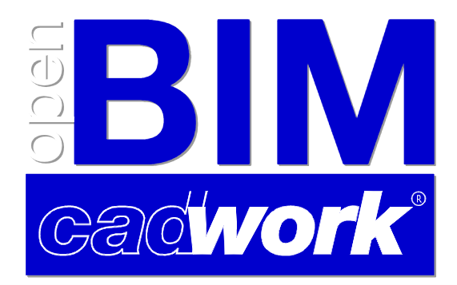{: style="width:700px"}

Die Digitalisierung in der Baubranche nimmt immer mehr Fahrt auf. Die Methode Building Information Modeling (BIM) dient dabei als Einstieg. Der transparente Prozess mit einer hohen Qualität an objektbeschreibenden Informationen und Quality Gates bildet die Grundlage für digitale Innovationen. Neben technischen Aspekten fordert die Methode einen **Kulturwechsel in der Baubranche**. Projektbeteiligte führen transparente Informationsflüsse und liefern gezielt Daten zum definierten Zeitpunkt in der geforderten Qualität. BIM führt zu Transparenz in Kommunikation und Zusammenarbeit. Es ist absehbar, dass sich in wenigen Jahren, wie bei der Einführung von CAD im letzten Jahrtausend, der gesamte Abwicklungsprozess über den Lebenszyklus dahingehend anpassen wird, dass die BIM-Methode eine zentrale Rolle einnehmen wird.

**...it's all about culture...**

### W-Fragen :bulb:<br>
**W**er benötigt, **w**ann, von **w**em, **w**ie sowie zu **w**elchem Zweck **w**elche Informationen in **w**elchem Datenformat? 

{: style="width:700px"}

## Begrifflichkeiten
Akronym | Begriff                           | Bedeutung
--------|-----------------------------------|-------------
BIM     | Building Information Modeling     | Arbeitsmethode
IFC	    | Industry Foundation Classes       | Transportiert Daten / Schema
BCF	    | BIM Collaboration Format          | Koordinierung von Änderungen
bsDD    | buildingSmart Data Dictionary     | Hostet Klassifizierungen und Eigenschaften in einer Datenbank
IDM     | Information Delivery Manual       | Beschreibt Prozesse
MVD     | Model View Defintion              | Übersetzt Prozesse in Software technische Anforderungen
LOG     | Level of Geometry	                | Geometrische Anforderung - Stufe
LOI	    | Level of Information	            | Alphanumerische Anforderung - Stufe
LOIN    | Level of Information Needed	    | Informationsbedarf (Besteller)
Pset    | Property Set	                    | Container für Informationseinheiten
BAP     | BIM-Projektabwicklungsplan	    | Richtliniendokument, das die Grundlage einer BIM-basierten Zusammenarbeit definiert
GUID    | Globally Unique Identifier        | Einmalige, nicht veränderbare 128 Bit Zahl - Kennungsnummer

Weitere Begrifflichkeiten zum Thema BIM finden sie im Glossar von bauen digital Schweiz :
[Glossar bdCH](https://bauen-digital.ch/de/produkte/glossar/){target=_blank} :bulb:

## der BIM-Prozess
Die Vorteile der BIM-Methode sollten nicht nur technisch, sondern auch strukturell voll ausgenutzt werden. Daher ist der Einsatz der openBIM-Methode in allen Projekten empfehlenswert. Hinsichtlich Umsetzung und Zusammenarbeit ergeben sich folgende Vorteile:
Software-Unabhängigkeit und Wahlfreiheit bei der Applikation aller Projektbeteiligter; daher kein Wettbewerbsnachteil aufgrund von Festsetzungen zu Applikationsverwendungen,
langfristige Verwendbarkeit der Modelldaten (Nachhaltigkeit durch ISO-Zertifizierung von IFC und IDM) und
Autarkie von software-spezifischen Modellinformationen (Transparenz).
Die Entwicklungsstufen von BIM geben dahingehend eine klare Einstufung ab

* `little BIM`: BIM-Insel, BIM-Einsatz nur in vereinzelten Disziplinen 
* `BIG BIM`: BIM-Integration in allen Disziplinen 
* `closedBIM`: geschlossene Lösung, Verwendung einer Software(familie) 
* `openBIM`: offene Lösung, Austauschbarkeit über verschiedene BIM-fähige Software-Produkte

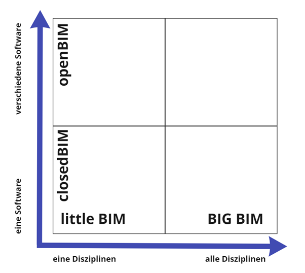{: style="width:700px"}

### openBIM[^1]

openBIM erweitert die Vorteile von BIM (Building Information Modeling), indem es die Zugänglichkeit, Nutzbarkeit, Verwaltung und Nachhaltigkeit von digitalen Daten in der Bauindustrie verbessert. Im Kern ist openBIM ein kollaborativer Prozess, der herstellerneutral ist. openBIM-Prozesse können als gemeinsam nutzbare Projektinformationen definiert werden, die eine nahtlose Zusammenarbeit für alle Projektbeteiligten unterstützen. openBIM erleichtert die Interoperabilität zum Nutzen von Projekten und Anlagen während ihres gesamten Lebenszyklus.

openBIM befähigt die Beteiligten, neue Arbeitsweisen zu entwickeln, indem es die traditionellen Peer-to-Peer-Arbeitsprozesse transformiert. Durch das Aufbrechen von Datensilos kann openBIM die Projektabwicklung und Anlagenleistung erheblich verbessern. Unternehmen, die einen openBIM-Ansatz verfolgen, entwickeln eine parteiübergreifende Zusammenarbeit, verbesserte Kommunikation und Austauschmethoden nach Industriestandard. Dies führt zu besseren Projektergebnissen, grösserer Vorhersehbarkeit, verbesserter Leistung und erhöhter Sicherheit bei reduziertem Risiko.
Während des gesamten Lebenszyklus einer Anlage hilft openBIM dabei, Menschen, Prozesse und Daten miteinander zu verbinden, um die Ziele für die Lieferung, den Betrieb und die Instandhaltung der Anlage zu erreichen. openBIM und nahtlose digitale Workflows machen wichtige Projektinformationen für alle Beteiligten zeitnah zugänglich, um die Entscheidungsfindung in den verschiedenen Phasen des Projekts zu unterstützen - von der Planung über die Übergabe bis hin zur Sanierung und sogar zum Abriss. openBIM beseitigt das traditionelle Problem der BIM-Daten, die typischerweise durch proprietäre Datenformate von Anbietern, durch Disziplinen oder durch die Phase eines Projekts eingeschränkt sind.

Durch die Einhaltung internationaler Standards und Arbeitsabläufe erweitert openBIM die Breite und Tiefe der Nutzung von BIM durch die Schaffung einer gemeinsamen Ausrichtung und Sprache. Technische Anwendungen, die für openBIM entwickelt wurden, verbessern die Verwaltung der Daten und beseitigen unzusammenhängende Arbeitsabläufe. Unabhängige Qualitätsbenchmarks sorgen für einen zuverlässigen offenen Datenaustausch.

openBIM ermöglicht digitale Arbeitsabläufe auf Basis von herstellerneutralen Formaten wie IFC, BCF, etc.

openBIM ermöglicht einen zugänglichen digitalen Zwilling, der die zentrale Grundlage für eine langfristige Datenstrategie für gebaute Anlagen darstellt. Dies sorgt für eine bessere Nachhaltigkeit von Projekten und für ein effizienteres Management der gebauten Umwelt.
[^1]: [buildingsmart](https://www.buildingsmart.org/about/openbim/openbim-definition/)

**Die Prinzipien von openBIM**

1.	Interoperabilität ist der Schlüssel für die digitale Transformation in der Bauindustrie
2.	Offene und neutrale Standards sollten entwickelt werden, um die Interoperabilität zu erleichtern
3.	Ein zuverlässiger Datenaustausch hängt von unabhängigen Qualitätsmassstäben ab
4.	Zusammenarbeits-Workflows werden durch offene und agile Datenformate verbessert
5.	Flexibilität bei der Wahl der Technologie schafft mehr Wert für alle Beteiligten
6.	Die Nachhaltigkeit wird durch langfristige, interoperable Datenstandards gesichert

Die Vorteile für die Bauindustrie sind:

- [X] openBIM verbessert die Zusammenarbeit bei der Projektabwicklung erheblich
- [X] openBIM ermöglicht ein besseres Asset-Management
- [X] openBIM ermöglicht den Zugriff auf BIM-Daten, die während der Planung für den gesamten Lebenszyklus des Bauwerks erstellt wurden
- [X] openBIM erweitert die Breite und Tiefe von BIM-Ergebnissen durch die Schaffung einer gemeinsamen Ausrichtung und Sprache. Sowie durch die Einhaltung internationaler Standards und gemeinsam definierter Arbeitsprozesse
- [X] openBIM ermöglicht eine gemeinsame Datenumgebung, die den Anwendern Möglichkeiten zur Entwicklung neuer Arbeitsabläufe, Softwareanwendungen und Technologieautomatisierung bietet
- [X] openBIM ermöglicht einen zugänglichen digitalen Zwilling, der die zentrale Grundlage für eine langfristige Datenstrategie für gebaute Anlagen bildet

openBIM | Data                           
---------------------------------------------------------|-----------
OpenBIM Daten müssen für alle **lesbar** für viele **kommentierbar** und für wenige **änderbar** sein. | 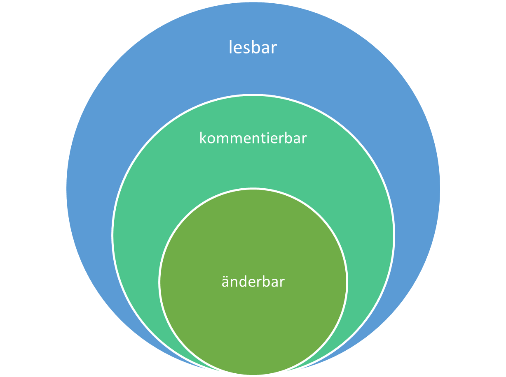

### Faktoren für ein erfolgreiches BIM

Damit BIM erfolgreich in einem Projekt implementiert werden kann, müssen verschiedene Faktoren berücksichtigt werden. 
Denn nur durch Berücksichtigung der folgenden Faktoren kann ein BIM Projekt erfolgreich umgesetzt werden. 


### Informationsanforderung
Informationsanforderung (Level of Information Need, LOIN) und deren Umsetzung in den unterschiedlichen Detaillierungsstufen (LOG/LOI)
Level of Geometry (LOG) 
definiert den geometrischen Inhalt eines Modells. Mit dem Fortschritt des Projekts nimmt die geometrische Genauigkeit zu. 
Level of Information (LOI) 
beschreibt den inhaltlichen (alphanumerischen) Informationsgrad eines Modells. Dazu werden die Attribute der zu verwendenden Objekte festgelegt.[^2]
[^2]: [bauen-digital-CH](https://bauen-digital.ch/assets/Downloads/de/180222-BdCH-SwissBIM-LOIN-Verstaendigung-web.pdf)

Level of Geomtry                | Level of Information                           
--------------------------------|------------------------------
 | 

Die LOG- und LOI-Definitionen sind individuell und unabhängig vorzunehmen. Es ist zu beachten, dass die LOD-Definition nicht die Summe von LOG und LOI ist, somit nicht LOD = LOI + LOG lauten kann. LOI- und LOG-Definitionen sind voneinander unabhängig, aber projektspezifisch hinsichtlich Ziele und entsprechenden Anwendungen bzw. den hierfür benötigten Informationen durch die Beteiligten, zu definieren.

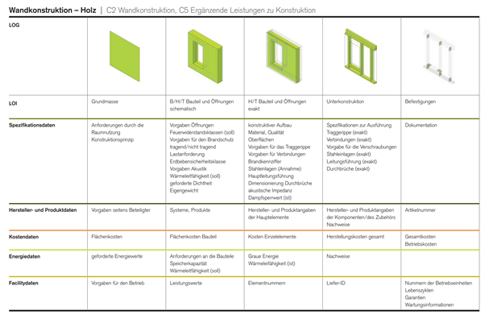{: style="width:700px"}

## ModelViewDefintion MVD
Zitiert aus bsI Standards Model View Definition (MVD)[^3] <br>

Im Allgemeinen ist eine MVD, oder "Model View Definition", eine Auswahl von Entitäten des gesamten IFC-Schemas, um eine bestimmte Verwendung oder einen Arbeitsablauf zu beschreiben. MVDs können so umfangreich sein wie fast das gesamte Schema (z.B. für die Archivierung eines Projekts) oder so spezifisch wie ein paar Objekttypen und zugehörige Daten (z.B. für die Preisgestaltung eines Vorhangfassadensystems).

Um die BIM-Interoperabilität über Hunderte von Softwareanwendungen zu unterstützen, ist das IFC-Schema so konzipiert, dass es viele verschiedene Konfigurationen und Detailebenen aufnehmen kann. 

Zum Beispiel kann eine Wand dargestellt werden:

1. als ein Linien- (oder Kurven-) Segment zwischen zwei Punkten;
2. als eine von vielen Arten von 3D-Geometrie für die Visualisierung und Analyse (z. B. als extrudierte Körper oder triangulierte Flächen);
3. als einfache Formen oder mit spezifischen Konstruktionsdetails (Erfassung einzelner Bolzen, Rohrverschraubungen, Verkabelungen usw.)...
4. ...zusammen mit Daten wie technische Eigenschaften, Verantwortliche, Terminplanung und Kosteninformationen. Aber nicht jeder Domänenexperte in den Konstruktions-, Beschaffungs-, Herstellungs- und Betriebsprozessen eines Projekts benötigt alle die gleichen Informationen, die geliefert oder empfangen werden.

eine MVD verwendet Entitäten aus IFC, um einen Austauschstandard für einen bestimmten Anwendungsfall oder Arbeitsablauf zu definieren. Dieser Austauschstandard (MVD) wird von Softwareanbietern implementiert.

[^3]: [MVD-buildingsmart](https://www.buildingsmart.org/standards/bsi-standards/model-view-definitions-mvd/)


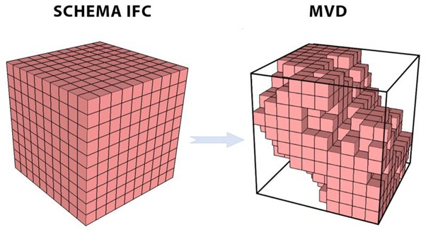{: style="width:700px"}

## Struktur IFC Datenschema
Zitiert aus dem BIMcert Handbuch 2021[^4] <br>

IFC ist in allen gängigen BIM-Applikationen integriert. Mittels der Software Certification durch buildingSMART international wird eine durchgängig hohe Übertragungsqualität abgesichert.
Alle funktionalen Elemente werden an Geschosse verknüpft und sind dadurch auch einem Bauwerk zugehörig. Neben alphanumerischen (Attribute, Parameter und Merkmale) und geometrischen Informationen enthält eine IFC-Datei auch Objektbeziehungen.
Die IFC-Spezifikation verwendet drei Strukturen: Verortungsstruktur, Funktionale Struktur und Materialstruktur.
Die Verortungsstruktur definiert in IFC die räumliche Struktur eines Bauwerks. Diese deklariert Bauplätze, darauf befindliche Bauwerke, darin befindliche Geschosse sowie die in einem Geschoss vorhandenen Räume.
Die Abbildung von Bauwerken erfolgt innerhalb der funktionalen Struktur durch eine Zerlegung in einzelne funktionale Elementklassen: z.B. Wände, Decken, Stützen, Türen oder Fenster. Jedes Element (Elementinstanz) erhält eine eindeutige Kennung (GUID).

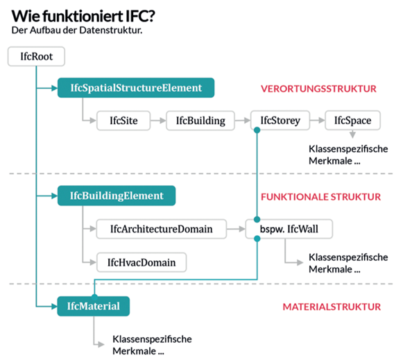{: style="width:700px"}

Jede funktionale Elementklasse ist für die Abbildung ihres Funktionsbereichs optimiert. Dafür trägt sie einen standardisierten Grundstock an Merkmalen zur Beschreibung relevanter Eigenschaften (Parameter) sowie ihrer typischen Geometrie (Attribute). Die Merkmale werden in Gruppen organisiert (Property-Sets). Jede Elementklasse trägt ein typisches Pset, das die wesentlichsten Merkmale trägt. Dieses Pset wird mit dem Suffix »Common« bezeichnet z.B. Pset_WallCommon oder Pset_DoorCommon.
Alle funktionalen Elemente werden an Geschosse verknüpft und sind dadurch auch einem Bauwerk zugehörig. Neben alphanumerischen (Attribute, Parameter und Merkmale) und geometrischen Informationen enthält eine IFC-Datei auch Objektbeziehungen.
Neben der Verortungsstruktur und der funktionalen Struktur existiert in der IFC-Datenstruktur auch eine Materialstruktur zur Deklaration materialbezogener Eigenschaften.
[^4]: [BIMcert](https://bif.bauwesen.tuwien.ac.at/fortbildung/kurse/aktuelle-kurse/bimcert/)

Das alphanumerische Dateiformat ist in zwei Bereiche struktuiert. In den Abschnitt HEADER, der die Informationen zur Datei enthält sowie in den Abschnitt DATA indem die Informationen zum Projekt enthalten sind.  
```
ISO-10303-21;
HEADER;
FILE_DESCRIPTION(('ViewDefinition [DesignTransferView_V1.0]','ExchangeRequirement [Architecture]'), '2;1');
FILE_NAME('Export_V2','2021-07-12T14:53:51',(''),('',''),'','cadwork','');
FILE_SCHEMA(('IFC4'));
ENDSEC;
DATA;
#1= IFCPROJECT('1a$RL01_H3_giBD$G0XTyj',#7,'Default Project','Description of default Project',*,*,*,(#15),#11);
#2= IFCPERSON($,'unknown','user',$,$,$,$,$);
#3= IFCORGANIZATION($,'Cadwork Informatik AG','organization',$,$);
#4= IFCPERSONANDORGANIZATION(#2,#3,$);
```
## Das Modell

Stachowiak, 1973:

> Modelle sind stets Modelle von etwas, für jemanden; sie erfüllen ihre Funktion eine Zeit lang und dienen einem Zweck.

Modelle sind nach den im Modellierungsplan definierten Regeln zu erstellen. [BIM Informations-Lieferungs-Handbuch (Grundlagen)](https://baustein.xella.ch/media/downloads/BIM-Grundlagen-Informations-Lieferungs-Handbuch-3.pdf)


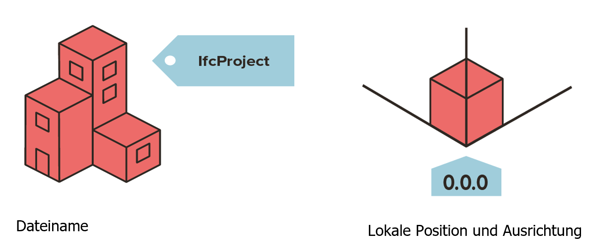{: style="width:700px"}

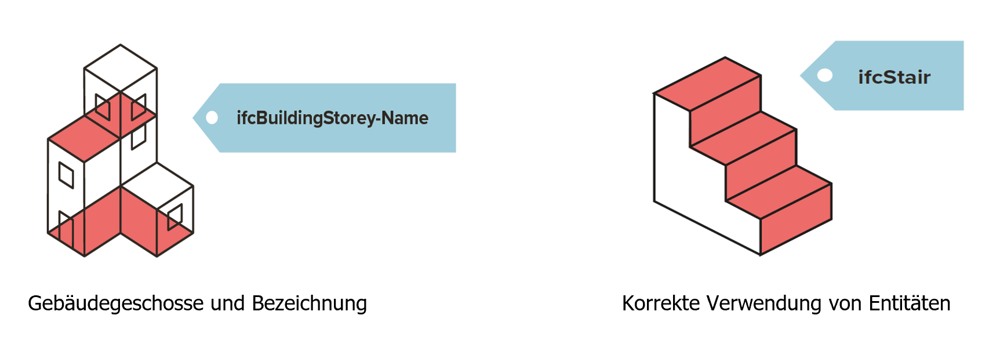{: style="width:700px"}

Je genauer die [Modellierungsregeln](ifc.md#IFC Modellaufbau & Export aus cadwork) umgesetzt werden, umso reibungsloser verläuft die modellbasierte Zusammenarbeit. Probleme bei der Zusammenführung der Modelle können durch die definierten Regeln umgangen werden und eine effiziente Zusammenarbeit wird ermöglicht. 

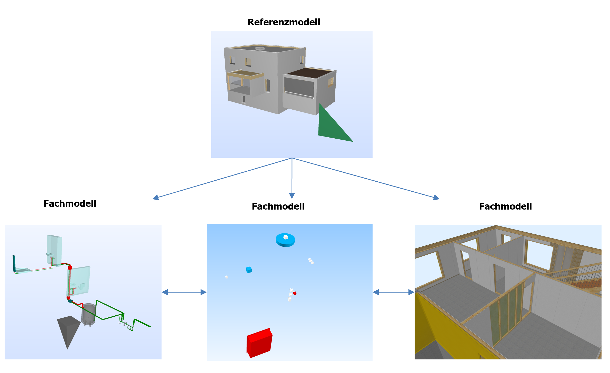{: style="width:700px"}

## Relative Positionierung
Die geometrische Modellierung im IFC-Datenmodell orientiert sich stark an der Verwendung eines lokalen Koordinatensystems.
So wird beispielsweise die Platzierung einer Stütze nicht global, sondern bezogen auf das Koordinatensystem des jeweiligen Stockwerks festgelegt.
Die Koordinaten der Stockwerke (IfcBuildingStorey) werden wiederum in Bezug auf das Koordinatensystem des Gebäudes (IfcBuilding) modelliert. Die Koordinaten des Gebäudes werden wiederum in Bezug auf das Koordinatensystem des Geländes (IfcSite) modelliert.

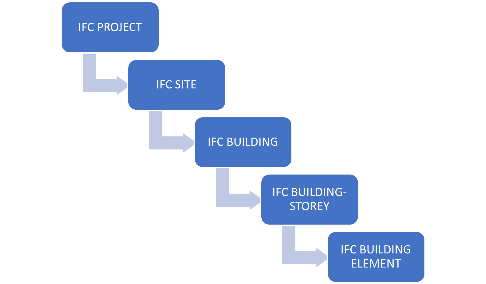{: style="width:700px"}

## IFC Entitäten
Eine IFC-Klasse ist ein **eindeutig identifiziertes Objekt** im IFC-Datenmodell. Abhängig von der Klassenzuweisung und der Typendefinition erhält das Objekt innerhalb des IFC-Schemas bestimmte **Standardattribute** und **Abhängigkeiten**. 
Die Wahl der richtigen Klasse beim IFC-Export ist daher sehr wichtig: Wird eine Wand nicht der Klasse IfcWall zugewiesen, bekommt sie nicht alle benötigten Attribute, um eindeutig beschrieben zu werden. Dann wird sie auch von anderen Programmen für die Koordination oder Auswertung nicht richtig interpretiert.

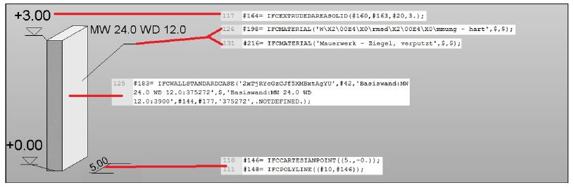{: style="width:700px"}

## PropertySet
Das IfcPropertySet ist ein **Container, der Eigenschaften innerhalb eines „Eigenschaftsbaums“ enthält**. Die Eigenschaften werden in Gruppen organisiert (sog. Psets = Property-Sets). Jede Elementklasse trägt ein typisches Pset, welches die wesentlichsten Merkmale trägt. Dieses Pset wird mit dem Suffix »Common« bezeichnet z.B. Pset_WallCommon oder Pset_BeamCommon.
Darüber hinaus kann jeder benutzerdefinierte Eigenschaftssatz erfasst werden. Eigenschaftssätze, die nicht als Teil der IFC-Spezifikation deklariert sind, müssen einen Name-Wert haben, der nicht das Präfix "Pset_" enthält. 

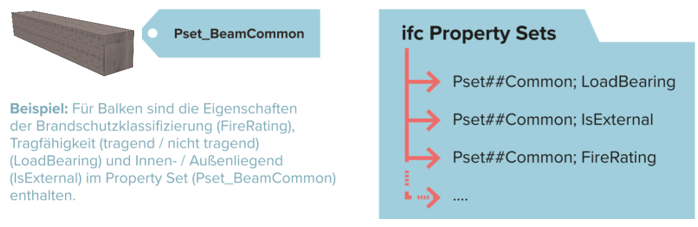{: style="width:700px"}

## Geometrie

Beginnend mit der 2,5D-Funktionalität, existiert schon seit über 30 Jahren die Fähigkeit dreidimensionale Objekte mit CAD-Programmen darzustellen. Um dreidimensionale Körper und nicht nur Flächen in einem Raum darstellen zu können, kamen die Technologien der BREP-, sowie die CSG-Methode dazu. 
Das IFC Schema unterstützt verschiedene Methoden, um Geometrie abzubilden. Je nach verwendeter Geometriemethode, werden unterschiedliche Ergebnisse erreicht. 
Die Qualität und Methode der Geometrie entscheidet über die Weiterverwendbarkeit der Elemente in cadwork. 

*	die explizite Modellierung mit der B-Rep Methode ((Boundary Representation), Begrenzungsflächenmodell) ist eine Geometriemethode, um beliebige 3D-Geometrien aus Begrenzungsflächen zu erstellen, die eine Hüllgeoemtrie vollständig umschliessen. Bei der B-Rep Methode wird immer nur das Ergebnis der Erstellung eines Körpers über die Begrenzungsflächen gespeichert.   
    *	das Volumen wird über die begrenzenden Flächen beschrieben
    *	komplexe Formen werden mit einer hohen Anzahl Facetten beschrieben
    *   Darstellung nicht ebener Flächen -> NURBS (nichtuniforme rationale B-Splines). Diese Methode erlaubt das Konstruieren von Freiformflächen. 

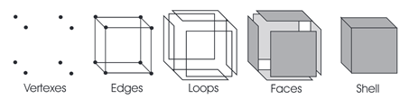{: style="width:700px"}
{: style="width:700px"}

* die implizite Modellierung CSG ((Constructive Solid Geoemtry), Extrusionen, Rotationen) ist eine Geoemetriemethode, um beliebige 3D-Geometrien aus Operationen zwischen Basiskörpern zu erstellen. 
    * das Volumen wird über eine Abfolge von Konstruktionsschritten beschreiben. Die Modellierungsschritte zum Resultat werden gespeichert (history). 
    *  Beim Konvertieren zu cadwork Elementen werden die booleschen Operationen ausgeführt. Die resultierende Geometrie kann, wenn Faktoren wie die Genauigkeit zusammenpassen, für z.B. die Produktion genutzt werden. 
    * CSG

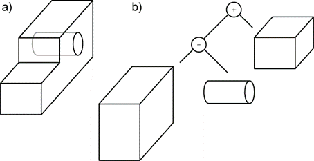{: style="width:700px"}
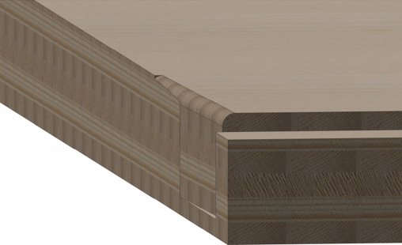{: style="width:700px"}

* Extrusion
    * Fläche (Area) wird entlang eines Richtungsvektors extrudiert

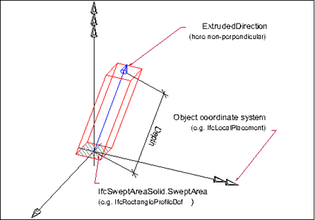{: style="width:700px"}


