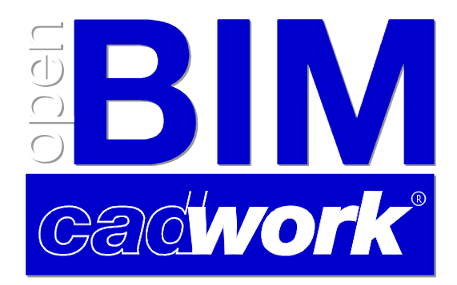
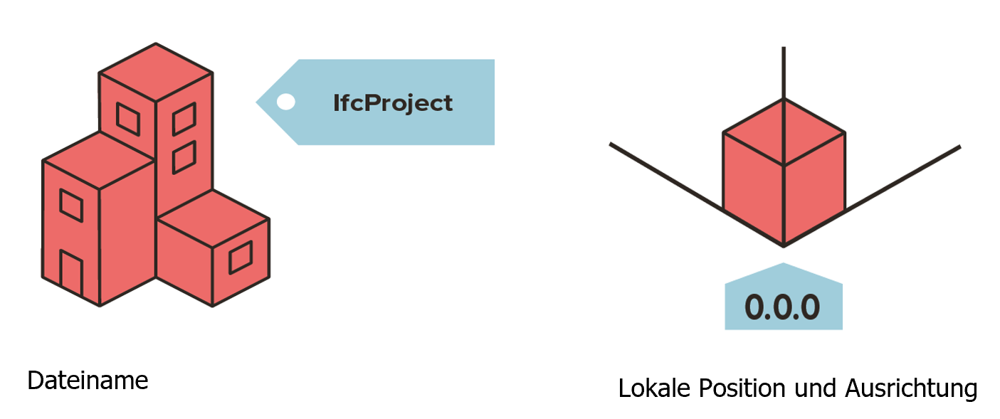
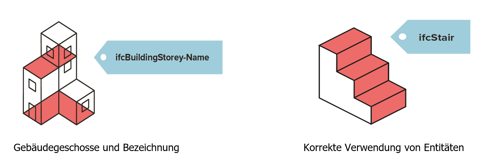
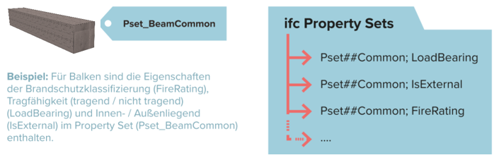
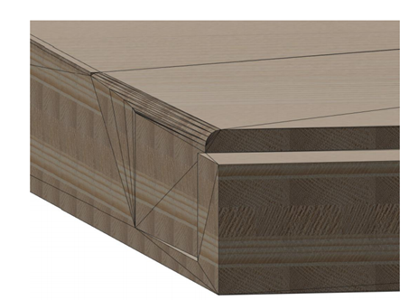
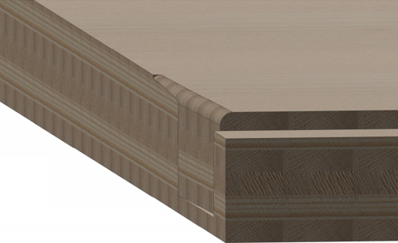

# cadwork BIM
{: style="width:700px"}

Digitization in the construction industry is gaining more and more momentum. The Building Information Modeling (BIM) method serves as an entry point. The transparent process with a high quality of object-describing information and quality gates forms the basis for digital innovations. In addition to technical aspects, the method calls for a **cultural change in the construction industry**. Project participants manage transparent information flows and deliver targeted data at the defined time in the required quality. BIM leads to transparency in communication and collaboration. It is foreseeable that in a few years, as with the introduction of CAD in the last millennium, the entire execution process over the life cycle will adapt so that the BIM method will take on a central role.

**...it's all about culture...**

### W-question :bulb:<br>
**Who** needs at **when** for **what** purpose **which** information in **which** file-format from **whom**?
**W**er benötigt, **w**ann, von **w**em, **w**ie sowie zu **w**elchem Zweck **w**elche Informationen in **w**elchem Datenformat? 

{: style="width:700px"}

## Begrifflichkeiten
Akronym | Terminology                       | Meaning
--------|-----------------------------------|-------------
BIM     | Building Information Modeling     | Working method
IFC	    | Industry Foundation Classes       | Transport of data / Scheme
BCF	    | BIM Collaboration Format          | Coordination of changes
bsDD    | buildingSmart Data Dictionary     | Hosts classifications and properties in a database
IDM     | Information Delivery Manual       | Description of processes
MVD     | Model View Defintion              | Translation of processes in technical software needs
LOG     | Level of Geometry	                | Geometric requirement level
LOI	    | Level of Information	            | Alphanumeric requirement level
LOIN    | Level of Information Needed	    | Required information from Orderer
Pset    | Property Set	                    | Container for element information
BAP     | BIM-Projektabwicklungsplan	    | Document, which defines basicx for BIM-based collaboration
GUID    | Globally Unique Identifier        | Unique, unchangeable 128 bit identification number

You can find more terms about BIM in the glossary of bauen digital Schweiz :
[Glossar bdCH](https://bauen-digital.ch/de/produkte/glossar/){target=_blank} :bulb:

## the BIM-Process
The advantages of the BIM method should be fully exploited not only technically, but also structurally. Therefore, the use of the openBIM method is recommended in all projects. In terms of implementation and collaboration, the following advantages arise:
Software independence and freedom of choice in the application of all project participants; therefore, no competitive disadvantage due to stipulations on application usage, long-term usability of model data (sustainability through ISO certification of IFC and IDM) and Autarky of software-specific model information (transparency).
The development stages of BIM provide a clear classification in this respect.

* `little BIM`: BIM-island, only used in single disciplines 
* `BIG BIM`: BIM-integration in all disciplines 
* `closedBIM`: closed solution, uso of only one software family 
* `openBIM`: open solution, exchange of information via various BIM-enabled products.

{: style="width:700px"}

### openBIM[^1]

openBIM extends the benefits of BIM (Building Information Modeling) by improving the accessibility, usability, management and sustainability of digital data in the construction industry. At its core, openBIM is a collaborative process that is vendor neutral. openBIM processes can be defined as shareable project information that supports seamless collaboration for all project stakeholders. openBIM facilitates interoperability to benefit projects and assets throughout their lifecycle.

openBIM empowers stakeholders to develop new ways of working by transforming traditional peer-to-peer work processes. By breaking down data silos, openBIM can significantly improve project delivery and asset performance. Companies that adopt an openBIM approach develop cross-party collaboration, improved communication and industry-standard sharing methods. This leads to better project outcomes, greater predictability, improved performance, and increased safety with reduced risk.
Throughout the lifecycle of a facility, openBIM helps connect people, processes, and data to achieve facility delivery, operations, and maintenance goals. openBIM and seamless digital workflows make critical project information accessible to all stakeholders in a timely manner to support decision making at various stages of the project - from design to handover to rehabilitation and even demolition. openBIM eliminates the traditional problem of BIM data typically being constrained by proprietary vendor data formats, by discipline, or by phase of a project.

By adhering to international standards and workflows, openBIM expands the breadth and depth of BIM use by creating a common direction and language. Technical applications developed for openBIM improve data management and eliminate disjointed workflows. Independent quality benchmarks ensure reliable open data exchange.
openBIM allows digital workflows based on vendor-neutral formats such as IFC, BCF, etc.

openBIM enables an accessible digital twin, which is the central basis for a long-term data strategy for built assets. This ensures better sustainability of projects and more efficient management of the built environment.
[^1]: [buildingsmart](https://www.buildingsmart.org/about/openbim/openbim-definition/)

**The principles of openBIM**

1. interoperability is the key to digital transformation in the construction industry
2. open and neutral standards should be developed to facilitate interoperability
3. reliable data exchange depends on independent quality measures
4. collaboration workflows are enhanced by open and agile data formats
5. flexibility in technology choices creates more value for all stakeholders
6. sustainability is ensured through long-term, interoperable data standards

The benefits to construction industries are:

- [X] openBIM significantly improves collaboration in project delivery
- [X] openBIM enables better asset management
- [X] openBIM enables access to BIM data created during design for the entire lifecycle of the structure
- [X] openBIM expands the breadth and depth of BIM deliverables by creating a common direction and language. As well as by adhering to international standards and commonly defined work processes.
- [X] openBIM enables a common data environment that provides users with opportunities to develop new workflows, software applications and technology automation
- [X] openBIM enables an accessible digital twin that provides the central foundation for a long-term data strategy for built assets

openBIM | Data                           
---------------------------------------------------------|-----------
OpenBIM data need to be **readable** for all, **commentable** for many and **changeable** for few.
| 

### Factors for successful BIM

Only by taking the following factors into account can a BIM project be successfully implemented. 


### Information requirement
**Level of Information Need (LOIN)** and its implementation in the different levels of detail (LOG/LOI).

**Level of Geometry (LOG)**
defines the geometric content of a model. As the project progresses, the geometric accuracy increases. 

**Level of Information (LOI)** 
describes the content (alphanumeric) information level of a model. For this purpose, the attributes of the objects to be used are defined. [^2]

[^2]: [bauen-digital-CH](https://bauen-digital.ch/assets/Downloads/de/180222-BdCH-SwissBIM-LOIN-Verstaendigung-web.pdf)

Level of Geomtry                | Level of Information                           
--------------------------------|------------------------------
 | 

The LOG and LOI definitions are to be made individually and independently. It should be noted that the LOD definition is not the sum of LOG and LOI, thus cannot be LOD = LOI + LOG. LOI and LOG definitions are to be defined independently of each other, but project-specifically with regard to goals and corresponding applications or the information required for this by the parties involved.

{: style="width:700px"}

## ModelViewDefintion MVD
Taken from bsI Standards Model View Definition (MVD)[^3] <br>

In general, an MVD, or "Model View Definition", is a selection of entities from the entire IFC schema to describe a particular use or workflow. MVDs can be as extensive as almost the entire schema (e.g., for archiving a project) or as specific as a few object types and associated data (e.g., for pricing a curtain wall system).

To support BIM interoperability across hundreds of software applications, the IFC schema is designed to accommodate many different configurations and levels of detail. 

For example, a wall can be represented:

1. as a line (or curve) segment between two points;
2. as one of many types of 3D geometry for visualization and analysis (e.g. as extruded solids or triangulated surfaces);
3. as simple shapes or with specific construction details (capturing individual bolts, pipe fittings, wiring, etc.)....
4...along with data such as technical characteristics, responsible parties, scheduling, and cost information. But not every domain expert in a project's design, procurement, manufacturing, and operations processes needs all the same information delivered or received.

An MVD uses entities from IFC to define an interchange standard for a particular use case or workflow. This interchange standard (MVD) is implemented by software vendors.

[^3]: [MVD-buildingsmart](https://www.buildingsmart.org/standards/bsi-standards/model-view-definitions-mvd/)


{: style="width:700px"}

## IFC data scheme, structure
Taken from BIMcert Handbuch 2021[^4] <br>

IFC is integrated in all common BIM applications. Software certification by buildingSMART international ensures consistently high transmission quality.
All functional elements are linked to floors and are thus also associated with a building. In addition to alphanumeric (attributes, parameters and characteristics) and geometric information, an IFC file also contains object relationships.
The IFC specification uses three structures: location structure, functional structure and material structure.
The location structure defines the spatial structure of a building in IFC. This declares building sites, structures located on them, floors located in them, and the rooms present in a floor.
Buildings are mapped within the functional structure by breaking them down into individual functional element classes: e.g. walls, ceilings, columns, doors or windows. Each element (element instance) is assigned a unique identifier (GUID).

{: style="width:700px"}

Each functional element class is optimized for the mapping of its functional domain. For this purpose, it carries a standardized base set of characteristics to describe relevant properties (parameters) as well as their typical geometry (attributes). The characteristics are organized into groups (property sets). Each element class carries a typical pset that carries the most essential features. This pset is designated with the suffix "Common" e.g. Pset_WallCommon or Pset_DoorCommon.
All functional elements are linked to floors and are thus also associated with a building. In addition to alphanumeric (attributes, parameters and characteristics) and geometric information, an IFC file also contains object relationships.
In addition to the location structure and the functional structure, there is also a material structure in the IFC data structure for declaring material-related properties.
[^4]: [BIMcert](https://bif.bauwesen.tuwien.ac.at/fortbildung/kurse/aktuelle-kurse/bimcert/)

The alphanumeric file format is structured in two sections. The HEADER section, which contains the information about the file, and the DATA section, which contains the information about the project.  
```
ISO-10303-21;
HEADER;
FILE_DESCRIPTION(('ViewDefinition [DesignTransferView_V1.0]','ExchangeRequirement [Architecture]'), '2;1');
FILE_NAME('Export_V2','2021-07-12T14:53:51',(''),('',''),'','cadwork','');
FILE_SCHEMA(('IFC4'));
ENDSEC;
DATA;
#1= IFCPROJECT('1a$RL01_H3_giBD$G0XTyj',#7,'Default Project','Description of default Project',*,*,*,(#15),#11);
#2= IFCPERSON($,'unknown','user',$,$,$,$,$);
#3= IFCORGANIZATION($,'Cadwork Informatik AG','organization',$,$);
#4= IFCPERSONANDORGANIZATION(#2,#3,$);
```
## The model

Stachowiak, 1973:

> Models are always models of something, for someone; they fulfill their function for a time and serve a purpose.

Models are to be created according to the rules defined in the modeling plan. [BIM Information Delivery Manual (Basics)] [BIM Informations-Lieferungs-Handbuch (Grundlagen)](https://baustein.xella.ch/media/downloads/BIM-Grundlagen-Informations-Lieferungs-Handbuch-3.pdf)


{: style="width:700px"}

{: style="width:700px"}

The more precisely the [modeling rules]() are implemented, the smoother model-based collaboration runs. Problems in merging the models can be circumvented by the defined rules and efficient collaboration is made possible. 

{: style="width:700px"}

## Relative positioning
The geometric modeling in the IFC data model is strongly oriented towards the use of a local coordinate system.
For example, the placement of a column is not defined globally, but in relation to the coordinate system of the respective floor.
The coordinates of the floors (IfcBuildingStorey) are in turn modeled with respect to the coordinate system of the building (IfcBuilding). The coordinates of the building are in turn modeled with respect to the coordinate system of the site (IfcSite).

{: style="width:700px"}

## IFC entities
An IFC class is a **uniquely identified object** in the IFC data model. Depending on the class assignment and type definition, the object is given certain **default attributes** and **dependencies** within the IFC schema. 
The choice of the right class during IFC export is therefore very important: If a wall is not assigned to the class IfcWall, it will not get all the required attributes to be described unambiguously. Then it will also not be interpreted correctly by other programs for coordination or evaluation.

{: style="width:700px"}

## PropertySet
The IfcPropertySet is a **container that contains properties within a "property tree"**. The properties are organized in groups (so called Psets = Property Sets). Each element class carries a typical Pset, which carries the most essential properties. This Pset is designated with the suffix "Common" e.g. Pset_WallCommon or Pset_BeamCommon.
In addition, any user-defined property set can be captured. Property sets that are not declared as part of the IFC specification must have a name value that does not contain the "Pset_" prefix. 

{: style="width:700px"}

## Geometry
Starting with the 2.5D functionality, the ability to represent three-dimensional objects with CAD programs has existed for over 30 years. In order to be able to represent three-dimensional bodies and not just surfaces in a space, the technologies of BREP, as well as the CSG method were added. 
The IFC schema supports different methods to represent geometry. Depending on the geometry method used, different results are achieved. 
The quality and method of the geometry determines the reusability of the elements in cadwork. 

* The explicit modeling with the B-Rep method ((Boundary Representation), boundary surface model) is a geometry method to create arbitrary 3D geometries from boundary surfaces that completely enclose an enveloping geometry. In the B-Rep method, only the result of creating a solid over the bounding surfaces is ever saved.   
    * the volume is described over the bounding surfaces
    * complex shapes are described with a high number of facets
    * representation of non-planar surfaces -> NURBS (non-uniform rational B-splines). This method allows the construction of freeform surfaces. 
	
{: style="width:700px"}
{: style="width:700px"}

* the implicit modeling CSG ((Constructive Solid Geoemtry), extrusions, rotations) is a geoemetric method to create arbitrary 3D geometries from operations between basic bodies. 
    * The volume is described by a sequence of construction steps. The modeling steps to the result are stored (history). 
    * Boolean operations are performed when converting to cadwork elements. The resulting geometry can be used for e.g. production if factors like accuracy match. 
    * CSG
	
{: style="width:700px"}
{: style="width:700px"}

* Extrusion
    * Area is extruded along a direction vector
	
{: style="width:700px"}


