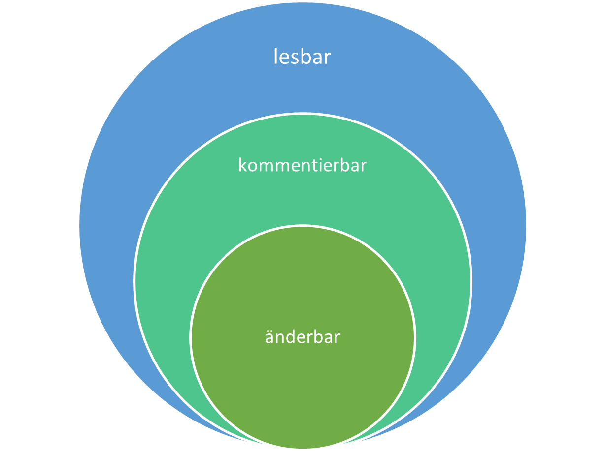
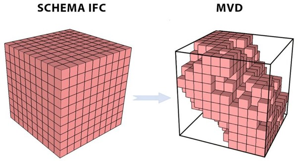
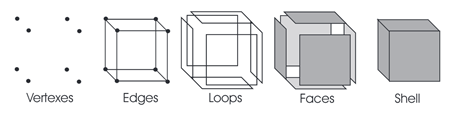
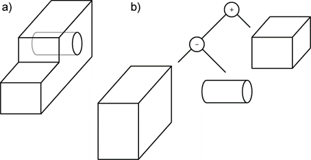
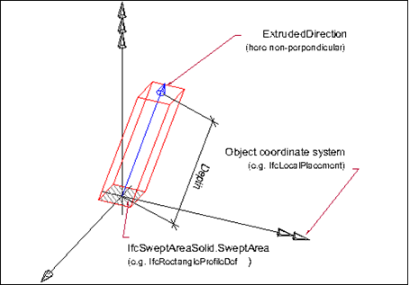

# Le BIM dans cadwork
{: style="width:700px"}

La numérisation dans le secteur de la construction prend de plus en plus d'ampleur. La méthode BIM (Building Information Modeling) sert de point d'entrée. Le processus transparent avec une haute qualité des informations décrivant les objets et des portes de qualité constitue la base des innovations numériques. Outre les aspects techniques, la méthode requiert un **Changement de culture dans le secteur de la construction**. Les participants au projet gèrent des flux d'informations transparents et fournissent des données ciblées au moment défini et avec un niveau de qualité requise. Le BIM entraîne la transparence dans la communication et la collaboration. Il est prévisible que dans quelques années, comme lors de l'introduction de la CAO au cours du dernier millénaire, l'ensemble du processus de déroulement du cycle de vie s'adaptera de manière à ce que la méthode BIM joue un rôle central.

**C'est une philosophie de travail**

### Les Questions à se poser :bulb:<br>
**Qui** a besoin, **quand**, à **quelle** fin, de **quelles** informations, dans **quel** format de données, de la part de **qui** ? 

{: style="width:700px"}

## Définitions
Acronyme | Terminologie                      | Signification
--------|-----------------------------------|-------------
BIM     | Building Information Modeling     | Méthode de travail
IFC	    | Industry Foundation Classes       | Format de fichier pour échange de données géométriques, informations structurelles, mais aussi architecturales, thermiques, climatiques, électriques… 
BCF	    | BIM Collaboration Format          | Format de fichier pour une coordination des modifications
bsDD    | buildingSmart Data Dictionary     | Héberge les classifications et les propriétés dans une base de données
IDM     | Information Delivery Manual       | Décrit les processus
MVD     | Model View Defintion              | Traduit les processus en exigences techniques logicielles
LOG     | Level of Geometry	                | Exigence géométrique - Niveau de détail
LOI	    | Level of Information	            | Demande alphanumérique - Niveau de détail
LOIN    | Level of Information Needed	    | Besoin d'information (Maitrise d'ouvrage, client)
Pset    | Property Set	                    | Conteneur d'unités d'information
GUID    | Globally Unique Identifier        | nombre unique et non modifiable de 128 bits - numéro d'identification

Vous trouverez d'autres termes relatifs au BIM dans le glossaire de construction suisse. :
[Glossar bdCH](https://bauen-digital.ch/de/produkte/glossar/){target=_blank} :bulb:

## Le processus BIM
Les avantages de la méthode BIM doivent être pleinement exploités non seulement sur le plan technique, mais aussi sur le plan structurel. C'est pourquoi l'utilisation de la méthode openBIM est recommandée dans tous les projets. En termes de mise en œuvre et de collaboration, les avantages suivants se présentent : Indépendance du logiciel et liberté de choix dans l'application de tous les participants au projet ; par conséquent, pas de désavantage concurrentiel dû à des stipulations sur l'utilisation de l'application, utilisabilité à long terme des données du modèle (durabilité grâce à la certification ISO de l'IFC et de l'IDM) et autarcie des informations du modèle spécifiques au logiciel (transparence). Les étapes de développement du BIM fournissent une classification claire à cet égard.

* `little BIM`: BIM-île, utilisé uniquement dans des disciplines uniques.
* `BIG BIM`: Intégration du process BIM dans toutes les disciplines.
* `closedBIM`: solution fermée, utilisation d'une seule famille de logiciels.
* `openBIM`: solution ouverte, échange d'informations via divers produits compatibles avec le processus BIM.

{: style="width:700px"}

### openBIM[^1]

L'openBIM étend les avantages du BIM (Building Information Modeling) en améliorant l'accessibilité, l'utilisation, la gestion et la durabilité des données numériques dans le secteur de la construction. Les processus openBIM peuvent être définis comme des informations de projet partageables qui soutiennent une collaboration transparente pour toutes les parties prenantes du projet. L'openBIM facilite l'interopérabilité au profit des projets et des actifs tout au long de leur cycle de vie.

L'openBIM permet aux parties prenantes de développer de nouvelles méthodes de travail en transformant les processus de travail traditionnels. En éliminant les disparités entre les données, l'openBIM peut améliorer considérablement la réalisation et la performance des projets. Les entreprises qui adoptent une méthode de travail openBIM développent une collaboration entre les corps de métiers, une meilleure communication et des méthodes de partage conformes aux normes du secteur. Il en résulte de meilleurs résultats pour les projets, une plus grande anticipation, des performances améliorées et une sécurité accrue avec des risques réduits. Tout au long du cycle de vie d'une installation, l'openBIM aide à connecter les personnes, les processus et les données pour atteindre les objectifs de livraison, d'exploitation et de maintenance des installations. L'openBIM et les flux de travail numériques transparents rendent les informations critiques du projet accessibles à toutes les parties prenantes en temps voulu pour soutenir la prise de décision à différents stades du projet - de la conception à la remise des clés, à la réhabilitation et même à la démolition. L'openBIM permet une communication transparente de chaque corps de métiers et élimine le problème traditionnel du closeBIM, à savoir la difficulté de partager des données provenant des différents outils CAO en fonction des disciplines et des métiers.

En respectant les normes et les flux de travail internationaux, l'openBIM élargit l'étendue et la profondeur de l'utilisation du BIM en créant une approche et un langage communs. Les applications techniques développées pour l'openBIM améliorent la gestion des données et éliminent les flux de travail incohérents. Des références indépendantes de qualité garantissent un échange de données ouvert et fiable.

L'openBIM permet des flux de travail numériques basés sur des formats neutres, tels que l'IFC, le BCF, etc.

L'openBIM permet de créer un jumeau numérique accessible, qui constitue la base centrale d'une stratégie de données à long terme pour les installations construites. Cela assure une meilleure durabilité des projets et une gestion plus efficace de l'environnement bâti.
[^1]: [buildingsmart](https://www.buildingsmart.org/about/openbim/openbim-definition/)

**Les principes de l'openBIM**

1.	l'interopérabilité est la clé de la transformation numérique dans le secteur de la construction.
2.	Des normes ouvertes et neutres devraient être développées pour faciliter l'interopérabilité.
3.	Un échange de données fiable dépend de critères de qualité indépendants.
4.	Les flux de travail collaboratifs sont améliorés grâce à des formats de données ouverts et flexibles.
5.	la flexibilité dans les choix technologiques crée plus de valeur pour toutes les parties prenantes.
6.	La durabilité est assurée par des normes de données interopérables à long terme.

Les avantages pour les entreprises de la construction sont les suivants :

- [X] L'openBIM améliore considérablement la collaboration dans la gestion de projets.
- [X] L'openBIM permet une meilleure gestion des équipements.
- [X] L'openBIM permet d'accéder aux données BIM créées lors de la conception pour l'ensemble du cycle de vie de l'ouvrage.
- [X] L'openBIM élargit l'étendue et la profondeur des livrables BIM en créant une approche et un langage communs, à travers des normes internationales et des processus de travail définis en commun.
- [X] L'openBIM permet un environnement de données commun qui offre aux utilisateurs des possibilités de développer de nouveaux processus de travail, des applications logicielles et une automatisation technologique.
- [X] L'openBIM permet de créer un jumeau numérique accessible, qui constitue la base centrale d'une stratégie de données à long terme pour les installations construites.

openBIM | Données                          
---------------------------------------------------------|-----------
Les données OpenBIM doivent être **lisibles** pour tous, **commentables** pour beaucoup et **modifiables** pour quelques-uns. | 

###  Les facteurs de réussite du BIM

Ce n'est qu'en tenant compte des facteurs suivants qu'un projet BIM peut être mis en œuvre avec succès. 


### Besoin d'information
Niveau de besoin d'information, Level of Information Need (LOIN) et sa mise en œuvre dans les différents niveaux de détail (LOG/LOI).
Le niveau de géométrie, Level of Geometry (LOG) définit le contenu géométrique d'un modèle. Au fur et à mesure de l'avancement du projet, la précision géométrique augmente.
Le niveau d'information, Level of Information (LOI) décrit le niveau d'information (alphanumérique) du contenu d'un modèle. Les propriétés des objets à renseigner sont définis.[^2]
[^2]: [bauen-digital-CH](https://bauen-digital.ch/assets/Downloads/de/180222-BdCH-SwissBIM-LOIN-Verstaendigung-web.pdf)

Level of Geometry                | Level of Information                           
--------------------------------|------------------------------
 | 

Les définitions LOG et LOI doivent être effectuées individuellement et indépendamment. Il convient de noter que la définition du LOD n'est pas la somme du LOG et du LOI et ne peut donc pas être LOD = LOI + LOG. Les définitions de la LOI et de la LOG doivent être indépendantes l'une de l'autre, mais doivent être définies en fonction des objectifs du projet et des applications correspondantes ou des informations nécessaires à cet effet par les personnes concernées.

{: style="width:700px"}

## Définition de la vue du modèle, ModelViewDefintion MVD
Sources(BuildingSmart International) Model View Definition(MVD)[^3] <br>

En général, un MVD, ou "Model View Definition", est une sélection d'entités de l'ensemble du format IFC pour décrire une utilisation ou un flux de travail spécifique. Les MVD peuvent être aussi vastes que la quasi-totalité du format (par exemple pour l'archivage d'un projet) ou aussi spécifiques que quelques types d'objets et données associées (par exemple pour la tarification d'un système de murs-rideaux).

Pour favoriser l'interopérabilité BIM entre des centaines d'applications logicielles, le format IFC est conçu pour s'adapter à de nombreuses configurations et niveaux de détail différents.

Par exemple, un mur peut être représenté :

1. comme un segment (ou courbe) entre deux points ;
2. comme l'un des nombreux types de géométrie 3D pour la visualisation et l'analyse (par exemple, sous forme de solides extrudés ou de surfaces triangulées) ;
3. comme des formes simples ou comme des détails de construction spécifiques ( boulons individuels, de raccords de tuyaux, de câblage, etc.) .... 
4. en même temps que des données telles que les caractéristiques techniques, les responsables, le calendrier et les informations sur les coûts. Mais tous les experts du domaine dans les processus de conception, d'approvisionnement, de fabrication et d'exploitation d'un projet n'ont pas besoin de toutes les mêmes informations.

Un MVD utilise des entités de l'IFC pour définir une norme d'échange pour un cas d'utilisation ou un flux de travail particulier. Cette norme d'échange (MVD) est mise en œuvre par les fournisseurs de logiciels.

[^3]: [MVD-buildingsmart](https://www.buildingsmart.org/standards/bsi-standards/model-view-definitions-mvd/)


{: style="width:700px"}

## Schéma et organisation des données IFC
Sources (BIMcert)[^4] <br>

L'IFC est intégré dans tous les outils traitant des processus BIM. La certification du logiciel par buildingSMART international garantit une qualité d'échange élevée et constante. Tous les éléments de construction sont liés aux étages et associés à un bâtiment. Outre les informations alphanumériques (attributs, paramètres et caractéristiques) et géométriques, un fichier IFC contient également des relations entre objets. La norme IFC utilise trois catégories : la définition de la localisation, la définition des fonctions et la définition des matériaux. Les données de localisation définit la structure spatiale d'un bâtiment en IFC. Elle définit les sites, les bâtiments, les étages ainsi que les composants et les pièces présentes dans un étage. Les bâtiments sont représentés au sein de la structure fonctionnelle en les décomposant en classes d'éléments fonctionnels individuels : par exemple, les murs, les plafonds, les poteaux, les portes ou les fenêtres. Un identifiant unique (GUID) est attribué à chaque élément.

{: style="width:700px"}

Chaque classe d'éléments fonctionnels est optimisée pour la représentation de son domaine fonctionnel. Pour cela, elle porte un ensemble de base standardisé de caractéristiques décrivant les propriétés pertinentes (paramètres) ainsi que sa géométrie typique (attributs). Les caractéristiques sont organisées en groupes (Property-Sets). Chaque classe d'éléments porte un Pset typique, qui porte les caractéristiques les plus importantes. Ce Pset est désigné par le suffixe "Common", p. ex. Pset_WallCommon ou Pset_DoorCommon.
Tous les éléments fonctionnels sont reliés aux étages (storey) et appartiennent donc également à un bâtiment. Outre les informations alphanumériques (attributs, paramètres et caractéristiques) et géométriques, un fichier IFC contient également des relations entre objets.
Il existe également dans la structure de données IFC une structure matérielle permettant de déclarer les propriétés liées aux matériaux.
[^4]: [BIMcert](https://bif.bauwesen.tuwien.ac.at/fortbildung/kurse/aktuelle-kurse/bimcert/)

Le format de fichier alphanumérique est structuré en deux parties. La partie HEADER, qui contient les informations sur le fichier, et la partie DATA, qui contient les informations sur le projet. 
```
ISO-10303-21;
HEADER;
FILE_DESCRIPTION(('ViewDefinition [DesignTransferView_V1.0]','ExchangeRequirement [Architecture]'), '2;1');
FILE_NAME('Export_V2','2021-07-12T14:53:51',(''),('',''),'','cadwork','');
FILE_SCHEMA(('IFC4'));
ENDSEC;
DATA;
#1= IFCPROJECT('1a$RL01_H3_giBD$G0XTyj',#7,'Default Project','Description of default Project',*,*,*,(#15),#11);
#2= IFCPERSON($,'unknown','user',$,$,$,$,$);
#3= IFCORGANIZATION($,'Cadwork Informatik AG','organization',$,$);
#4= IFCPERSONANDORGANIZATION(#2,#3,$);
```
## Le modèle

Stachowiak, 1973:

> Les modèles sont toujours des modèles de quelque chose, pour quelqu'un ; ils remplissent leur fonction pendant un certain temps et servent un objectif.

Les modèles doivent être créés selon les règles définies dans la charte BIM ou convention BIM. [BIM Informations-Lieferungs-Handbuch (Grundlagen)](https://baustein.xella.ch/media/downloads/BIM-Grundlagen-Informations-Lieferungs-Handbuch-3.pdf)


{: style="width:700px"}

{: style="width:700px"}


Plus les [Règles de modélisation] sont mises en œuvre de manière précise, plus la collaboration basée sur les modèles est fluide. Les problèmes de superposition des modèles peuvent être contournés par les règles définies et une collaboration efficace est rendue possible.

{: style="width:700px"}

## Positionnement relatif
La modélisation géométrique dans le modèle de données IFC est fortement orientée vers l'utilisation d'un système de coordonnées local. Par exemple, l'emplacement d'une colonne n'est pas défini globalement, mais par rapport au système de coordonnées de l'étage correspondant. Les coordonnées des étages (IfcBuildingStorey) sont à leur tour modélisées par rapport au système de coordonnées du bâtiment (IfcBuilding). Les coordonnées du bâtiment sont à leur tour modélisées par rapport au système de coordonnées du site (IfcSite).

{: style="width:700px"}

## Type IFC
Un type IFC est un **objet identifié de manière explicite** dans le modèle de données IFC. En fonction de l'attribution  et la définition du type, l'objet reçoit certains **attributs standard** et **liens** au sein du schéma IFC. 
Le choix du bon type IFC lors de ces exports IFC est donc très important : si un mur n'est pas associé à un type IfcWall, il ne recevra pas tous les attributs nécessaires pour être décrit de manière explicite. Il ne sera alors pas non plus interprété correctement par d'autres programmes de planification ou de traitement.

{: style="width:700px"}

## PropertySet
L'IfcPropertySet est un **répertoire qui contient des propriétés au sein d'une " arborescence de propriétés "**. Les propriétés sont organisées en groupes (appelés Psets = Property-Sets). Chaque classe d'éléments porte un Pset spécifique, qui contient les caractéristiques les plus importantes. Ce Pset est désigné par le suffixe "Common", par ex. Pset_WallCommon ou Pset_BeamCommon.
En outre, tout ensemble de propriétés défini par l'utilisateur peut être saisi. Les ensembles de propriétés qui ne sont pas déclarés comme faisant partie de la spécification IFC doivent avoir une valeur de nom qui ne contient pas le préfixe "Pset_". 

{: style="width:700px"}

## Géometrie

En prenant en compte les fonctionnalités 2.5d, la capacité de représenter des objets tridimensionnels avec des programmes de CAO existe depuis plus de 30 ans. Afin de pouvoir représenter des corps tridimensionnels et pas seulement des surfaces dans un espace, les technologies de BREP, ainsi que la méthode CSG ont été ajoutées. Le format IFC prend en charge différentes méthodes de représentation de la géométrie. Selon la méthode de géométrie utilisée, on obtient des résultats différents. La qualité et la méthode de la géométrie déterminent la possibilité de réutiliser les éléments dans cadwork.

*	La modélisation explicite avec la méthode B-Rep ((Boundary Representation), modèle de surface) est une méthode géométrique permettant de créer n'importe quelle géométrie 3D à partir de surfaces qui entourent entièrement une géométrie d'enveloppe. Avec la méthode B-Rep, seul le résultat de la création d'un corps à partir de surfaces de délimitation est enregistré.   
    *	le volume est décrit par les surfaces qui le délimitent
    *	les formes complexes sont décrites avec un grand nombre de facettes
    *   Représentation de surfaces non planes -> NURBS (B-splines rationnelles non uniformes). Cette méthode permet de construire des surfaces de forme libre. 

{: style="width:700px"}
{: style="width:700px"}

* la modélisation implicite CSG ((Constructive Solid Geometry), extrusions, rotations) est une méthode géométrique permettant de créer des géométries 3D arbitraires à partir d'opérations entre corps de base.
    * le volume est décrit par une succession d'étapes de construction. Les étapes de modélisation menant au résultat sont enregistrées (avec historique). 
    *  Des opérations booléennes sont effectuées lors de la conversion en éléments cadwork. La géométrie résultante peut être utilisée pour la production, par exemple, si des facteurs comme la précision correspondent.
    * CSG

{: style="width:700px"}
{: style="width:700px"}

* Extrusion
    * La surface est extrudée le long d'un vecteur.

{: style="width:700px"}


