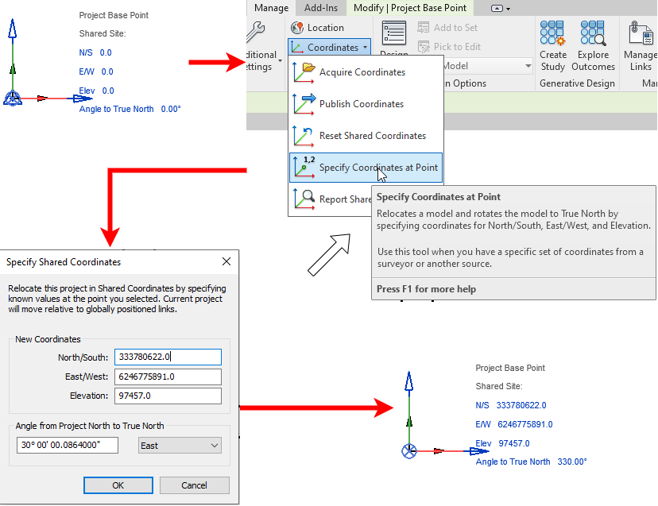

kurze Einleitung zu Revit.. Revit kommt in Architekru...... 

* foo
* bar
* baz

{: style="width:300px"}

## Revit 2022 und IFC

Revit wird mit einer integrierten IFC-Schnittstelle ausgeliefert, deren Funktionalität mit dem Open Source Erweiterung erweitert werden kann. Dieses Plugin bietet ausserdem den Vorteil, dass es stetig weiterentwickelt und von Autodesk regelmässig aktualisiert wird – unabhängig von den Revit-Update-Zyklen.
Entwickler können auf den kompletten Quellcode zugreifen und den Exporter bei Bedarf individuell anpassen.

Wenn Sie mit IFC-Dateien in Revit arbeiten, sollten Sie zuerst die neueste Version der Open Source Erweiterung installieren. Diese finden Sie hier:
[Sourceforge](https://sourceforge.net/projects/ifcexporter) oder über den Autodesk AppStore: [Autodesk](http://apps.autodesk.com)  Nach der Installation sehen Sie kein neues Icon
in Revit. Das Plugin überschreibt stattdessen die Standarddialogfelder. Wenn Sie Entwickler sind und mit dem Quellcode arbeiten möchten, finden Sie weiterführende Informationen unter dem bereits erwähnten
Sourceforge Link. Wenn Sie mit IFC-Dateien arbeiten, ist es wichtig, dass Sie nicht nur über ihre Struktur (MVD) sowie Version informiert sind, sondern auch die Möglichkeiten und die Bedeutung der einzelnen Optionen beim Export und Import kennen. Nur mit den richtigen Einstellungen erhalten Sie eine IFC-Datei, die alle benötigten Informationen enthält. Wie Sie dabei vorgehen, zeigen die
folgenden Kapitel.

### Revit IFC Handbuch

[Revit IFC Handbuch](https://www.autodesk.de/campaigns/interoperability/ifc-handbuch) :information_source:

### Modellaufbau

### Platzierung

{: style="width:600px"}

### Struktur 

### Inhalt (ER)

### Exporteinstellungen

### Importeinstellungen & Anforderungen

### Checkpoints Revit

* bla
* bla
* bla
* Quality Gate

## Cadwork Import IFC aus Revit

### Quality Gate

### Import

* foo bar baz
* Kontrolle globaler Nullpunkt

### IFC Properties mappen

### Exporteinstellungen

### Checkpoints cadwork
